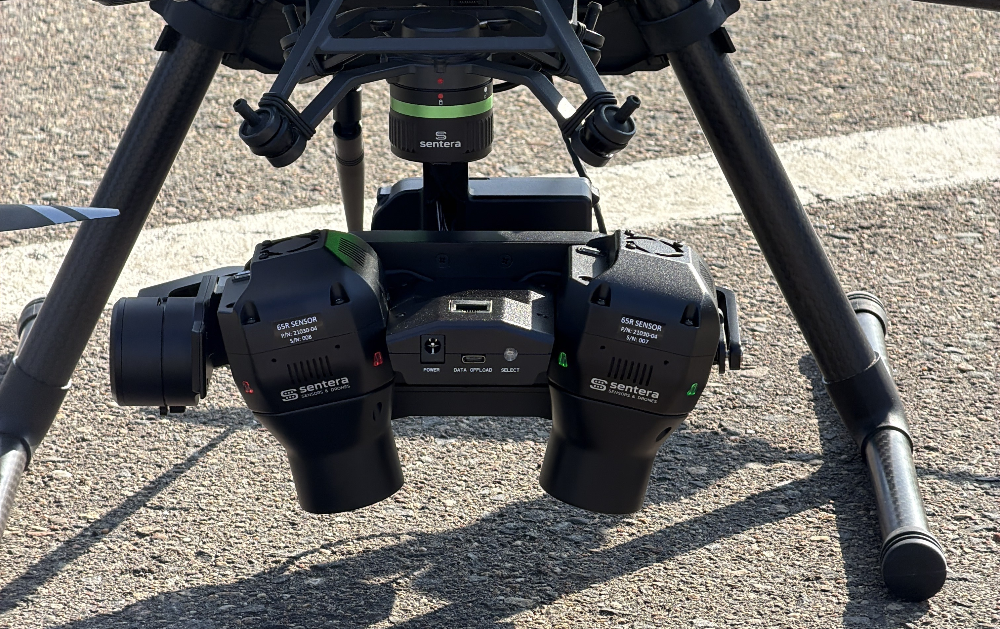

# PixelScout Fault Isolation

## Gimbal

Only one session starts

<figure><figcaption></figcaption></figure>

This may happen randomly and just needs a restart or two. Otherwise the system may have some outdated softwares on them

1. Restart the camera a max of 2 times to try to fix it.
2. Check the software/firmware versions on all the components (cameras, boards, etc.)

Flashing Antenna Lights



1. Check that the base station is using 1 Hz for all the RTCM3 message frequencies.

## Antenna

U-Center box doesn't show green symbol/baud rate

Check the baud rate used for communication.

1. At the top, click Receiver>Autobauding

