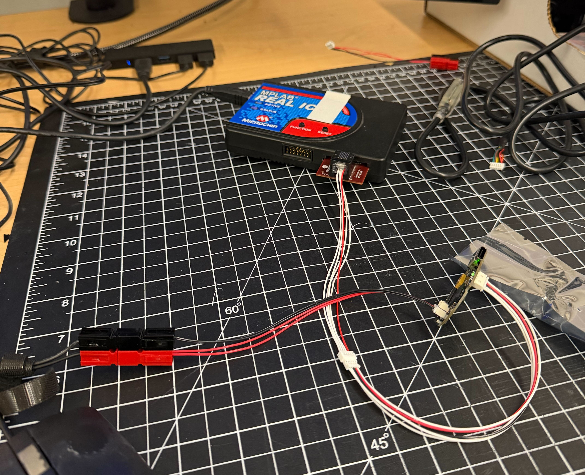
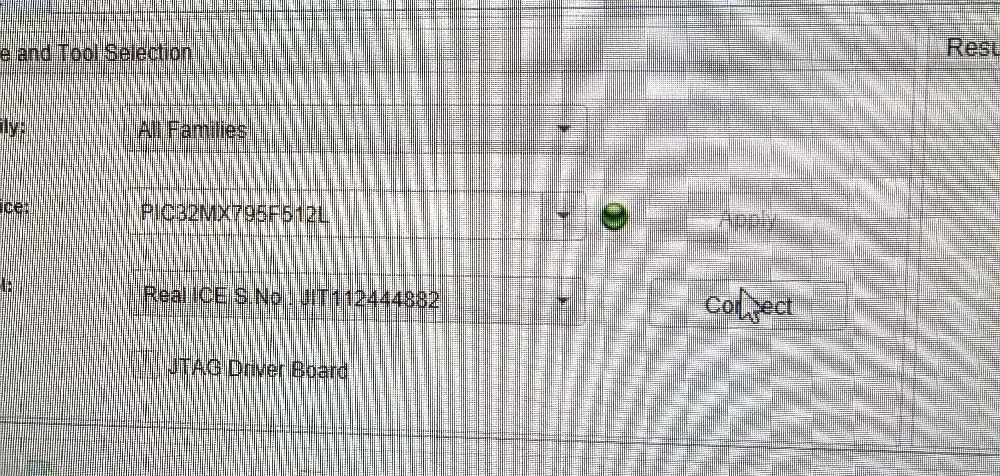
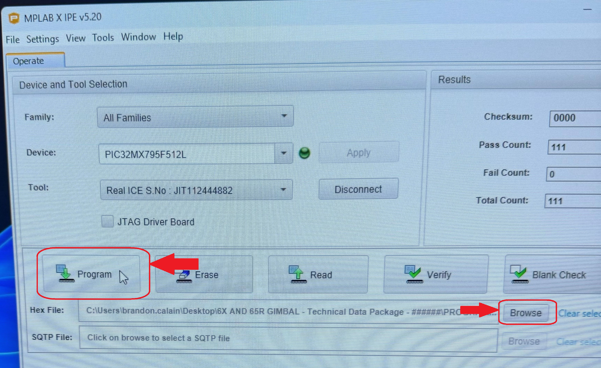

# Comms Board Programming

## Items Required

* MPLAB ICE module (with USB cable and small cable)
* 24V "NEW COMMS BOARD ONLY" AC Adapter
* Anderson power adapter cable
* communication adapter cable

## Step-by-step guide



### Plug in Everything

Note: PLUG IN ANDERSON CONNECTOR LAST to avoid any unwanted power surges or dips.

The Connections are:

* Power via ac adapter and Anderson power adapter cable
* Communication from computer via MPLAB ICE comms box and adapter

<figure><figcaption></figcaption></figure>



### Open the MPLAB X IPE v5.2 software

Refer to the software installation guide for information on downloading and installing this software.



### Program the board.

1. Under 'Device:', type the model number of the PIC32 chip on the comms board
   1. The model number is on one side of the black microchip on the board.
   2. For this example, it is 'PIC32MX795F512L'.

<figure><figcaption></figcaption></figure>

2. Click 'Connect'
   1. The pink box at the bottom should populate and the 'Connect' button should now say 'Disconnect'.
3. To the right of the 'Hex File' box, click on 'Browse'.
4. Find the correct hex file and open it into the program.
   1. The path is here:
      1. \as-taurus.jdnet.deere.com\Production\Technical Packages\6X AND 65R GIMBAL\IN PROGRESS\6X AND 65R GIMBAL - Technical Data Package - ######\PROGRAMMING\Prerequisites and Programs\Hex File\\.
   2. The filename is: pic32-Gimbal2.DEFAULT3.2025073000.hex.
5. Click 'Program'.

<figure><figcaption></figcaption></figure>

6. Once the programming process is complete, click 'Disconnect' and unplug the board, power first.


