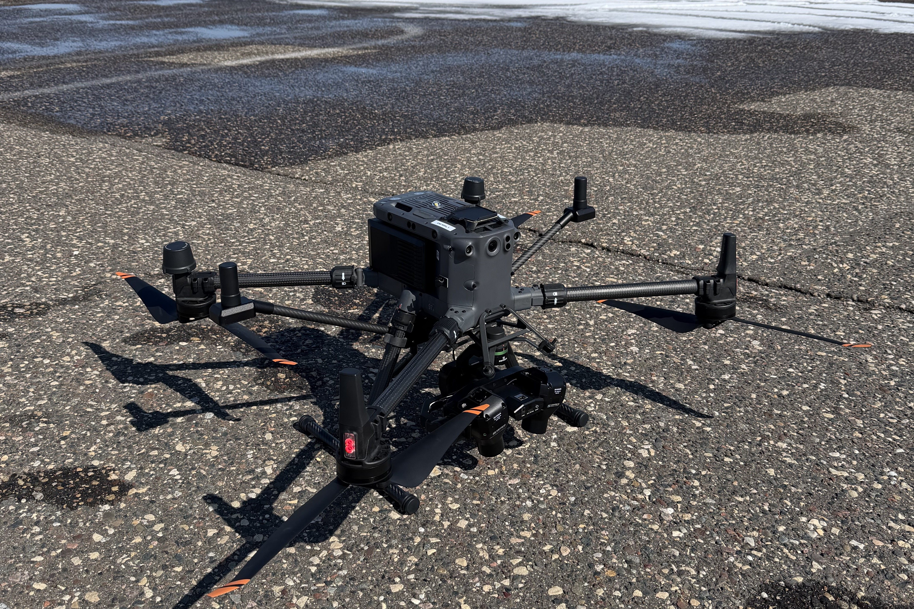

# Pixel Scout

<figure><figcaption></figcaption></figure>

<figure><figcaption></figcaption></figure>

Note: The rows (1, 2, 3, 4, and 5) help to organize the Gitbook in order of an approximate assembly order. The picture shows the order of which things need to happen but some things aren't dependent on others.

