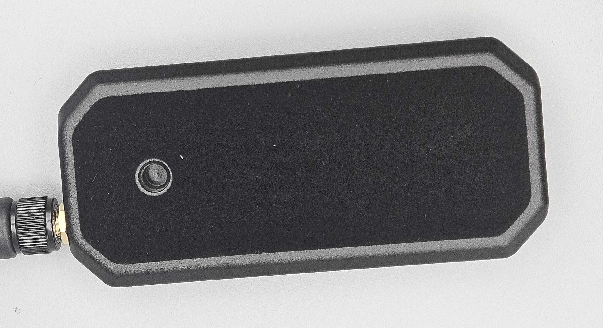

# 🚧 Ground Module Assembly

## Drawing


[#rtk-ppk-ground-module-greater-than-31039](../../space-and-general/drawings.md#rtk-ppk-ground-module-greater-than-31039)


Refer to this document if Gitbook is not properly updated.&#x20;



## Notes&#x20;

The P900 programming needs to be completed before assembly. Refer to [p900-radio-programming.md](../../technical-instructions/rtk-ppk/p900-radio-programming.md "mention") before continuing assembly.

## Guide

1. Install RF cable
   1. Remove locking washer and nut from cable. Discard locking washer
   2. Install RF cable and tighten nut with wrench
   3.

       <figure><figcaption></figcaption></figure>
   4. Apply Araldite 2-part adhesive to rear side of SMA connector as shown


Note: This adhesive is intended to prevent the connector from spinning when installing/uninstalling antenna.

Note: Cure time is 24 hours, but it is not required to wait until cured to continue assembly.


<figure><figcaption></figcaption></figure>

2.  Assemble and install magnet stack

    1. Clean both sides of magnet with alcohol
    2. Apply mounting tape circle to one side and foam bumper to other side
       1. Note: Magnet is not directional, so the sides do not matter
    3.

        <figure><figcaption></figcaption></figure>
    4. Clean round recess inside enclosure with alcohol
    5. Install magnet stack into enclosure with foam bumper facing upward

    <figure><figcaption></figcaption></figure>

3.  Loosely install USB-C breakout board

    1. Use 2 Shim washers <mark style="color:yellow;">Item #9 (91017A656)</mark>, 2 Washers <mark style="color:yellow;">Item #10 (92217A101)</mark>, and 2 screws <mark style="color:yellow;">Item #11 (91772A063)</mark> to install the USB-C breakout board into enclosure with Loctite

    <figure><figcaption></figcaption></figure>


{% column width="50%" %}
<figure><figcaption></figcaption></figure>


{% column width="50%" %}
<figure><figcaption></figcaption></figure>



4. Align and install radio board
   1. Install the P900 board to the USB-C breakout board and shift the boards such that ALL 4 of the mounting holes align between enclosure and P900 board
   2. Press on USB-C connector of the USB-C breakout board to prevent shifting and remove the P900 board.&#x20;
      1. Note: it may be easiest to pull on the USB-C connector side of the P900 board because the connector on the bottom is on that side. This will prevent twisting/shifting.
      2.

          <figure><figcaption></figcaption></figure>

   3. Tighten screws to install USB-C breakout board completely. Torque to 20 in-oz.
   4. Route the coax cable as shown.
      1.

          <figure><figcaption></figcaption></figure>
   5. Re-install the P900 board to USB-C board and make sure the holes are still aligned. If not, remove P900 board, loosen USB-C breakout board screws and repeat step 4.
   6. Make sure nothing is squishing the coax cable by pressing on the P900 board and sliding the coax cable back and forth. There should be no resistance.
   7. Install 4 screws <mark style="color:yellow;">Item #12 (91772A073)</mark> using Loctite. Torque to 40 in-oz.
      1.

          <figure><figcaption></figcaption></figure>
5.  Plug the coax cable into the P900 board and route as shown

    <figure><figcaption></figcaption></figure>

6.  Cut a small square out of a foam bumper and stick it to the raised circle on the cover. This foam bumper ensures the RF cable stays connected during use.

    <figure><figcaption></figcaption></figure>

7.  Install the cover to the enclosure using 4 screws <mark style="color:yellow;">Item #13 (91772A067)</mark> and Loctite. Torque to 20 in-oz.

    <figure><figcaption></figcaption></figure>
8. Install felt sheet.
   1. Clean surface with alcohol and let dry&#x20;
   2. Line up the hole with the sheet and get as straight as possible.&#x20;
   3. Avoid removing the felt sheet multiple times
   4.

       <figure><figcaption></figcaption></figure>

9. Apply stickers
   1. Clean the recessed area of the cover with alcohol
   2. Apply the label to the cover ensuring the transparent circles on the label align with the holes of the cover.
      1. Note: it may be easiest to use 2 tweezers on either side of the sticker to enable finer control of the placement.
   3. Clean the cover with alcohol
   4. Apply the radio net ID sticker with the corresponding number as shown.


NOTE: The sticker will have an extra 1 for PixelScout/WeedScout systems (3201110xxx).


<figure><figcaption></figcaption></figure>

9.  Install the antenna to the radio module and hand tighten

    <figure><figcaption></figcaption></figure>
