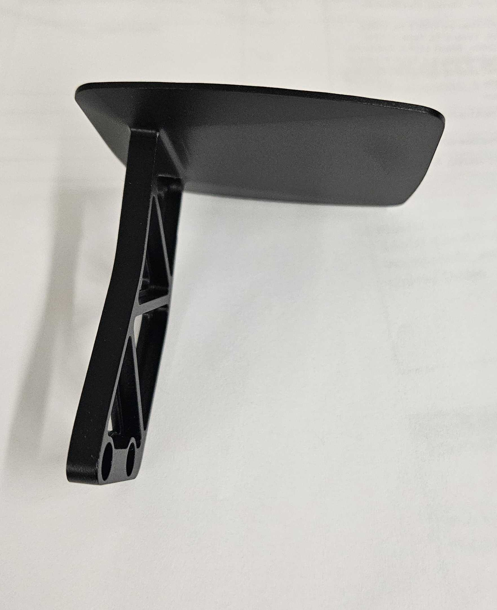
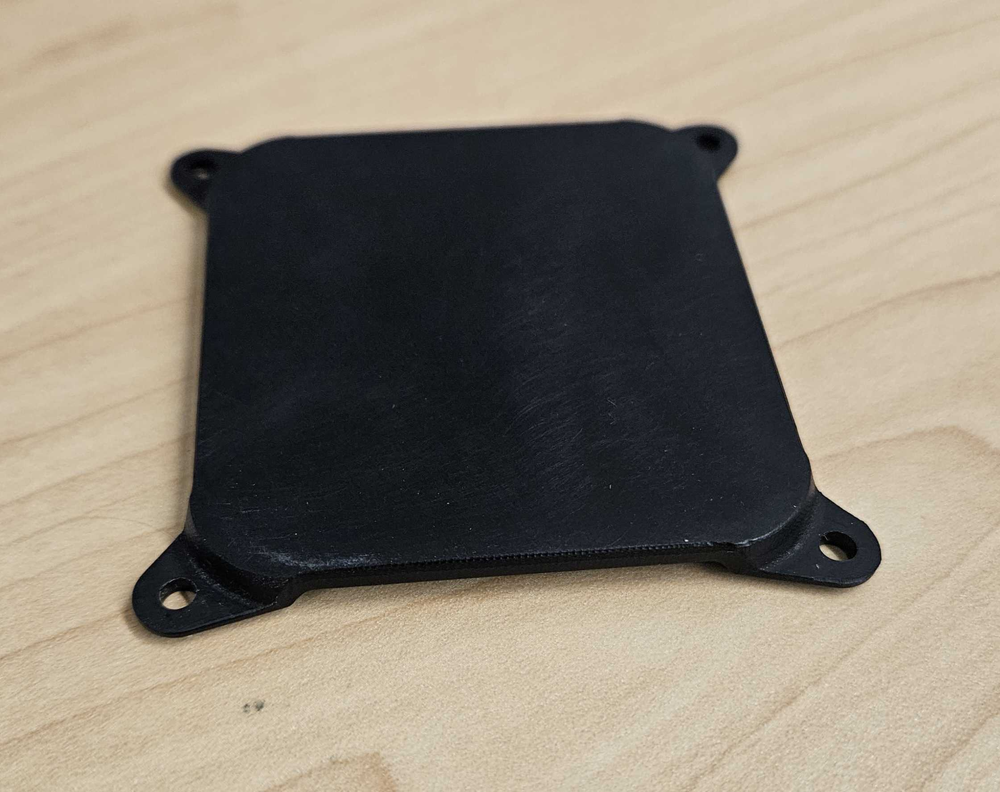
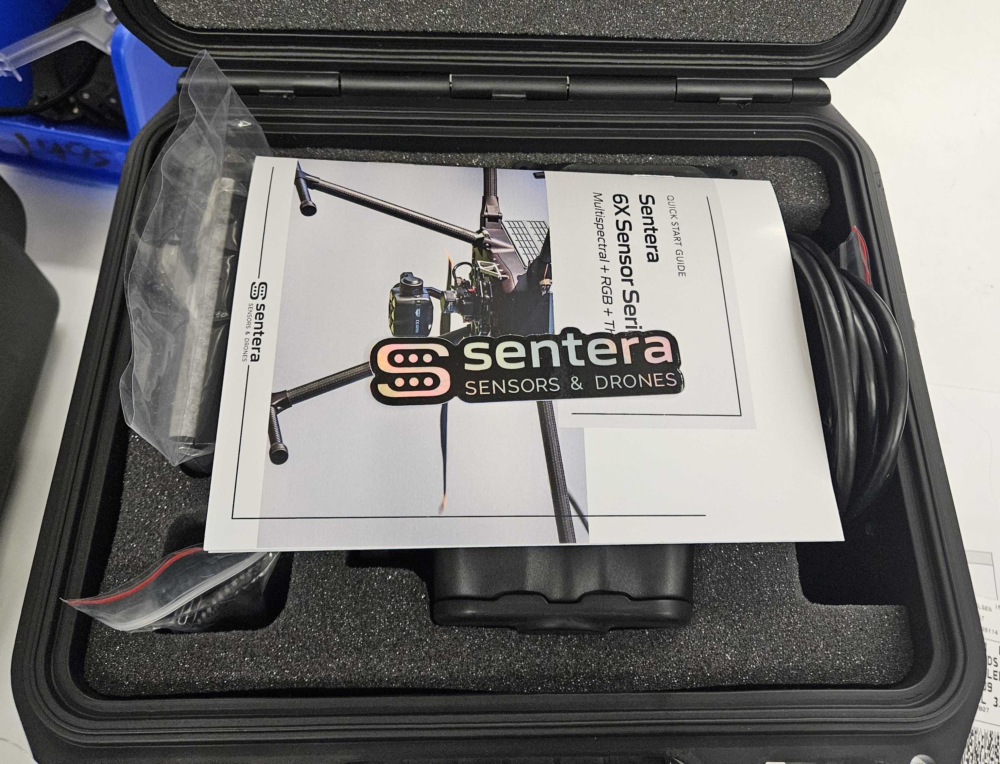

# 6X Final QC


This step should be completed by a different person that did the build and pre-shipment set-up. During Final QC, your job is to confirm everything is perfect. The package should not be shipped out with any issues.&#x20;


## Camera Check&#x20;

1. Power on the 6X camera and go to website 192.168.42.1. If you are required to enter in credentials, the username is "sentera" and leave the password blank.
2. Confirm the following
   1. Firmware is up to date&#x20;
   2. Correct Configuration is set use the following to confirm the correct config according to the SOS part number that is being shipped.&#x20;
      1. 21930-00, 21930-01, 21930-12 M300/M350 --> DJI skyport, Gimbaled
      2. 21930-02, 21930-03, 21930-13 Freefly Astro --> Freefly Astro Gimbal
      3. 21930-04, 21930-05, 21930-14 IF800 --> IF800, Inspired Flight Gimbal
      4. 21930-06, 21930-07, 21930-15 IF1200 --> IF1200A, Inspired Flight Gimbal
      5. 21930-08, 21930-09, 21930-16 OEM --> Sentera GPS, OEM
      6. 21930-10, 21930-11, 21930-17 Gremsy --> MAVLink-v2, Gremsy Hyper Quick
      7. 21930-18, 21930-19, 21930-20 M400 --> Sentera GPS, Gimbaled
   3.
3. Diagnostics is the same P/N and S/N as the camera
4. Go to File explorer and type in \\\192.168.42.1
   1. "\\\192.168.42.1\data\snapshots" is empty&#x20;
   2. "\\\192.168.42.1\sdcard\info\hw\_config.yaml" is aligned Calibration 1.3.2 and has the correct S/N. Make sure this S/N matches the 6x's SOS build and the label on the outside of the sensor. Make sure the HW number matches the 6x's SOS build and the label on the outside of the sensor.
5. Visual Check&#x20;
   1. Sticker is clean&#x20;
   2. Screws attaching the sensor to the gimbal are at the correct torque spec (15 inch-oz) and none of them are missing. This includes all three philips head screws and the shoulder screw.
   3. SD card is secured&#x20;
   4. All lenses are clean and do not have any smudges or fingerprints on them
6. Taurus Check&#x20;
   1. Using File Explorer, navigate to "\\\as-taurus.jdnet.deere.com\Production\Sensors\\". Find and open the folder for the specific part number and serial number of the Sensor being QC'd.
   2. Data folder contains the Cal, Focus, and Flight Test&#x20;
   3. SDcard includes Firmware, info, and System Volume Information
   4. CheckinDoc is in folder, Click into Checkin and read through it

<figure><figcaption></figcaption></figure>

## Reflectance Panel Check


\as-taurus.jdnet.deere.com\Production\Systems & Kits\21226-00 -- Reflectance Panel


1. Locate your sales order&#x20;
2. Confirm the reflectance panel number in the case is the same in the SO folder&#x20;
3. Look at image and confirm no issues with the panel&#x20;

<figure><figcaption></figcaption></figure>

## Light Sensor&#x20;


\as-taurus.jdnet.deere.com\Production\Sensors\21215-XX -- 6X Light Sensor


1. Confirm S/N of the light sensor in case is the same on the Sales order&#x20;
2. Confirm S/N folder in Taurus has Communication\_ship image&#x20;
3. Look at image and confirm no issues with light sensor&#x20;

<figure><figcaption></figcaption></figure>

## &#x20;Paper Information Check

1. On the packing list, confirm the following
   1. Item QTY being shipped matches
   2. All items are included in the shipment
   3. Item is the correct variation (Ex: 6X, 6XT)
2. On the Shipping Label, confirm the following via the Sales Order
   1. Address is correct&#x20;
   2. Names are spelled correctly&#x20;
   3. Tracking order is the same

## Accessories Check&#x20;


Remove the items out of the case to check them. &#x20;


1. There should be 2 Small Red Lined bags, First bag includes (Bag A)
   1. 2 gray USB-A to C Adapters&#x20;
   2. 1 black USB-C to C @ 90 degree Adapter

<figure><figcaption></figcaption></figure>

2. Second Bag includes (Bag B)
   1. Small USB-C to C cable&#x20;
   2. Sterile Wipe&#x20;
   3. Screws&#x20;
   4. Cable mount

<figure><figcaption></figcaption></figure>

3. Light sensor mount matches what drone that camera is being flown on&#x20;




Astro Mount 

<figure><figcaption></figcaption></figure>




IF800 Mount 

<figure><figcaption></figcaption></figure>



3. Confirm case looks like the image below
   1. The light sensor mount can vary depending on drone the camera is designed for

<figure><figcaption></figcaption></figure>

4. Put the pamplet in the case with a Sentera sticker on top when accessory check is complete.&#x20;

<figure><figcaption></figcaption></figure>

## Pack the Shipment

1. Get a blue Sentera box and tape the bottom
2. Confirm Pamplet and sticker is in the 6X case&#x20;
3. Do a last visual check and then close the case&#x20;
4. Put the case in the box (no bubble wrap needed)
5. Put the packing list in the box on top of the case&#x20;
6. Tape the top of the box&#x20;
7. Stick on the label&#x20;
8. Put package in shipping location&#x20;
