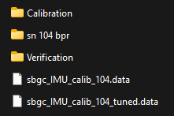

# PixelScout Shipping QC

## Artifact Locations in Taurus>Production

### Systems & Kits>21282-00 — PixelScout Phase 4

<figure><figcaption></figcaption></figure>

* Calibration Flight Files
  * Ensure files are present
* Verification Flight Files
  * Ensure files are present.
  * Open the file 'quicktile\_0.050m\_rgb\_dewarp.tif' from the '\_out' folder in QGIS and ensure it looks well-stitched.
    * Open QGIS and drag the file into the blank space



<figure><figcaption>
GOOD CALIBRATION
</figcaption></figure>



<figure><figcaption>
BAD CALIBRATION
</figcaption></figure>



* IMU Calibration Data (tuned and untuned)
* Optional: BPR Files

Calibration Files (Preferred but not required)

<figure><figcaption></figcaption></figure>

| File                                       | Description                                                                                   |
| ------------------------------------------ | --------------------------------------------------------------------------------------------- |
| Session                                    | Session folder of calibration flight                                                          |
| \_cal                                      | Files from calibration tool (includes offsets and new hw\_config)                             |
| \__cal\__&#x6F;ut (optional but preferred) | Quicktile files using calculated offsets to predict how well the verification flight will be. |
| \_out (optional but preferred)             | output of original quicktile before calibration or offsets are applied                        |
| _pix4d (and \_2nd for secondary cam)_      | pix4d files used in the calibration                                                           |
| info                                       | info folder from the camera                                                                   |
| .p4d file                                  | File generated during pix4d processing                                                        |

Verification Files

<figure><figcaption></figcaption></figure>

| Folder  | Description                                         |
| ------- | --------------------------------------------------- |
| Session | Session folder of verification flight               |
| \_out   | quicktile output                                    |
| info    | info folder from SD card during verification flight |

BPR Files

<figure><figcaption></figcaption></figure> <figure><figcaption></figcaption></figure>

Two folders per camera, one with the raw pictures, and one with the output files.

bpr\_map.csv is applied to camera to be used for BPR.

### Sensors>21030-XX — 65R>21030-04

<figure><figcaption></figcaption></figure>

* Focus Session Folder (Same as 65R 21030-02)
  * Optional to take a quick look at a few pictures to see the focus.
* Left, middle, and right target screenshots from the focus app (including right starting with 65R SN 022)&#x20;
  * Only need to make sure all 3 target screenshots are present.
* 'Numbers' file containing max, target, and ending focus scores.
  * Not required but optional to check final score percentages.
    * Above 96% required for middle
    * Above \~75% is required for sides (Prefer closer to 92% but not required)
* Refer to [1-pixelscout-65r-focusing.md](../../technical-instructions/pixel-scout/assembly-steps/1-pixelscout-65r-focusing.md "mention") for more context if desired.

What the screenshots look like

<figure><figcaption></figcaption></figure>

## Checking the Cameras

192.168.42.1 is the address for the Primary Camera

192.168.42.2 is the address for the Secondary Camera

1. plug in power and USB-C on the front of the gimbal
2. Open file explorer and navigate to 192.168.42.1
   1. If prompted, use the following username and password.
      1. Username: sentera
      2. Password: \[leave empty]
   2. Make sure there's no sessions on the camera.
   3. Ensure the hw\_config file has the correct serial number/part number.
   4. Ensure the hw\_config has calibration method set to pix4d and the 'rig\_relatives\_deg' values are set to values other than 0.
   5. Ensure the bpr.csb file exists in the 'info' folder.

SD Card Folder

<figure><figcaption></figcaption></figure>

Info Folder

<figure><figcaption></figcaption></figure>

hw_config file

<figure><figcaption></figcaption></figure>

3. Navigate to a web browser and go to 192.168.42.1
   1. Check all the pages to make sure they are agreeable with the following drop down menus.

Main

Primary

<figure><figcaption></figcaption></figure>

Secondary

<figure><figcaption></figcaption></figure>

Configuration

Primary:

<figure><figcaption></figcaption></figure>

Secondary:

<figure><figcaption></figcaption></figure>

Image Adjustment

Primary and Secondary are the same:

<figure><figcaption></figcaption></figure>

Diagnostics

Note: the Serial numbers will be different than pictured

The Connection status in the pictures shows both USB and Ethernet. One or both might say 'Disconnected'

Primary and secondary are the same:

<figure><figcaption></figcaption></figure>

Update Firmware

Primary and Secondary are the same

Current firmware version: 4.5.1

<figure><figcaption></figcaption></figure>

4. Repeat steps 2 and 3 using IP Address 192.168.42.2

## Checking the Case

Refer to [#final-packing](../../technical-instructions/pixel-scout/calibration-and-verification/case-packing.md#final-packing "mention") for a guide on packing the case. Ensure the case follows this guide correctly.

(in the future, may copy everything to this page.
