# PixelScout Shipping QC

## Required Software/Documents

* QGIS ([#qgis](../../space-and-general/software-installation-guide.md#qgis "mention"))
* Sales Order&#x20;
* Shipping Label
* Packing List
* Build

## Artifact Locations in Taurus>Production

### Systems & Kits>21282-00 — PixelScout Phase 4

Note: This process also checks **Sensors>21030-XX — 65R>21030-04**

* Navigate to PixelScout directory "<mark style="color:blue;">\as-taurus.jdnet.deere.com\Production\Systems & Kits\21282-00 -- PixelScout Phase 4\\###</mark>" where ### is the s/n of the PixelScout
* Ensure all sub-directories and files are present (NOTE: extra files may be present if irregularities were documented)
  * <mark style="color:blue;">Calibration</mark>
  * <mark style="color:blue;">Verification</mark>
  * <mark style="color:blue;">sbgc\_IMU\_calib\_phase4SN###.data</mark>
  * <mark style="color:blue;">sbgc\_IMU\_calib\_phase4SN###\_tuned.data</mark>
  * <mark style="color:blue;">sensor\_###</mark> (shortcut for primary sensor)
  * <mark style="color:blue;">sensor\_###</mark> (shortcut for secondary sensor)

<figure>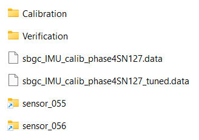<figcaption></figcaption></figure>

* Check within each sub-directory & shortcut

<mark style="color:blue;">Calibration</mark> (Preferred but not required)

* Two directories should be present: <mark style="color:blue;">###\_primary</mark>, <mark style="color:blue;">###\_secondary</mark>

<figure>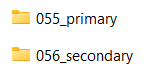<figcaption></figcaption></figure>

<mark style="color:blue;">Calibration\###_primary</mark> &#x26; <mark style="color:blue;">Calibration\###_secondary</mark>

* Each directory should contain the following files:
  * <mark style="color:blue;">\[session]</mark>
  * <mark style="color:blue;">\[session]\_cal</mark>
  * <mark style="color:blue;">\[session]\_cal\_out</mark>
  * <mark style="color:blue;">\[session]\_out</mark>
  * <mark style="color:blue;">\[session]\_pix4d</mark>
  * <mark style="color:blue;">info</mark>
  * <mark style="color:blue;">\[session]\_pix4d.p4d</mark>

<figure>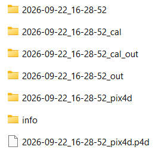<figcaption></figcaption></figure>

<mark style="color:blue;">Verification</mark>

* Two directories should be present: <mark style="color:blue;">###\_primary</mark>, <mark style="color:blue;">###\_secondary</mark>

<figure><figcaption></figcaption></figure>

<mark style="color:blue;">Verification\###_primary</mark> &#x26; <mark style="color:blue;">Verification\###_secondary</mark>

* Each directory should contain the following files:
  * <mark style="color:blue;">\[session]</mark>
  * <mark style="color:blue;">\[session]\_val\_out</mark>
  * <mark style="color:blue;">info</mark>

<figure>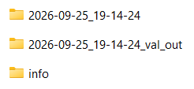<figcaption></figcaption></figure>

<mark style="color:blue;">Verification\###_primary\[session]_val_out</mark> &#x26; <mark style="color:blue;">Verification\###_secondary\[session]_val_out</mark>

* Open <mark style="color:blue;">QGIS</mark>
* Drag the '<mark style="color:blue;">quicktile\_0.050m\_rgb\_dewarp.tif</mark>' image into the blank space
* Ensure the image looks well-stitched (i.e. no jumps significantly bigger than 5 pixels/the width of a parking spot line)

<figure><figcaption>
GOOD CALIBRATION
</figcaption></figure> <figure><figcaption>
BAD CALIBRATION
</figcaption></figure>

* You may close <mark style="color:blue;">QGIS</mark> at this point leave it open for more QC-ing
  * If prompted to save, click '<mark style="color:blue;">Discard</mark>'

<figure>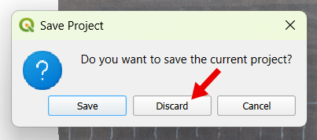<figcaption></figcaption></figure>

<mark style="color:blue;">sensor_###</mark> (Do this for both sensors)

* The directory should contain the following sub-directories and files:
  * <mark style="color:blue;">BPR\_###</mark>
  * <mark style="color:blue;">Focus</mark>
  * <mark style="color:blue;">bottom.jpg</mark>
  * <mark style="color:blue;">cap photo.jpg</mark>
  * <mark style="color:blue;">middle.jpg</mark>
  * <mark style="color:blue;">top.jpg</mark>

<figure>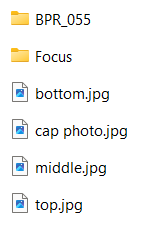<figcaption></figcaption></figure>

<mark style="color:blue;">sensor_###\BPR_###</mark> (Do this for both sensors)

* The directory should contain the following sub-directories and files:
  * <mark style="color:blue;">BPR\_###\_bad\_pixels</mark>
  * <mark style="color:blue;">img\_bayer\_bright\_##.tif</mark> (45, 100, 255)
  * <mark style="color:blue;">img\_bayer\_dark\_##.tif</mark> (0, 45, 100)

<figure><figcaption></figcaption></figure>

<mark style="color:blue;">sensor_###\BPR_###\BPR_###_bad_pixels</mark> (Do this for both sensors)

* The directory should contain the following sub-directories and files:
  * <mark style="color:blue;">bad\_pixel\_details.csv</mark>
  * <mark style="color:blue;">bad\_pixel\_mask.tif</mark>
  * <mark style="color:blue;">bpr\_map.csv</mark>
  * <mark style="color:blue;">image\_summary.csv</mark>
  *   <mark style="color:blue;">transient\_pixels.csv</mark>

      <figure>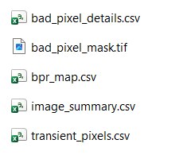<figcaption></figcaption></figure>

## Checking the Cameras

<mark style="color:blue;">192.168.42.1</mark> is the address for the Primary Camera

<mark style="color:blue;">192.168.42.2</mark> is the address for the Secondary Camera

1. plug in power (24V) and USB-C on the front of the gimbal
2. Open file explorer and navigate to <mark style="color:blue;">\\\192.168.42.1</mark>
   1. If prompted, use the following username and password.
      1. Username: sentera
      2. Password: \[leave empty]
   2. Make sure there's no sessions in <mark style="color:blue;">\\\192.168.42.1\data\snapshots</mark>
   3. Open <mark style="color:blue;">\\\192.168.42.1\sdcard\info\hw\_config.yaml</mark>
   4. Ensure the <mark style="color:blue;">hw\_config.yaml</mark> file has the correct serial number/part number.
   5. Ensure the <mark style="color:blue;">hw\_config.yaml</mark> has calibration method set to pix4d and the 'rig\_relatives\_deg' values are set to values other than 0.
   6. Ensure the <mark style="color:blue;">bpr\_map.csv</mark> file exists in the '<mark style="color:blue;">info</mark>' folder.

SD Card Folder

<figure><figcaption></figcaption></figure>

Info Folder

<figure><figcaption></figcaption></figure>

hw_config file

<figure><figcaption></figcaption></figure>

3. Navigate to a web browser and go to <mark style="color:blue;">192.168.42.1</mark>
   1. Check all the pages to make sure they are agreeable with the following drop down menus.

Main

Primary

<figure><figcaption></figcaption></figure>

Secondary

<figure><figcaption></figcaption></figure>

Configuration

Primary:

<figure><figcaption></figcaption></figure>

Secondary:

<figure><figcaption></figcaption></figure>

Image Adjustment

Primary and Secondary are the same:

<figure><figcaption></figcaption></figure>

Diagnostics

Note: the Serial numbers will be different than pictured

The Connection status in the pictures shows both USB and Ethernet. One or both might say 'Disconnected' depending on how you are connected.

Primary and secondary are the same:

<figure><figcaption></figcaption></figure>

Update Firmware

Primary and Secondary are the same

Current firmware version: <mark style="color:blue;">4.8.1</mark>

<figure>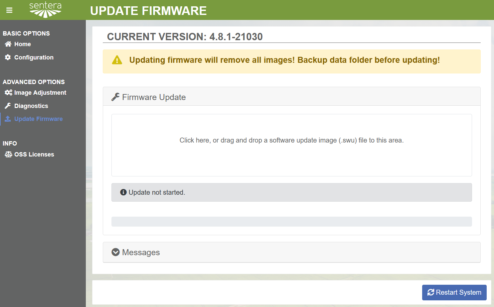<figcaption></figcaption></figure>

4. Repeat steps 2 and 3 using IP Address <mark style="color:blue;">192.168.42.2</mark>

## Checking the Case

Refer to [#final-packing](../../technical-instructions/pixel-scout/calibration-and-verification/case-assembling-and-packing.md#final-packing "mention") for a guide on packing the case. Ensure the case follows this guide correctly.

(in the future, may copy everything to this page.)

## Label Check

* Check each label

Sensor Unit (3 Labels)

* One label on each 65R Sensor
  * Primary should have the lower S/N

<figure>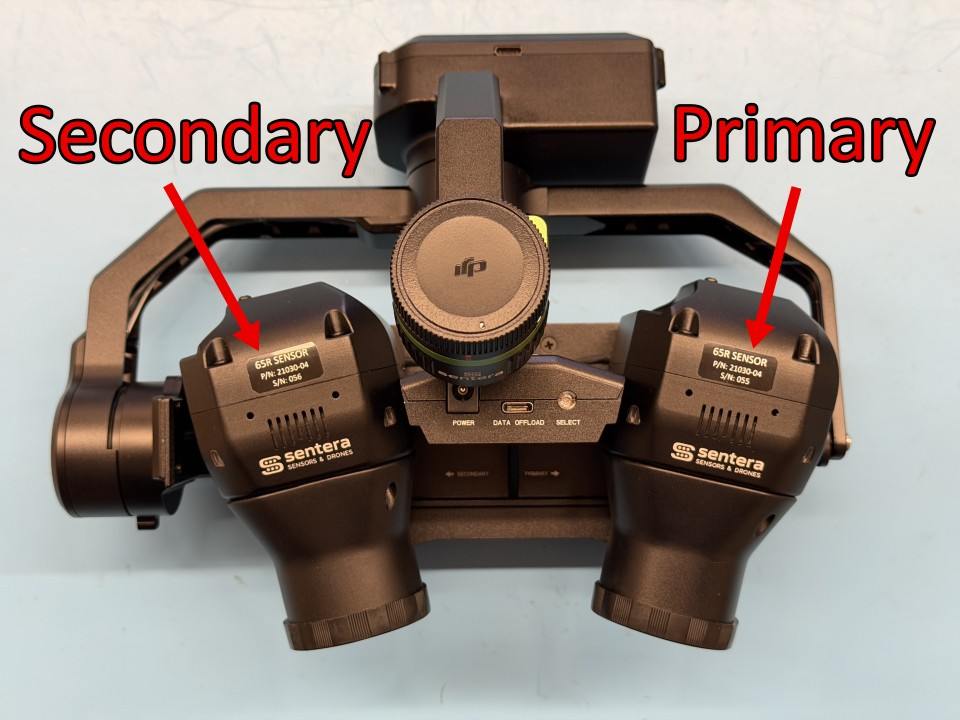<figcaption></figcaption></figure>

* One label on the bottom of the sensor unit (facing up when in the case)
  * Ensure the S/N is correct

<figure><figcaption></figcaption></figure>

Dual Antenna (2 Labels)

* One label on the back cover of the Dual Antenna
  * Ensure the S/N is correct
  * Radio Net ID: 32011-10### where ### is the PixelScout S/N

<figure>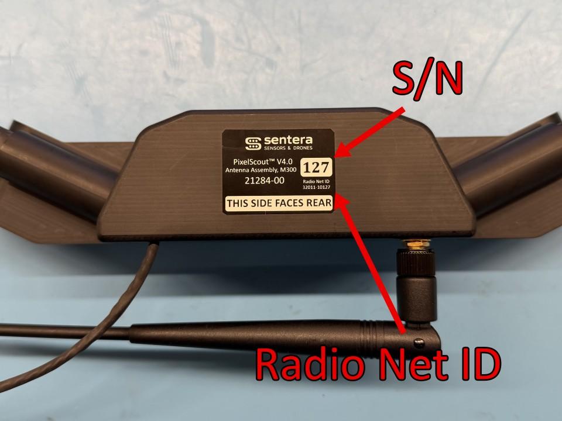<figcaption></figcaption></figure>

* One label between indicator LEDs and Ethernet port

<figure>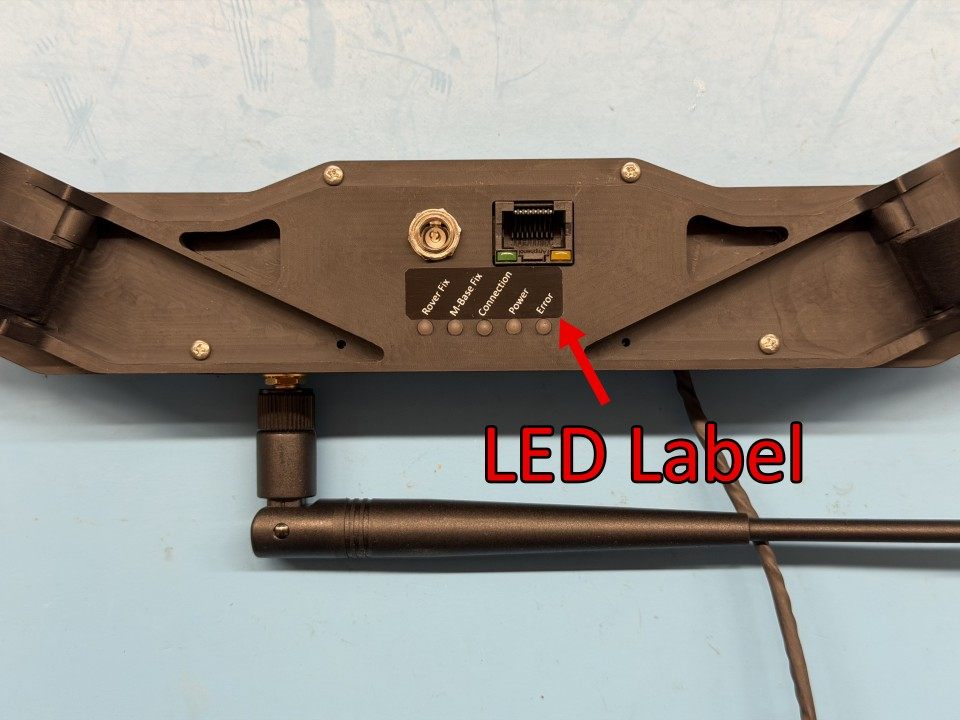<figcaption></figcaption></figure>

Emlid (1 Label)

* One label on the Emlid above the power button
  * Ensure the S/N is correct

<figure>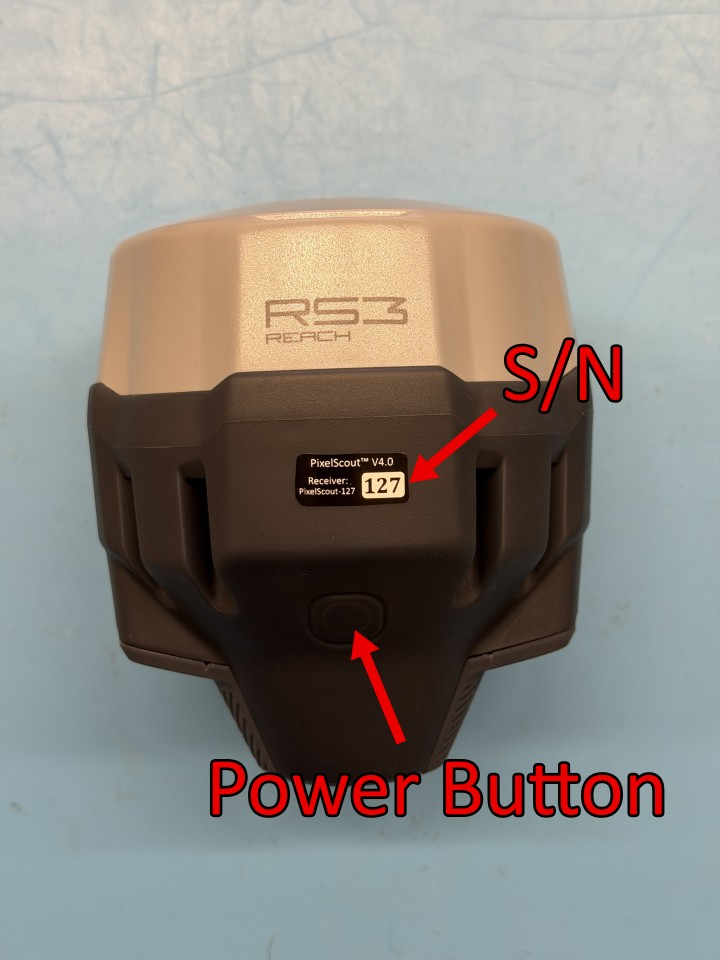<figcaption></figcaption></figure>

Base Station (2 Labels)

* Large RTK/PPK label
  * LED holes should line up on the bottom of the large Label
* Small PixelScout label
  * Ensure S/N is correct
  * Radio Net ID: 32011-10### where ### is the PixelScout S/N
  * Sticker should be right-side-up when attached to the tripod (as seen below)

<figure><figcaption></figcaption></figure>

