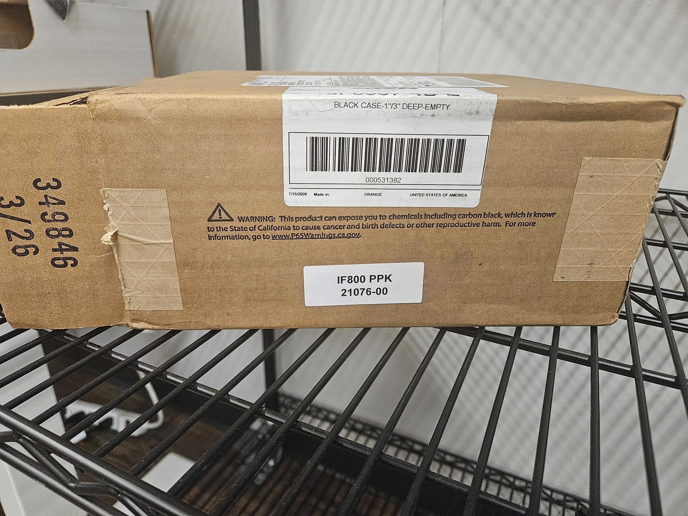

# 🚧 RTK/PPK Shipping QC

## Documents Needed

1. Sales Order&#x20;
2. Shipping Label
3. Packing List
4. Build

## QC

* Go to the QC rack with your computer&#x20;

### Taurus Files

1. Go to this file location in Taurus
   1. \as-taurus.jdnet.deere.com\Production\Systems & Kits\21077-XX -- RTK PPK Module
2. Locate number of Module being shipped&#x20;
3. Should have 3 files, check each file below
   1.

       <figure><figcaption></figcaption></figure>

### NTRIP Hand Controller

1. Click into "NTRIP Hand Controller Folder"
   1. Click into the session folder&#x20;
   2. Confirm 3 files
      1. RGB folder, Sentera GNSS, and Sentera Timestamp
   3.

       <figure><figcaption></figcaption></figure>

### Reach RS2+ Base Station

1. Click into "Reach RS2+ Base Station"
   1. Click into Sesson folder&#x20;
   2. Confirm 3 files&#x20;
      1. RGB folder, Sentera GNSS, and Sentera Timestamp
   3.

       <figure><figcaption></figcaption></figure>

### Taurus Files "SN# PDF"

1. Click into "SN# PDF"
   1. Open PDF with Google Chrome
2. Confirm information on the file is correct&#x20;
   1. All sections should be filled the same way as the example PDF&#x20;
   2. For both sections (NTRIP and Base Station)
      1. Confirm GPS type is: RTK Fixed&#x20;
      2. Confirm Verification: Time Sync Present



### IF800 Case Kit Check

1. IF800 Kit, confirm items in plastic bags according to the following.
   1. IF800 Large Bag (5x10)
      1. 1x 1.5’ USB-C to USB-C Cable
      2. 1x 3’ USB-C to USB-A Cable
      3. 1x 6” Antenna Cable
      4. 1x 4” USB-C to USB-A 90-degree cable
      5. 1x Leg Cable Clip
   2. IF800 Small Bag&#x20;
      1. 1x Alcohol Wipe
      2. 1x Mini Slotted Screwdriver
      3. 1x Adhesive-backed Cable Clip
   3. Check labels&#x20;
      1. Check SN on Air&#x20;
      2. Radio Net ID on both Air and ground modules should be the same
2. Final Case Assembly



<figure><figcaption></figcaption></figure>




<figure><figcaption></figcaption></figure>



### IF1200 Case Kit Check

1. IF1200 Kit, confirm items in plastic bags according to the following
   1. IF1200 Large Bag (5x10)
      1. 1x 3’ USB-C to USB-C Cable
      2. 1x 3’ USB-C to USB-A Cable
      3. 1x 18” Antenna Cable with Bracket (Build bracket as shown below before packing)
      4.

          <figure><figcaption></figcaption></figure>
      5. 1x 4” USB-C to USB-A 90-degree cable
      6. 2x Leg Cable Clip
   2. IF1200 Small Bag
      1. 1x Alcohol Wipe
      2. 1x Mini Slotted Screwdriver
      3. 2x Adhesive-backed Cable Clip
      4. 1x 3mm Hex L-key
   3. Check labels&#x20;
      1. Check SN on Air&#x20;
      2. Radio Net ID on both Air and ground modules should be the same
2. Final Case Assembly



<figure><figcaption></figcaption></figure>



<figure><figcaption></figcaption></figure>



### Address Confirmation

1. Confirm the shipping label is the same as the address on the sales order
2. Confirm Tracking number is the same on the Packing List&#x20;
3. Correct any issues that appear&#x20;

### Ship Package

1. Place plastic bag around case
2. Place Packing List, support book, and sticker on top of the case inside the plastic bag
3. Put case in the box&#x20;
4. Close up box
5. Tape around edges&#x20;
6. Tape/stick-on label to the box&#x20;
7. Use labels on both sides of the box to identify if it is IF800 or IF1200 to all sides&#x20;
   1.

       <figure><figcaption></figcaption></figure>
8. Place in the shipment zone
