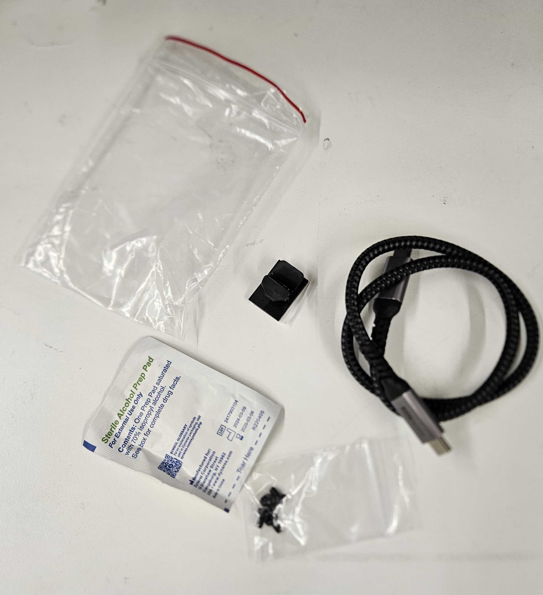
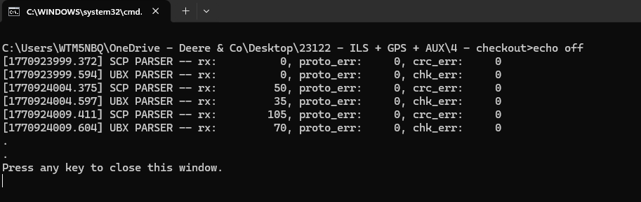

# Pre-Shipment Set-Up

## Complete build

1. Complete the build to assembly the case. This will include the pamphlet, all cables and accessories.
2. Once parts are pulled from inventory, Put the accessories in the case&#x20;
3. There should be 2 Small Red Lined bags, First bag includes (Bag A)
   1. 2 gray USB-A to C Adapters&#x20;
   2. 1 black USB-C to C @ 90 degree Adapter

<figure><figcaption></figcaption></figure>

4. Second Bag includes (Bag B)
   1. Small USB-C to C cable&#x20;
   2. Sterile Wipe&#x20;
   3. Screws&#x20;
   4. Cable mount

<figure><figcaption></figcaption></figure>

4. Put all components in place (review picture below)

<figure><figcaption></figcaption></figure>

### Light Sensor

1.  &#x20;Complete the build to pull a light sensor&#x20;

    1. Plug in light sensor with USB-C cable&#x20;
    2. Open the 23122 file -> Checkout

    <figure><figcaption></figcaption></figure>

    1. Change the CFG file to the correct COM port (open device manager->ports)
    2. Run the Cummunication program
    3. Screenshot the results once the program is finished

    <figure><figcaption></figcaption></figure>

    e. Save the screenshot in the light sensor SN # and label it communication\_Ship

<figure><figcaption></figcaption></figure>

### Reflectance Panel

1. Complete the build for Reflectance Panel&#x20;
   1. Locate your Sales Order Number&#x20;
   2. Move the Reflectance panel number into that sales order&#x20;
   3. Pull that number refectance panel from inventory&#x20;

<figure><figcaption></figcaption></figure>

## Printing the Label&#x20;

1. On your personal Laptop, open SOS and locate your sales order
2. Print Sales Order if not done already
   1. Click dropdown -> PDF and print
3. Go to printing laptop with the Sales order Information
4. Enter in address and package information,
   1. Enter in full shipping address
   2. Enter in number of packages, weight, and dimensions
   3. Enter in Account number and bill to specified person (Ex: 3rd party)
   4. Enter in email address and turn on notifications for customers
5. Confirm everything is correct and print the label

## Moving Sales Order to Shipment

1. In Sales -> Sales Orders (SO), locate your SO# for your build&#x20;
2. Click the dropdown button and click on <mark style="color:blue;">Create Shipment</mark>
3. Enter in the carrier (EX: FedEx, UPS)
4. Enter in the tracking number&#x20;
5. Enter in the Serial number for item being shipped
6. Go back to your personal computer
7. Select your name for QA check
8. Click <mark style="color:blue;">Save and Close</mark>&#x20;

## Shipment

1. In SOS, go to Fulfillment -> Shipment&#x20;
2. Locate your Sales Order&#x20;
3. Click the dropdown -> PDF and print&#x20;

## Organization&#x20;

1. Collect the Sales Order, Packing List and builds&#x20;
   1. Builds include -> light sensor to camera, reflectance panel to sales order, and case components &#x20;
2. Place all papers and shipping label under the Case for Final QC
