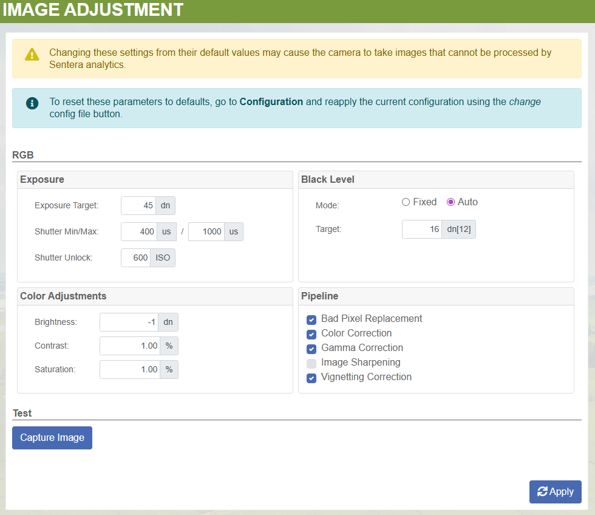

# PixelScout Shipping QC

## Artifact Locations in Taurus>Production

### Systems & Kits>21282-00 — PixelScout Phase 4

<figure><figcaption></figcaption></figure>

* Calibration Flight Files
  * Ensure files are present
* Verification Flight Files
  * Ensure files are present.
  * Open .tif file from '\_out' folder in QGIS and ensure it looks well-stitched.
* IMU Calibration Data (tuned and untuned)
* Optional: BPR Files

Verification Flight Files

<figure><figcaption></figcaption></figure>

| Folder  | Description                                         |
| ------- | --------------------------------------------------- |
| Session | Session folder of verification flight               |
| \_out   | quicktile output                                    |
| info    | info folder from SD card during verification flight |

BPR Files

<figure><figcaption></figcaption></figure>

bpr\_map.csv is applied to camera to be used for BPR.

### Sensors>21030-XX — 65R>21030-04

<figure><figcaption></figcaption></figure>

* Focus Session Folder (Same as 65R 21030-02)
* Left, middle, and right target screenshots from the focus app
* 'Numbers' file containing max, target, and ending focus scores.

## Checking the Cameras

192.168.42.1 is the address for the Primary Camera

192.168.42.2 is the address for the Secondary Camera

1. plug in power and USB-C on the front of the gimbal
2. Open file explorer and navigate to 192.168.42.1
   1. If prompted, use the following username and password.
      1. Username: sentera
      2. Password: \[leave empty]
   2. Make sure there's no sessions on the camera and the logs folder is empty.
   3. Ensure the hw\_config file has the correct serial number/part number.
   4. Ensure the hw\_config has calibration method set to pix4d and the 'rig\_relatives\_deg' values are set to values other than 0.
   5. Ensure the bpr.csb file exists in the 'info' folder.
3. Navigate to a web browser and go to 192.168.42.1
   1. Check everything you would normally for a 65R
   2. Check the image adjustment tab for correct settings (BPR should be enabled)
4. Repeat steps 2 and 3 using IP Address 192.168.42.2

<figure><figcaption></figcaption></figure>
