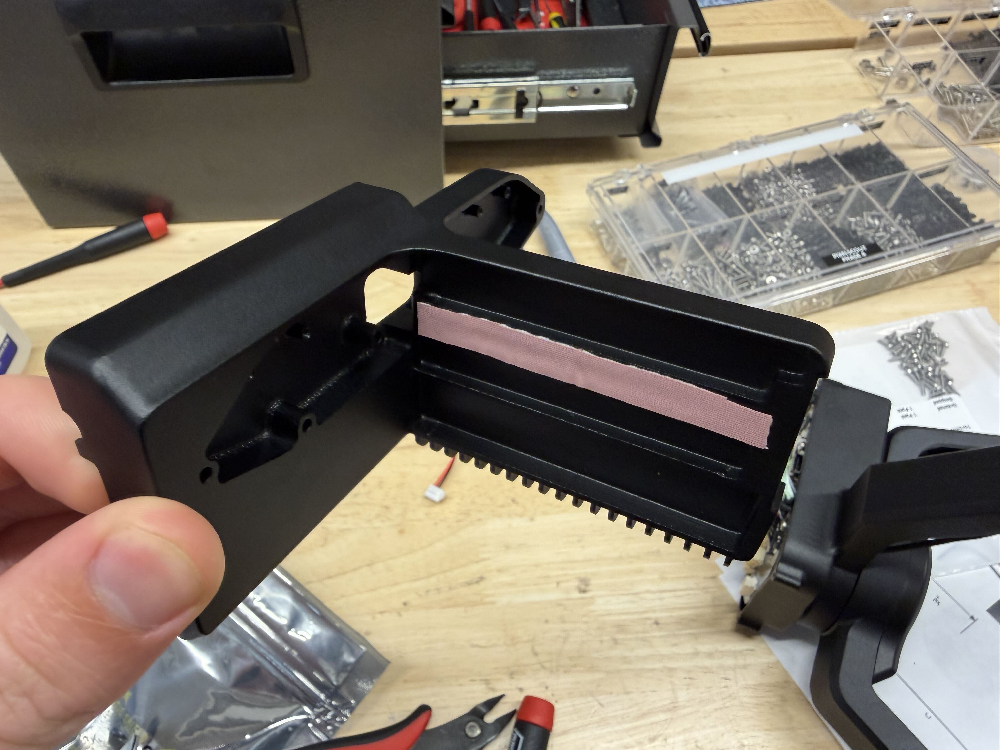
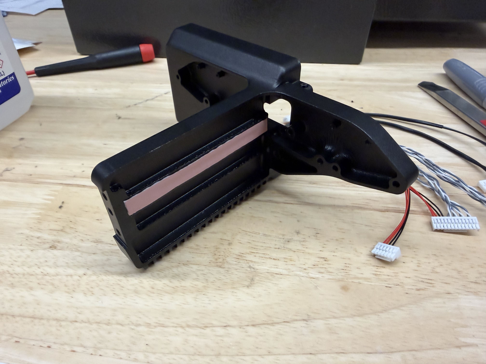
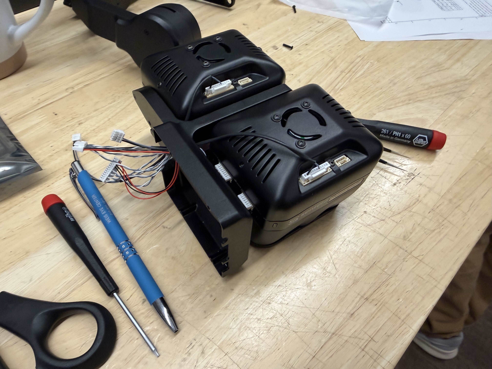
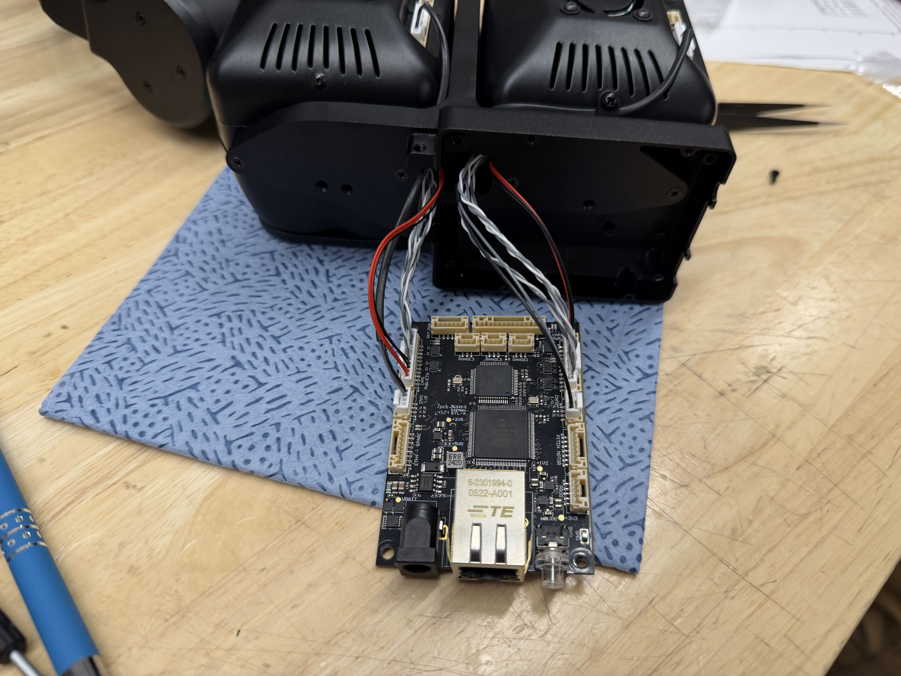

# 📷 Camera Pod

## Required Materials

| Loctite | Thermal Tape |   |
| ------- | ------------ | - |
|         |              |   |
|         |              |   |

## Notes:

This guide doesn't completely finish the camera pod. It is finished in the full assembly guide. The things that are missing from this guide are: securing the dual comms board and attaching the cover to the pod.

## Guide:

1. Apply thermal tape to both sides of the camera mount as shown

<figure><figcaption></figcaption></figure> <figure><figcaption></figcaption></figure>

2. Connect the cables to the cameras. Note: The **longer** cables pair with the **front** camera (Multispectral)

<mark style="color:red;">picture here</mark>

3. Feed the wires through the opening of the mount. Route them to avoid pinching.

<figure><figcaption></figcaption></figure>

4. Secure the cameras to the mount using 6 screws (3 per camera) (<mark style="color:yellow;">96640A298 2-56 x 7/16" Flat Head, Black</mark>)

<mark style="color:red;">picture here</mark>

5. Secure the cable to the front camera using the clip and screw.
   1. Clip: 25422-00
   2. Screw: <mark style="color:yellow;">91255A076 2-56 x 3/16" Button Phillips Black</mark>

<figure><figcaption></figcaption></figure>

6. Connect the cables to the 22139 Dual Comms board as shown. The Primary camera (rear: Thermal Pro) plugs into the camera 1 positions.

<figure><figcaption></figcaption></figure>

7. Do not secure the dual comms board to the camera pod until after the green micro coax cable is connected in the full assembly guide.

[full-assembly.md](full-assembly.md "mention")

8. Secure the Gimbal Pivot bracket to the outside of the pod using 4 screws:
   1. <mark style="color:yellow;">2 x 91698A302 M3x6mm Flat head black</mark> into the pod
   2. <mark style="color:yellow;">2 x 91253A076 2-56 x 5/32" Flat head black</mark> into the cameras
   3. It is easiest to start the M3x6 screws first, then start the 2-56 screws. then tighten everything.

<mark style="color:red;">picture here</mark>
