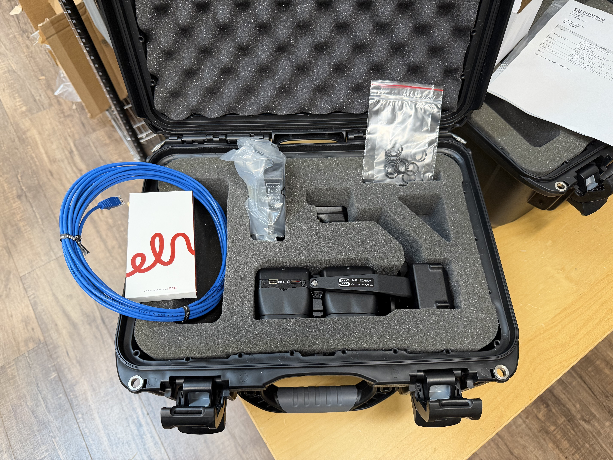

# Case Assembly

<figure><figcaption></figcaption></figure>

Organize all components in the following manner, shown above:

* Main Pocket:
  * 6X Array Assembly
* Left Pocket:&#x20;
  * 160019-COLOR-20: Cat6 Ethernet Cable
  * B07VT6R6VY: USB C to Ethernet Adapter
* Top Middle Pocket:
  * SWI36-24-N-P5: Wall Mount AC Adapter (24V)
* Top Right Pocket:
  * 2 x 12 ct bags of Rubber O-Rings (24218T121 or 2418T121)
