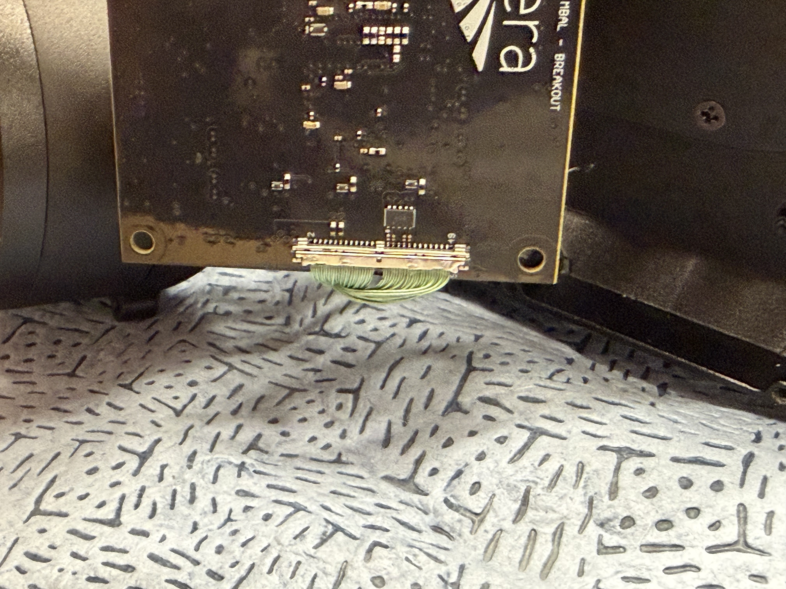
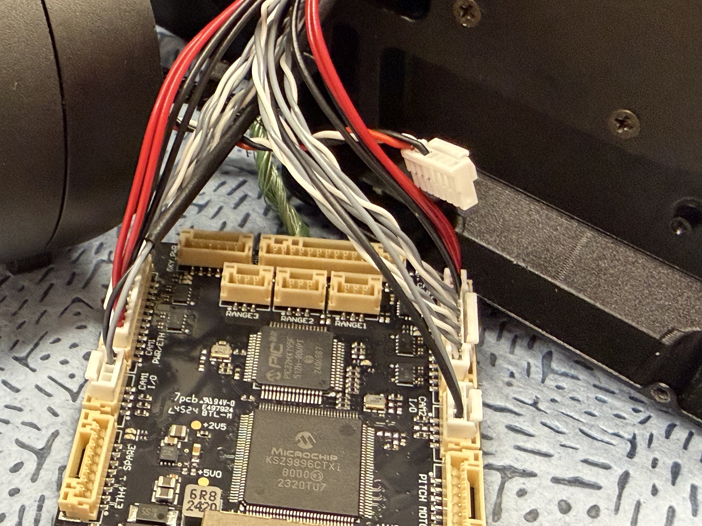
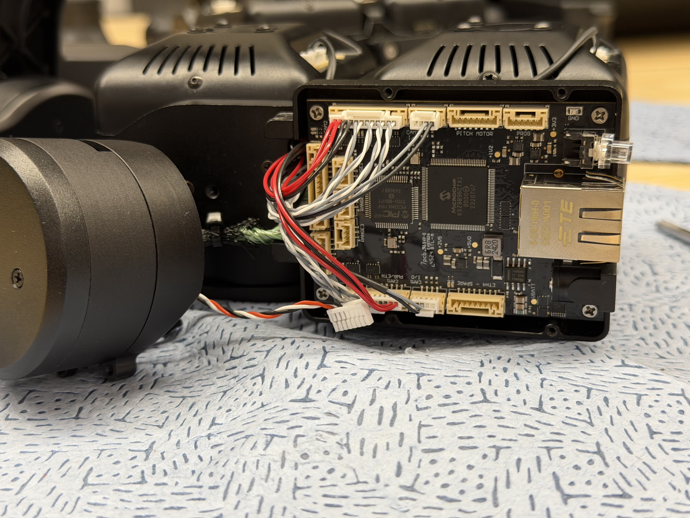
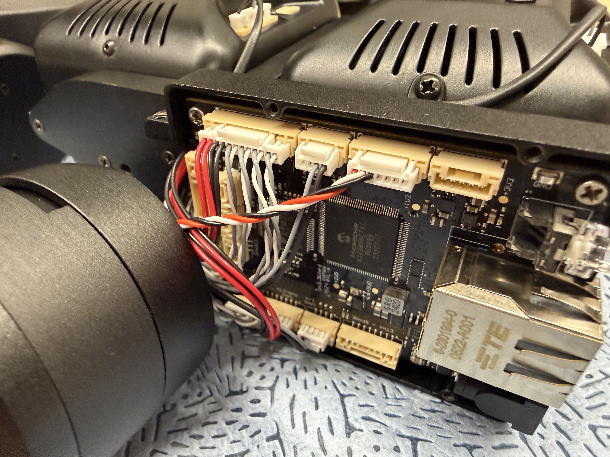
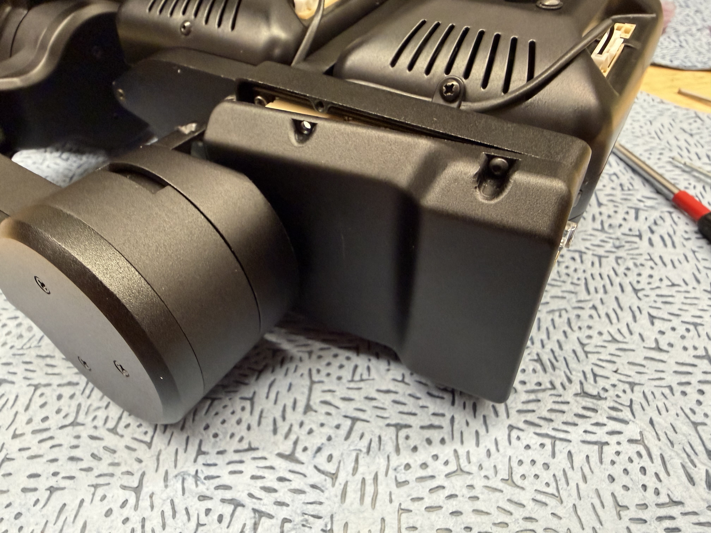
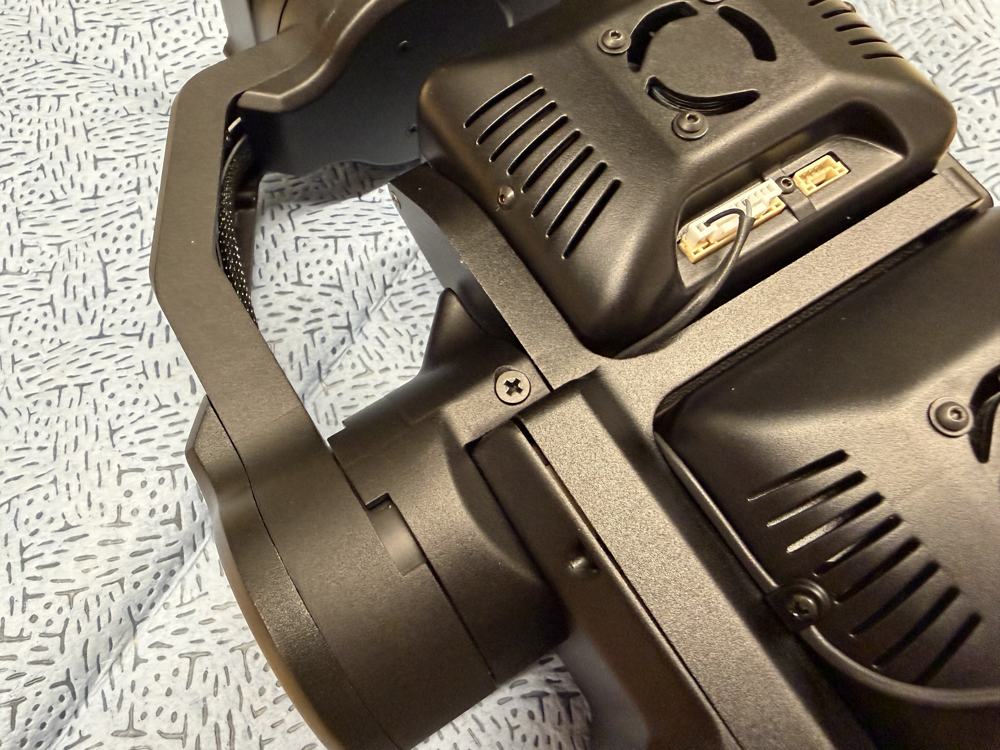
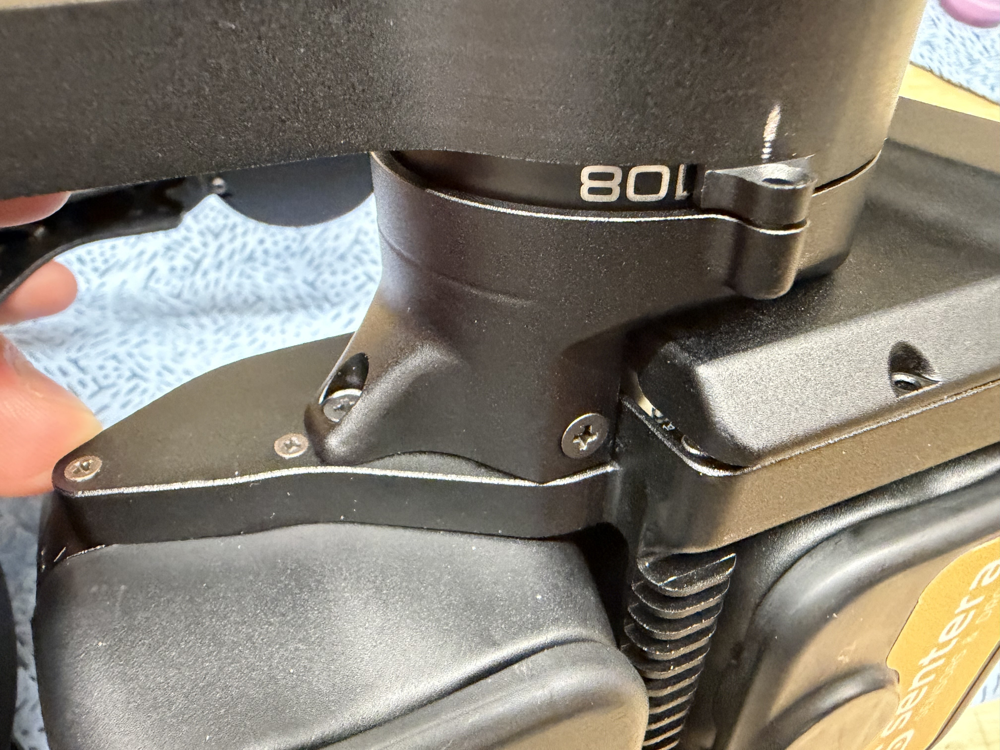
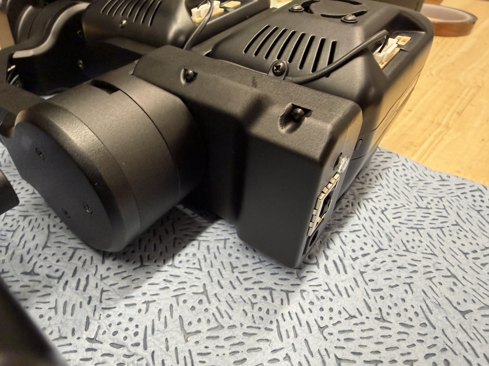
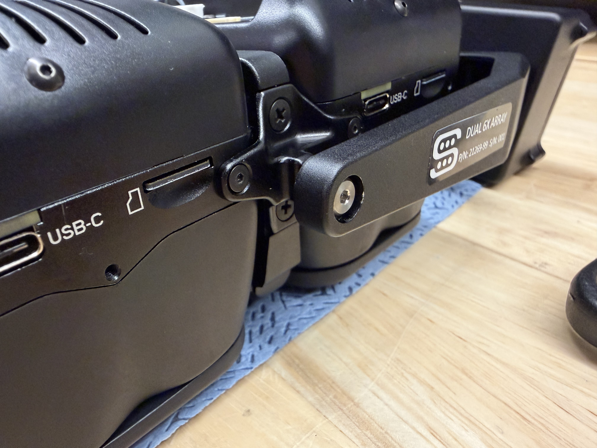

# 🚧 Full Assembly

## Notes

## Guide

1. Program the front board (dual comms)
   1. [#front-board-dual-comms](board-programming.md#front-board-dual-comms "mention")
2. Attach the green micro-coax cable to the back-side of the dual comms board.

<figure><figcaption></figcaption></figure> <figure><figcaption></figcaption></figure>

3. Secure the board to the camera pod with the ethernet and power ports facing forward. Use 4 screws (<mark style="color:yellow;">94017A101, M2x4mm Narrow Cheese Head</mark>) and Loctite.

<figure><figcaption></figcaption></figure>

4. Connect the pitch motor encoder to the board. The camera pod may have to be almost completely in place for the cable to reach. Be careful to not put too much strain on the cable

<figure><figcaption></figcaption></figure>

5. Place the cover over the dual comms board and lightly secure with one screw (<mark style="color:yellow;">91239A701 M2x5mm Button Head Black</mark>) and Loctite. DO NOT FULLY TIGHEN

<figure><figcaption></figcaption></figure>

6. Line up and secure the camera pod onto the gimbal. It may be easiest to line up and secure the top screw first and then the other two. Ensure no wires are pinched in this process.
   1. <mark style="color:yellow;">91698A307 M3x6mm Flat head Black</mark>

<figure><figcaption></figcaption></figure> <figure><figcaption></figcaption></figure>

7. Secure the cover to the camera pod using 3 more screws and Loctite. Tighten all 4 screws.

<figure><figcaption></figcaption></figure>

8. Secure the other side of the gimbal to the camera pod using the shoulder screw and bearing from the BOM with Loctite.
   1. Shoulder Screw: <mark style="color:yellow;">90337A165 1/8" Shoulder, 4-40</mark>
   2. Bearing: <mark style="color:yellow;">57155K329 Ball Bearing, 0.125 ID 0.25 OD</mark>

<figure><figcaption></figcaption></figure>
