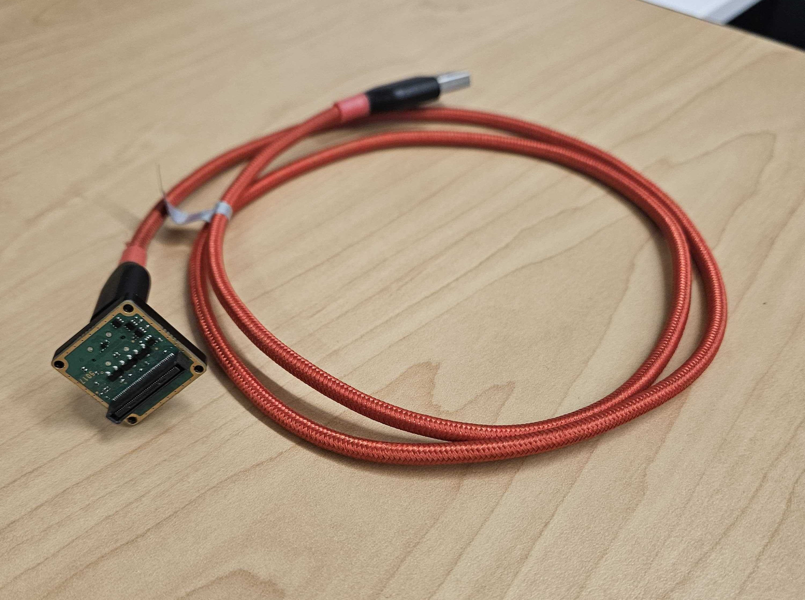

# 📷 6XT/6XTP Front Half&#x20;

## Equipment Needed

| UV Bonding Glue | Tweezers               |
| --------------- | ---------------------- |
| Curing Box      | Purple Loctite 222     |
| 6X Screw Bin    | Loctite 401            |
| Screw Driver    | Blue towels            |
| 1.5 x 50 Hex    | Production Shroud Jig  |

## Notes


These instructions are for 6X Thermal (21216-02 and 21216-03).&#x20;

For Regular 6X visit [.](./ "mention")


## Guide

1. Layout filters in their respective positions
   1. Ensure the positions are correct during installation&#x20;
   2. <mark style="color:red;">(Insert picture for positions)</mark>
2. Remove the filter from packaging and ensure it is free from all debris, damage, and prints.
   1. Orient the filter with the lettering facing down as shown. This is how it will be installed in the lens mount.

>  (1) (1) (1).png>)    (1) (1) (1) (1) (1) (1).png>)

3. Place the filter in the corresponding position on the lens mount.
   1. Secure the filter with 3 contact points of UV glue on the very edge of the lens.
   2.

       <figure><figcaption></figcaption></figure>
   3.

       <figure><figcaption></figcaption></figure>
   4. Once all the lens have 3 contact points with the UV bonder, place in the curing box for at lease 10 minutes
4. In Boson App Confirgure the FLIR Sensor

CONFIGURE THE FLIR SENSOR BEFORE INSTALLATION

1. Install BosonApp\_V3.0.0\_x64drivers.msi
   1. \as-taurus.jdnet.deere.com\Production\Technical Packages\6X SENSOR\IN PROGRESS\6X SENSOR - Technical Data Package - 260302\6X SENSOR - PROGRAMMING\FLIR Boson\GUI
2. Connect the FLIR Boson VPC adapter to the back of the thermal sensor
3. Connect the USB cable between the PC and the VPC adapter
   1.

       <figure><figcaption></figcaption></figure>

>  (1) (1) (1) (1).png>)    (1) (1) (1) (1).png>)&#x20;


6XTP will not have an adapter, but the process is the same


4. Open the FLIR Boson App
5. In the lower right corner of the window, click the “<mark style="color:blue;">Port</mark>” dropdown and select the COM port for the thermal sensor
   1. If the thermal sensor is the only USB device used, there will only be one COM port
   2. The correct COM port can also be viewed in the device manager
6. The “Boson Link” status should show connected
7. Click the “<mark style="color:blue;">Image Appearance</mark>” button on the left column of options
8. Click on the “<mark style="color:blue;">Analog/CMOS</mark>” video controls section
   1. Under the video section, click the “<mark style="color:blue;">CMOS</mark>” checkbox
   2. Under the configure section, set video source to “<mark style="color:blue;">TLinear</mark>”. The Output should be “<mark style="color:blue;">TLinear</mark>”
   3. Under the CMOS & USB telemetry section, turn “<mark style="color:blue;">CMOS Enable</mark>” on
   4. Under the CMOS & USB telemetry section, set the “<mark style="color:blue;">Mode</mark>” drop down to “<mark style="color:blue;">Header</mark>”
9. Click on the “<mark style="color:blue;">System</mark>” button on the column on the left column of options
   1. Under the “<mark style="color:blue;">Configuration Controls</mark>” section, click “<mark style="color:blue;">Save Power-On Defaults</mark>”
10. Disconnect the sensor and close the GUI

5. Secure the thermal camera to the lens mount.
   1. Apply thread locker to screws <mark style="color:yellow;">Item 49 (92010A783)</mark> before installation.
   2. Ensure the thermal camera is oriented as shown.

>  (1) (1).png>)    (1).png>)

6. Install the cover spacer
   1. Apply thread locker to the screws <mark style="color:yellow;">Item 27 (91772A063)</mark>


Install spacer before lens as the spacer will not fit when they are installed prior


<figure><figcaption></figcaption></figure>

7. Install the lockring included with each 8mm lens. Repeat for all 4 lenses.&#x20;
   1.

       <figure><figcaption></figcaption></figure>
8. Install the lock ring onto the 7.2mm lens.
   1.

       <figure><figcaption></figcaption></figure>
9. Install each of the lenses in the lens mount in their corresponding positions.
   1.

       <figure><figcaption></figcaption></figure>
10. Remove Kapton tape from all 3 of the imagers

    > .png>)    
    >

11. Place the monochrome (right and left) and HD/mono (middle) imagers in the lens mount.
    1. Monochrome imagers (right and left)&#x20;
       1. The writing above the connector should be facing up.&#x20;
    2.

        <figure><figcaption></figcaption></figure>
    3. HD/mono imager (middle)
       1. The arrow should be facing up
    4.

        <figure><figcaption></figcaption></figure>
12. Secure the imager boards
    1. Apply thread locker to the screws <mark style="color:yellow;">Item 20 (91771A165)</mark>
    2. Do not secure the corners
    3.

        <figure><figcaption></figcaption></figure>
13. Secure the diffusers in each corner using screws <mark style="color:yellow;">Item 21 (91772A065)</mark> with thread locker applied&#x20;
    1. See orientation in images below

> .png>)   .png>)

14. Attach the front assembly and rear assembly together.&#x20;
    1. A “click” will be felt when the imager connectors interface with the baseboard.
    2. Make sure there is no SD card in the 6x sensor during this step.
    3.

        
<figure><figcaption></figcaption></figure>

15. Secure the front and back of the sensor together.
    1. Apply thread locker to each screw <mark style="color:yellow;">Item 26 (91772A073)</mark>
    2.

        <figure><figcaption></figcaption></figure>

## Shroud Assembly&#x20;


The shroud will be attached after Focusing Step&#x20;


1. Grab the Production Shroud Jig
2. Place the production lid under the shroud for your build&#x20;
   1. Use the production jig to ensure the magnets are installed with required polarity
3. Install four .188” magnets to the body of the shroud
   1. Secure magnets in place with Loctite 401
   2. Once the Loctite cures, use a second layer of Loctite 401 to ensure magnets stay in place
   3.

       <figure><figcaption></figcaption></figure>
4. Place the production body of the shroud under the lid for your build&#x20;
5. Install two .188" magnets and two .250 magnets on the lid of the shroud
   1. Secure magnets in place with Loctite 401
   2. Place the Sentera Sticker over the magnets&#x20;

>  (1).png>)    (1) (1) (1) (1) (1).png>)

6. Insert spacers&#x20;
   1. For 6XT -> loctite (401) the spacer on the inside of the shroud
   2. For 6XTP -> Loctite (401) the spacer on the outside of the shroud. Take not of where the gap is.&#x20;
   3. <mark style="color:red;">(Insert pictures)</mark>
