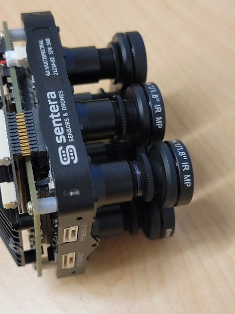
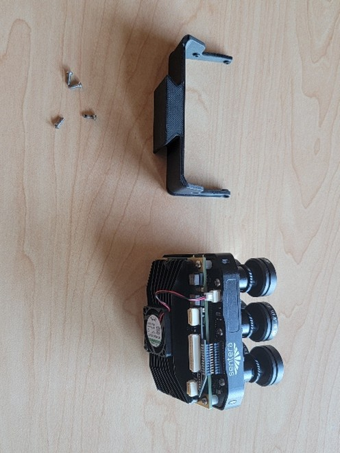
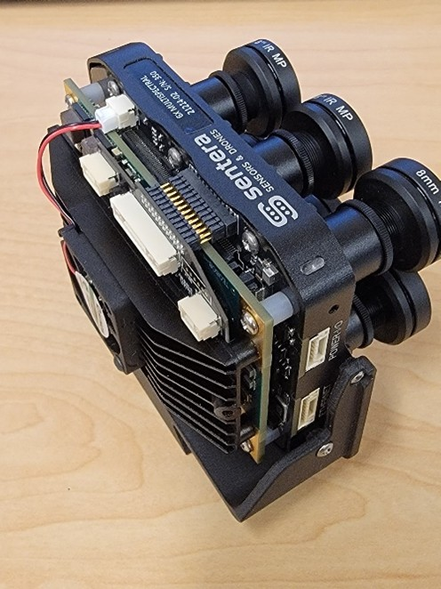
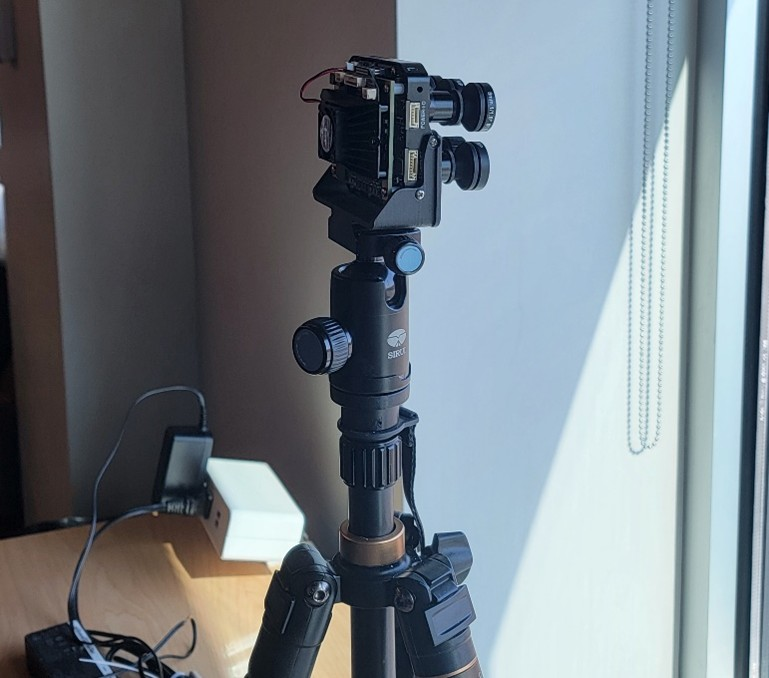
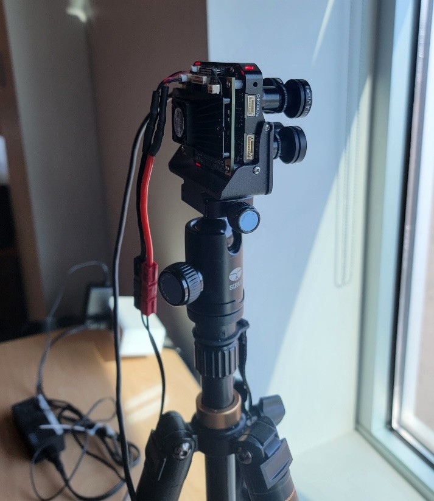

# 🚧 6X Focusing

## Equipment Needed

<table data-header-hidden><thead><tr><th></th><th width="185"></th><th></th></tr></thead><tbody><tr><td>6X</td><td>Focusing Table</td><td>Tripod</td></tr><tr><td>Focusing Jig</td><td>2-56 .250" Screws</td><td>Philips Screwdriver</td></tr><tr><td>6X Power Supply</td><td>USB C Cable</td><td>Windows Computer</td></tr><tr><td>Loctite 222</td><td>Toothpicks</td><td>Disposable Tray</td></tr></tbody></table>

## Set up

1. Obtain the 6X technical package, this requires access to taurus
2. open File Explorer on the Windows Device and navigate to "\as-taurus.jdnet.deere.com\Production\Technical Packages\6X SENSOR"
3. copy the latest released 6X technical package and paste it onto the Windows Machine locally
4. unzip the technical package and save the unzipped folder on the desktop
5. obtain irfanview software software from www.irfanview.com
6.  Set up the focusing station, here is an example:\
    \
    \
    This station is set up with all of the items listed in Tools and Materials. The Tripod should be facing a landscape that has features at roughly 50 and 400 feet that can be used to determine if the image is in focus. Use the image standards within the Technical Package as an example.

    <figure><figcaption></figcaption></figure>

&#x20;

## Focusing Process

1.  Start by applying Loctite

    <figure><figcaption></figcaption></figure>

    1. Place a small dab of Loctite on the threads of one of the lenses
    2. Rotate the lens and repeat until there is Loctite all the way around the threads
    3. Use about as much Loctite as needed to fill two threads
2. Thread the lockrings so that they also get Loctite in the threads and then back them back out. This is so that the lockrings are also held in place by Loctite. Only perform this step on the monochrome lenses. The RGB lens has a plastic lock ring, so avoid getting Loctite inside of this lock ring's threads.
3.  Use the screws to mount the 6x onto the focusing mount as shown:

    
<figure><figcaption></figcaption></figure> <figure><figcaption></figcaption></figure>

4.  With the 6x attached, place the focusing mount onto the tripod as shown:

    <figure><figcaption></figcaption></figure>

    Tighten the Tripod so that the 6x does not move freely using the dial on the tripod.
5.  Plug the USB C cable and then the power cable into the 6x as shown:

    <figure><figcaption></figcaption></figure>

6. log into the computer and plug the USB C cable into it.
7. it ma

