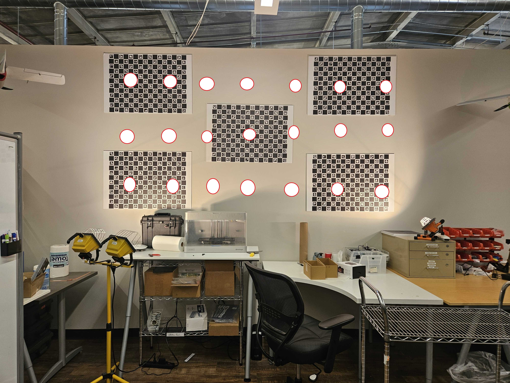

# 6X Pixel Alignment&#x20;

## Equipment Needed

|     Tall Tripod     | 12v 6x power supply |
| :-----------------: | :-----------------: |
| Tripod Camera Mount |     USB-C cable     |
|       Laptop        |   Wireless Mouse    |

## Guide

### Capturing Pictures

1. Secure 6x camera onto the mount with the screws provided
2. Connect the USB-C cable and the power supply to the 6x camera
3. Open the camera webpage on your computer 192.168.42.1
4. Start a session named CAL&#x20;
5. Complete 3 rows reach at a different height and take 7 pictures per row (see image below for more details)

<figure><figcaption></figcaption></figure>

6. Move the tripod to 4 other spots (forward, back, left, and right) and repeat step 5 for each location.
7. Remove the camera from the mount and tripod and go back to your desk&#x20;

### Calibration App

1. Create a folder on your laptop and inside that create a folder named the serial number (Example: Pixel Alignment -> SN 438)
2. In the serial number folder create another folder called Output
3. Power on the camera and connect USB-C
4. In the Data-> Snapshots ...Copy over the CAL and Focus folders into the serial number folder&#x20;
5. In the SD Card -> Info .. Copy over the hw\_config file into the serial number folder
6. Power off the camera when copying is complete&#x20;

<figure><figcaption></figcaption></figure>

7. Open the Calibration GUI app
   1. \as-taurus.jdnet.deere.com\Production\Technical Packages\6X SENSOR\IN PROGRESS\6X SENSOR - Technical Data Package - 260302\6X SENSOR - PIXEL ALIGNMENT
   2. Download 1.3.1 Calibration app from taurus, unzip folder and put on desktop

<figure><figcaption></figcaption></figure>

8. Click the 3 dots to select the folders from your saved SN xx folder

Calibration Session -> <strong>CAL</strong>

Alignment Session -> <strong>Focus</strong>

HW Config -> <strong>hw_config</strong>

Output Folder -> <strong>Output</strong>

<figure><figcaption></figcaption></figure>

9. Confirm the serial number is the same on the camera and all the files&#x20;
10. Click Run (This will take about 20 minutes, wait for the screen to say "finished"&#x20;
11. Look at ending result from the window that opens. All columns should be mostly/all green except the last RGB column&#x20;
12. When program is finished, go to your SN xx file and click results -> output&#x20;
13. Check photos for alignment
    1. Groups of 5 pictures should be aligned within a small margin. Seen best if the arrow is used to change quickly between them.
14. Power on the camera and connect USB-C
15. Navigate to SDcard-> Firmware&#x20;
16. Copy the hw\_config.yaml (NOT orig) from your SN xx folder into the Firmware folder on the 6x camera
17. Restart camera&#x20;
18. Navigate to SDcard -> info -> hw\_config
19. Confirm the method is updated (Calibration 1.3.2)


6X Thermal and Thermal pro will show a different method in the hw\_config file

