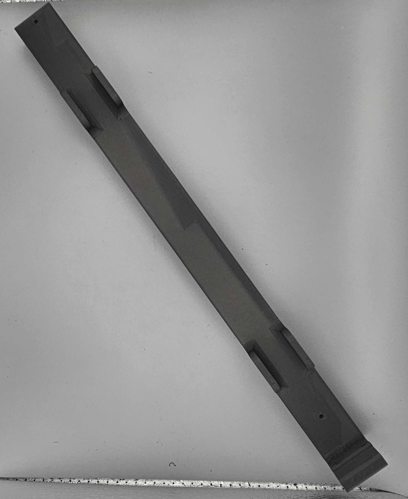

# 🚧 Astro Legs

<figure><figcaption></figcaption></figure>

## Equipment Needed

| Power drill    | Blue paper towel        |                   |
| -------------- | ----------------------- | ----------------- |
|                | Scissors                | Araldite          |
|                | Latex or nitrile gloves | mixing tray       |
| Alignment jigs | Safety glasses          | stirring sticks   |
| Vise jigs      | Bench Vise              | isopropyl alcohol |
| Hammer         | Piano wire cutter       | Loctite           |
| Wrench         | Ruler                   | 2mm hex           |

Astro Leg Jigs

1. Bottom Leg Centering Jig (Located in Astro Leg Box)
   1.

       <figure><figcaption></figcaption></figure>
2. QC Predrilled holes Jig (Located in Astro Leg Box)
   1.

       <figure><figcaption></figcaption></figure>

Tools

<table data-view="cards"><thead><tr><th align="center"></th><th></th><th data-hidden data-card-cover data-type="image">Cover image</th></tr></thead><tbody><tr><td align="center">Sanding Bits </td><td>Two different sizes, use in hand drill. Located in Astro Leg Box</td><td data-object-fit="contain"><a href="../../.gitbook/assets/20260924_074222.jpg">20260924_074222.jpg</a></td></tr><tr><td align="center">Carbon Fiber Bits</td><td>Use in hand drill or drill press. Located in Astro Leg Box</td><td data-object-fit="contain"><a href="../../.gitbook/assets/20260924_074254.jpg">20260924_074254.jpg</a></td></tr><tr><td align="center"></td><td></td><td></td></tr></tbody></table>

Adhesives

<table data-view="cards"><thead><tr><th></th><th></th><th data-hidden data-card-cover data-type="image">Cover image</th></tr></thead><tbody><tr><td>Araldite 2011</td><td>Located on the wire rack to the left of the drill press. </td><td data-object-fit="contain"><a href="../../.gitbook/assets/20260924_073945.jpg">20260924_073945.jpg</a></td></tr><tr><td></td><td></td><td></td></tr></tbody></table>

## Drawings


[#astro-legs-greater-than-11604](../../space-and-general/drawings.md#astro-legs-greater-than-11604)


## Prep

1. Using the power drill and sanding bits, scratch the inside of the T joint.

>  (1) (1) (1) (1) (1) (1) (1) (1) (1) (1).png>)      (1) (1) (1) (1) (1).png>)

2. Cut paper towels into pieces

<figure><figcaption></figcaption></figure>
