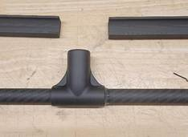

# Astro Legs Assembly

## Assembly&#x20;

1\. Glue .57” (smaller) diameter carbon tube to the T Joint.

* Use jigs to mark where to glue, mark \~1/4” past jigs with a white sharpie as shown:

<figure><figcaption></figcaption></figure>

2. Mix Araldite epoxy by pouring some onto a mixing tray and mixing it around with a stirring stick. Stir the Araldite until the solution is completely mixed.
3. Apply a layer of Araldite to the area between the marks. Make sure to THINLY coat the carbon tube all the way around. Do not get Araldite anywhere outside of the marks.
4. Feed the carbon tube through the T joint as shown:

 


You’ll notice that some Araldite will remain on the outside of the T joint. This will need to be cleaned up with isopropyl alcohol. &#x20;


5. Make sure T is centered, use jigs to align it

 


&#x20;If any Araldite is oozing out from the T joint, wipe off the excess Epoxy with isopropyl alcohol and paper&#x20;


6. Attach the jig to the T Joint

7. Drill a hole through the T joint using the 3/32 bit designed for carbon fiber

<figure><figcaption></figcaption></figure>

8. Use a hammer to start the 3/4” slotted spring pin as shown.

<figure><figcaption></figcaption></figure>

9. Fully press the pin into the T joint &#x20;

<figure><figcaption></figcaption></figure>


Let it sit overnight before moving onto next step

 



10. On the next day, after the Araldite is cured. Fit the end caps over the carbon tube.’

 

11. Attach cam follower to .695” carbon tube.
    1. Insert the cam follower into the carbon tube.
    2. Line up the cam follower and carbon tube holes.
    3. While keeping the cam follower and carbon tube together with the holes aligned, place the two items tab down on the work bench.
    4. Use a hammer to start inserting the 3/4” pin, make sure to go from the non-clip side.

<figure><figcaption></figcaption></figure>

e.       Use the vise jigs and a vise to press it into place, make sure the pin is not protruding.

>  (1).png>)       (1).png>)

### Complete T joint

1. Apply a small Araldite to the inside of the open section on the T joint

<figure><figcaption></figcaption></figure>

2. Feed the slotted side of carbon tube into T joint until the holes line up.
3. Start the 7/8” slotted spring pin into the hole with a hammer.

<figure><figcaption></figcaption></figure>

4. Use a vice to press it into place, make sure the pin is not protruding.

 

### Assemble Cam Lock Bracket

1. Using the wire cutter, clip the short side to <mark style="color:blue;">1/32"</mark> past the spring.

<figure><figcaption></figcaption></figure>

2. Using the wire cutter, clip the long side to <mark style="color:blue;">7/32"</mark> past the spring.

 

3. Fit the spring into the cam lever as shown. The spring may be trimmed more to fit.

<figure><figcaption></figcaption></figure>

4. &#x20;Insert the cam lock as shown. Pay attention to spring orientation.

<figure><figcaption></figcaption></figure>

5. Apply a generous amount of Loctite to the shoulder screw.
6. Feed the shoulder screw through the cam and cam lock as shown. Screw in the shoulder screw and tighten to 40 in-oz.

<figure><figcaption></figcaption></figure>

7. Pull down on the cam lever and feed the T joint assembly into the bracket. Push up on the cam lever all the way to secure.

<figure><figcaption></figcaption></figure>
