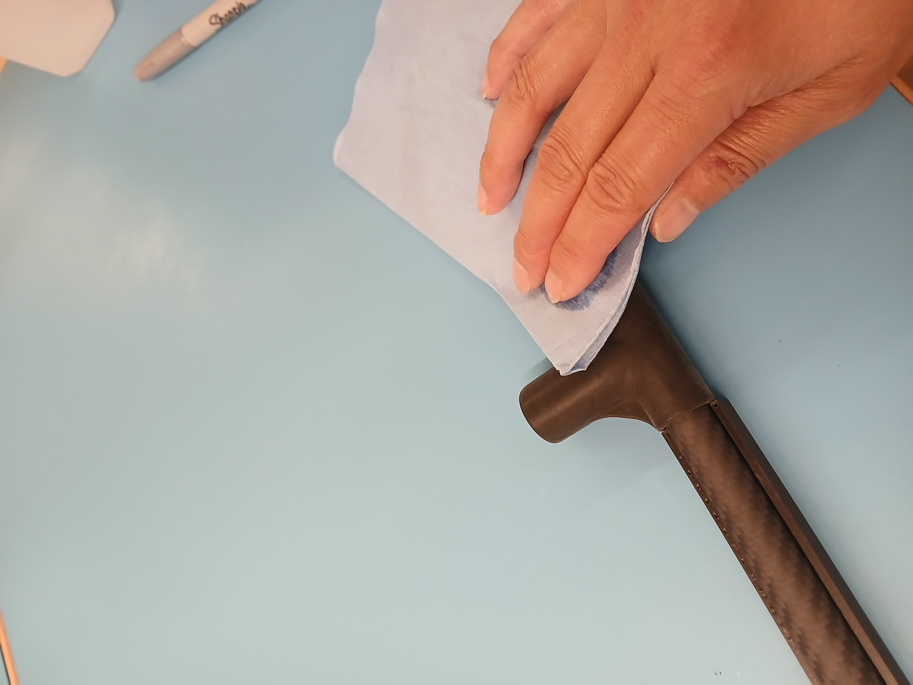

# 🚧 Astro Legs Assembly

## Guide

1\. Place the small carbon tube .57 diameter (Small) part number #15626-00 into jig as shown in the picture. Use a sharpie, mark the carbon tube where's the end of the jig. This is where the T joint will be placed later as shown:

<figure><figcaption></figcaption></figure>

2. Using the Araldite gun squeeze Araldite onto a mixing tray. Wipe off any excessive Araldite from the tip of the gun with a blue cleaning napkin to prevent stuck for future use. Use a stirring stick, mix Araldite until the solution is completely mixed as shown:



<figure><figcaption></figcaption></figure>




<figure><figcaption></figcaption></figure>



3. Apply Araldite to the area of the carbon tube in between the markings. SLIGHTLY apply Araldite thoroughly around the carbon tube. Please make sure you don't get Araldite anywhere outside of the markings as shown:

<figure><figcaption></figcaption></figure>

4. Slightly twist the small .57 diameter (Small) carbon tube onto the T joint.
5. Using the jigs. Make sure that the T joint is now aligned and centered as shown:&#x20;

<figure><figcaption></figcaption></figure>


&#x20;Wipe off ANY excessive Araldite on the side of the T joint with Isopropyl alcohol and blue paper napkins.&#x20;


<figure><figcaption></figcaption></figure>

 

🛑🤚ALLOW ARALDITE TO CURE OVER NIGHT!!! Proceed to the next following step.

6. Grab the big carbon tube diameter .695" (Big) part number #15627-00 and insert cam follower part number #15621-03 into the top of the carbon tube where's the hole is nearest to the edge of the tube. Verify visual through the holes. If the holes don't align, report defect to someone immediately.
7. Use a Hammer and insert the 3/4" long Stainless-steel pin part number #92373A147 into the hole where's the non-clip side as shown:&#x20;

NOTE: Only hammered the pin HALFWAY!

<figure><figcaption></figcaption></figure>

8. Using a plier, grab the pin where's the pin is at halfway into the carbon tube. Slightly twisted the pin at 180 degrees. Straighten out the pin, if necessary. The cut out of the pin should facing downward as shown:



<figure><figcaption></figcaption></figure>




<figure><figcaption></figcaption></figure>




8. Then using the compression clamp suppressed the pin into the carbon tube for a flush look as shown below:

      

10. AFTER ARALDITE IS CURED OVERNIGHT. Attach the provided jig to the bottom of T Joint to prepare it for drilling as shown:

<figure><figcaption></figcaption></figure>

11. Locate the 3/32 bit and attached it onto drilling machine. After you attach the drill bit onto the drilling machine. Make sure to use the attached torque wrench on the side to tighten it down for a secured fit as shown:



<figure><figcaption></figcaption></figure>




<figure><figcaption></figcaption></figure>




<figure><figcaption></figcaption></figure>

10. Use the 3/32 bit provided specifically for carbon fiber tubes. Drill a hole through the center of the T joint with the provided jig as shown:



<figure><figcaption></figcaption></figure>




<figure><figcaption></figcaption></figure>




10. Use a hammer and insert the 3/4” long stainless-steel spring pin part number #92373A147 into the T joint as shown:

NOTE: Only hammered the pin HALFWAY!

<figure><figcaption></figcaption></figure>

10. Fully press the 3/4" long stainless-steel spring pin into the T joint using compression clamp as shown below:&#x20;



<figure><figcaption></figcaption></figure>




<figure><figcaption></figcaption></figure>




10. Fit end cap's part #15624-00 over the carbon tube ends as shown:



<figure><figcaption></figcaption></figure>




<figure><figcaption></figcaption></figure>




### Complete T joint

1. Apply Araldite into the inside of the top open section of the T joint as shown:

<figure><figcaption></figcaption></figure>

2. Insert the big carbon tube .697" diameter (Big) part number #15627-00 into the top of the T joint until the holes aligned.
3. Next insert the 7/8” stainless-steel slotted spring pin part number #92373A148 into the hole with a Hammer as shown below:

<figure><figcaption></figcaption></figure>

4. Use the compression clamp to suppress it into place, make sure the pin is not protruding for a flush and clean look.

5. Now your legs should be complete as shown below:

### Assemble Cam Lock Bracket

1. Using the wire cutter, clip torsion spring part number #9271K636 one side short to <mark style="color:blue;">1/32"</mark> on a ruler. To be sure please use a google image as reference.

<figure><figcaption></figcaption></figure>

2. For the other side, using the wire cutter. Clip one side long side to <mark style="color:blue;">7/32"</mark> on a ruler. To be sure please use a google image as reference.

 

3. Fit the spring into the cam lever part number #15623-02. Long side of spring should be pointing out as shown. Make sure the spring don't fall out of the lever and is nicely secured and fitted.

<figure><figcaption></figcaption></figure>

4. &#x20;Insert the cam lever onto cam lock bracket part number #15620-01. The spring should NOT be protruding and should sit flush with the edge of the cam lock bracket as shown:&#x20;


If the spring is protruding too much, trim it down and reinsert it. If the spring is too short, throw away and recut a new spring.


5. Dip shoulder screw part number #90278A733 threaded side into provided Loctite. Make sure to dap the threaded end onto a blue clean napkin to wipe off any excessive Loctite before inserting into cam lock for screwing.
6. Next insert the shoulder screw through the hole of the cam lock as shown. Make sure your provided screwdriver is torqued to 40.0 in-oz as shown. Screw in the shoulder screw and tighten it to 40 in-oz as shown:
7.

    <figure><figcaption></figcaption></figure>
8. Insert the cam locker onto the top of the big carbon fiber tube part number #15627-00. Pull down on the cam lever to fit it into the T joint assemble. Push up on the cam lever all the way to secure and lock it in place. You're now finish with this build. Your Astro Leg's should look like the image provided below: &#x20;

<figure><figcaption></figcaption></figure>
