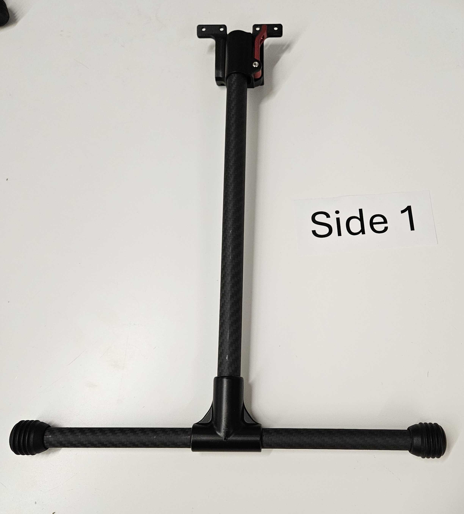
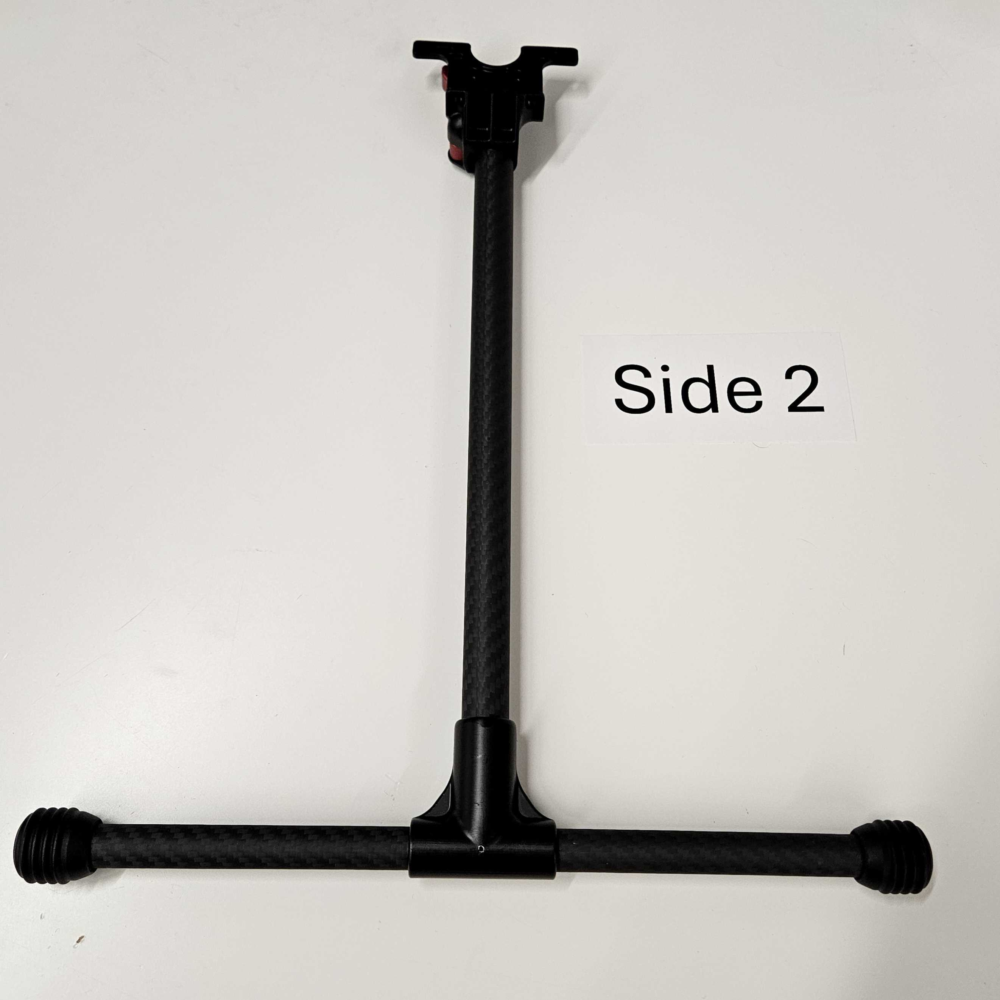

# Astro Legs QC and Bagging (Insert Images)

## QC (in progress on taurus)

1. Grab a pair of astro legs&#x20;
2. Inspect each of the legs&#x20;
   1. Confirm no scratches
   2. No glue is showing
   3. The pins are fully seated&#x20;
3. Place a numbered sticker on each of the legs <mark style="color:red;">(Insert pic of location)</mark>
4. Take a picture of each leg, each side and the Sticker serial number for leg 1&#x20;
5.

    <figure><figcaption></figcaption></figure>

6. Flip over leg and include side 2 tag&#x20;
7.

    <figure><figcaption></figcaption></figure>

8. Repeat for other leg

## Bagging

1. Place 12 of the M3 x 8mm screws into the 2” by 3” plastic bag.

<figure><figcaption></figcaption></figure>

&#x20;2\. Tape the screw bag to the bottom inside of the 18” by 15” bag.

<figure><figcaption></figcaption></figure>

&#x20;3\. Take two legs that were built and combine them with the leg clip as shown.

<figure><figcaption></figcaption></figure>

4. Place the leg pair into the large bag and close it.
5. Fold the bag cover in half and place it over the large bag. Use a stapler to staple it on as shown: &#x20;


Try to keep the staples on either side of the Sentera logo.


 <mark style="color:red;">(Replace image with new setup)</mark>

***

