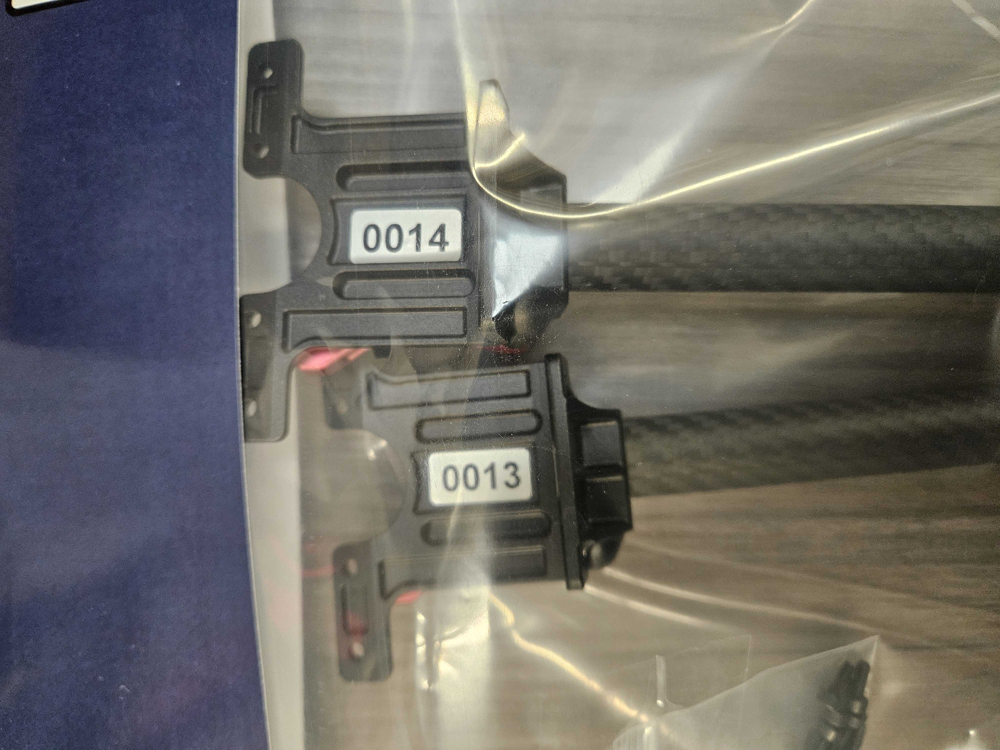
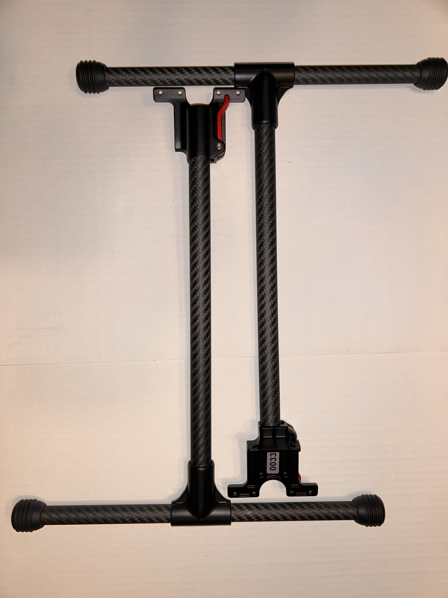
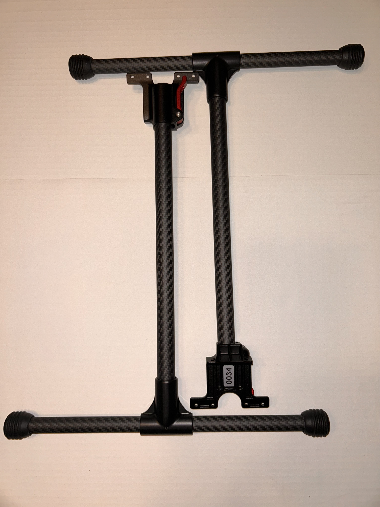
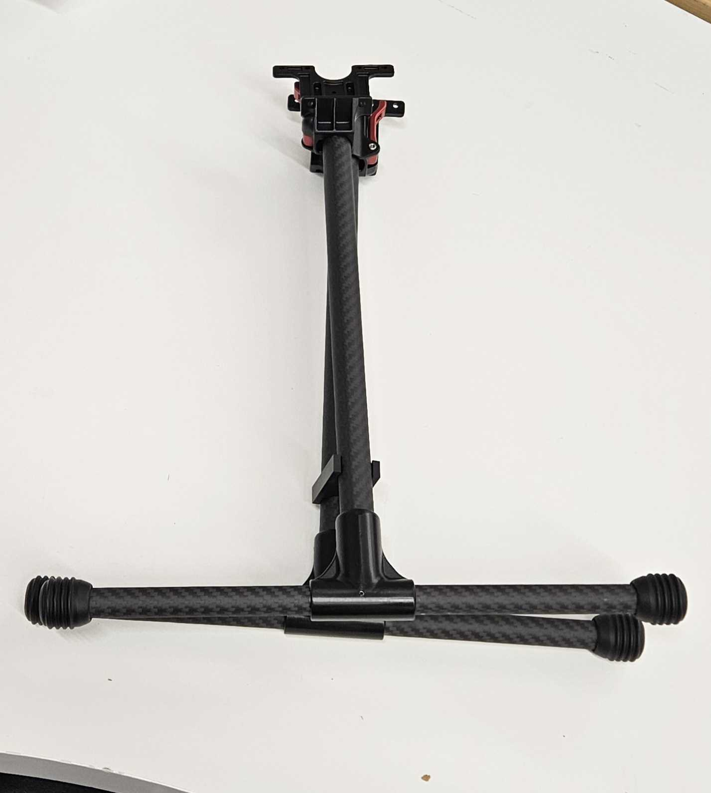
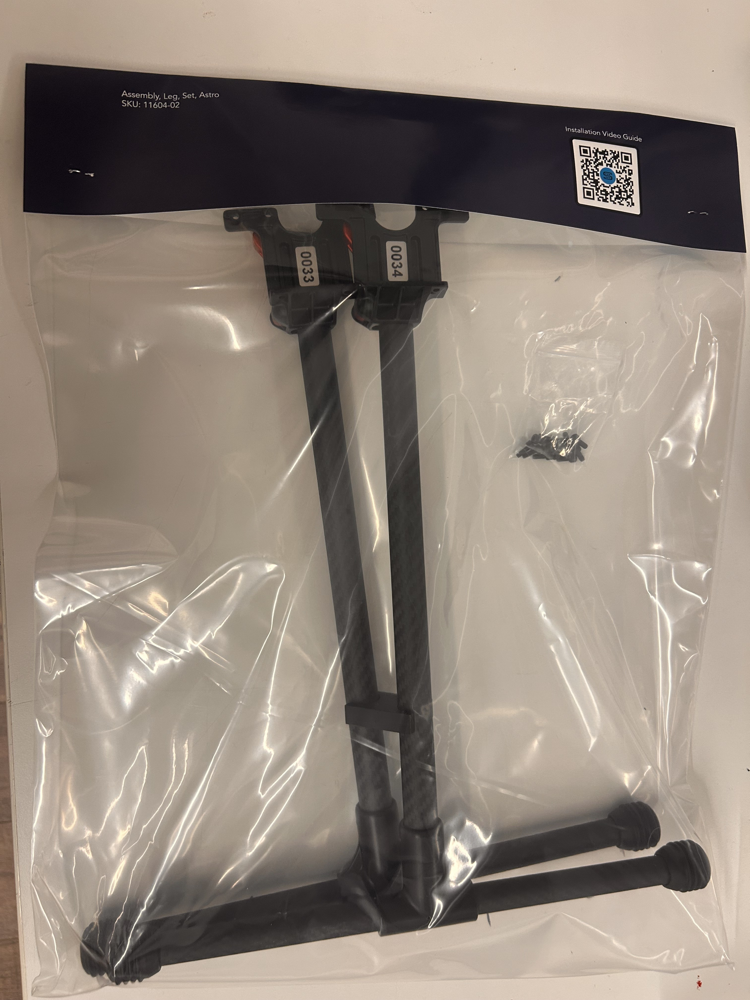

# Astro Legs QC and Bagging (Insert Images)

## QC&#x20;

1. Grab a pair of astro legs&#x20;
2. Inspect each of the legs&#x20;
   1. Confirm no scratches
   2. No glue is showing
   3. The pins are fully seated&#x20;
3. Place a numbered sticker on each of the legs
   1.

       <figure><figcaption></figcaption></figure>
4. Take 2 pictures legs before bagging and place on taurus (See naming convention below bagging)
   1. Confirm the light is bright enough to see any defects&#x20;
   2. Confirm sticker is visible&#x20;
   3. Confirm both legs are fully in the picture&#x20;
   4. Confirm both serial numbers show each side of the leg




Image 1 

<figure><figcaption></figcaption></figure>




Image 2

<figure><figcaption></figcaption></figure>



## Bagging

1. Place 12 of the M3 x 8mm screws into the 2” by 3” plastic bag.

<figure><figcaption></figcaption></figure>

&#x20;2\. Tape the screw bag to the bottom inside of the 18” by 15” bag.

<figure><figcaption></figcaption></figure>

&#x20;3\. Take two legs that were built and combine them with the leg clip as shown.

<figure><figcaption></figcaption></figure>

4. Place the leg pair into the large bag and close it.
5. Fold the bag cover in half and place it over the large bag. Use a stapler to staple it on as shown: &#x20;


Try to keep the staples on either side of the Sentera logo.


6. Take a Final picture and place on taurus&#x20;
   1.

       <figure><figcaption></figcaption></figure>

## Taurus Naming Convention

1. Create a folder in taurus&#x20;
   1. \as-taurus.jdnet.deere.com\Production\Systems & Kits\11604-XX -- Astro Legs
2. Label the folder based on their serial numbers&#x20;
   1. Example: 0027-0028
   2. Put the 2 images before bagging and the final image after bagging in the new folder&#x20;
   3.

       <figure><figcaption></figcaption></figure>
