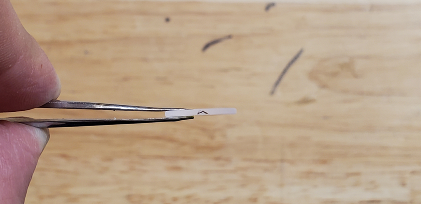

# Assembly

## Guide&#x20;


Keep all the screws from the double 4K, as you will need them in future steps&#x20;


1. Remove the back half of the D4k until you reach the lens mount.&#x20;
2. The imager board and everything else attached to the lens mount will need to be removed.&#x20;
   1. Keep note of the orientation for reassembly&#x20;
3. Use the chart to know the lens orientation&#x20;
   1.

       <figure><figcaption></figcaption></figure>
4. Install the filter using the tweezers. Note the chevron on the side of the filter should be pointing up when installed.&#x20;
   1.

       <figure><figcaption></figcaption></figure>
5. Use UV bonding glue with 3 points of contact on the sides of the lens&#x20;
6. Put lens mount into the uv bonding box for at least 10 minutes
   1. Do a polk test to confirm the glue is dried&#x20;
7. Reinstall the imager boards back onto the lens mount&#x20;
   1.

       <figure><figcaption></figcaption></figure>
8. Reinstall the SD guard and light to the lens mount&#x20;
   1.

       <figure><figcaption></figcaption></figure>
9. Form the 2 halves back together. Ensure all 3 ports are lined up&#x20;



<figure><figcaption></figcaption></figure>



<figure><figcaption></figcaption></figure>



10. Secure the 2 halves together together with the provided screws&#x20;
    1.

        <figure><figcaption></figcaption></figure>
11. Secure the back cover with provided screws&#x20;
    1.

        <figure><figcaption></figcaption></figure>

