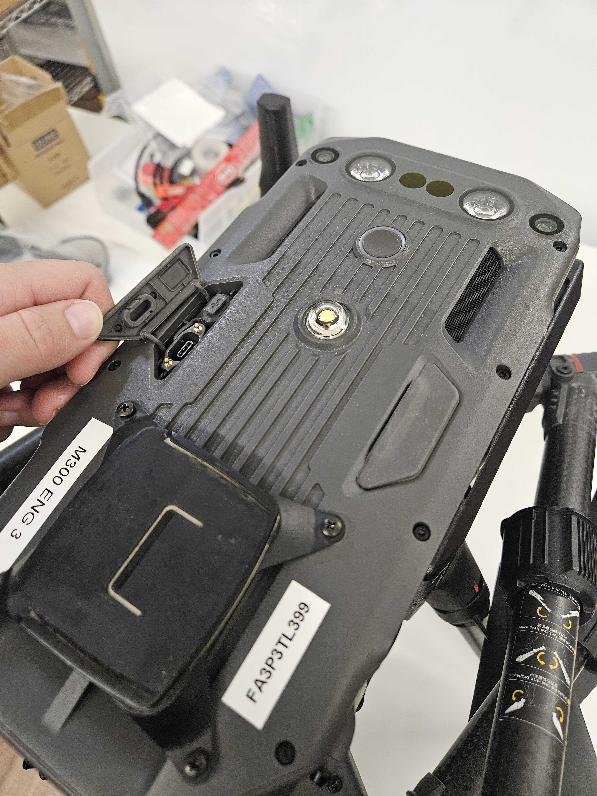
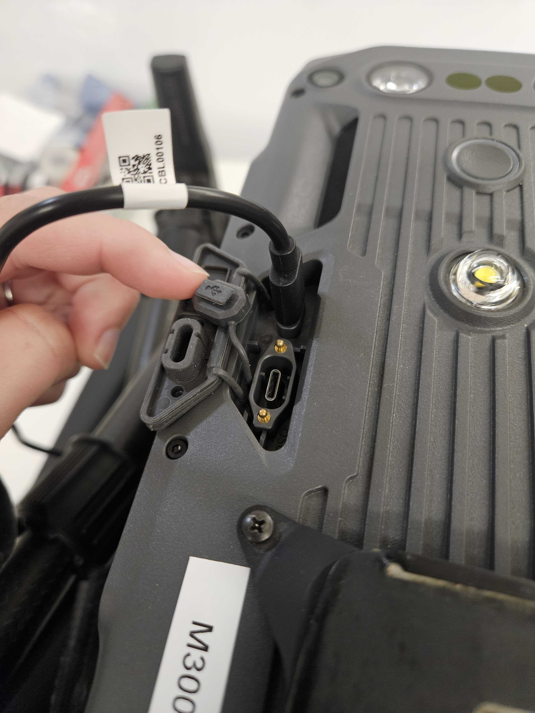
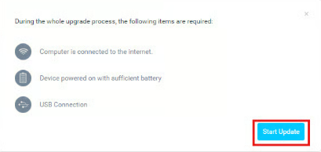
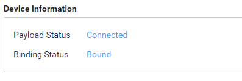

# ✅ DJI Only Binding Stack

## DJI Binding&#x20;


DJI Binding only has to be done for skyport gimbal stacks. Binding is for the Gimbal and has to be done to get green lights on the camera. The camera and Gimbal do not need to stay together, this is simply for the gimbal.&#x20;


#### Equipment&#x20;

|                               |                                                |
| ----------------------------- | ---------------------------------------------- |
| M300/M350 Drone and Batteries | DJI Assistant 2 (Enterprise Edition) installed |
| USB-C to USB-C cable          | Computer                                       |

1. Install DJI Assisant 2 (Enterprise Edition) onto your desktop
2. Connect Gimbal to a camera and attach to a M300/M350 drone
3. Connect USB-C cable from drone to computer&#x20;



<figure><figcaption></figcaption></figure>



<figure><figcaption></figcaption></figure>



4. Open <mark style="color:blue;">DJI Assistant 2</mark>
5. Click on the <mark style="color:blue;">drone name</mark>
   1.

       <figure><figcaption></figcaption></figure>
6.  Click <mark style="color:blue;">Ignore</mark> to skip this step&#x20;

    <figure><figcaption></figcaption></figure>
7. Update the firmware through DJI assistant
   1. Go to <mark style="color:$primary;">firmware update</mark> > <mark style="color:$primary;">DJI Skyport V2.0 (Primary)</mark>
      1. Note: DJI Assistant usually opens to this screen.
   2. If the current version isn't <mark style="color:$primary;">V01.03.0500</mark>, click on the <mark style="color:$primary;">upgrade</mark> or <mark style="color:$primary;">downgrade</mark> button next to that version
   3.

       <figure><figcaption></figcaption></figure>

   4. Start Update and wait for it for complete
   5.

       <figure><figcaption></figcaption></figure>
   6.

       <figure><figcaption></figcaption></figure>
   7. Confirm Current verion is <mark style="color:$primary;">V01.03.0500</mark>
      1.

          <figure><figcaption></figcaption></figure>

8. Bind the Skyport-V2 puck
   1. <mark style="color:$primary;">Payload SDK</mark> > Click <mark style="color:$primary;">Bind</mark>
   2.

       <figure><figcaption></figcaption></figure>
   3. Confirm screen says <mark style="color:$primary;">Bound</mark>&#x20;
   4.

       <figure><figcaption></figcaption></figure>
9. Session Start
   1. Once binding is complete, confirm the camera starts a session and has green lights
