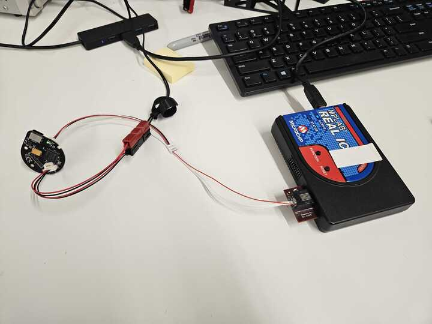
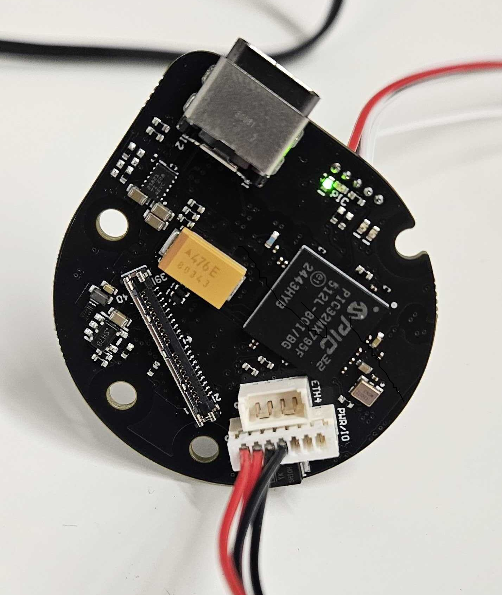
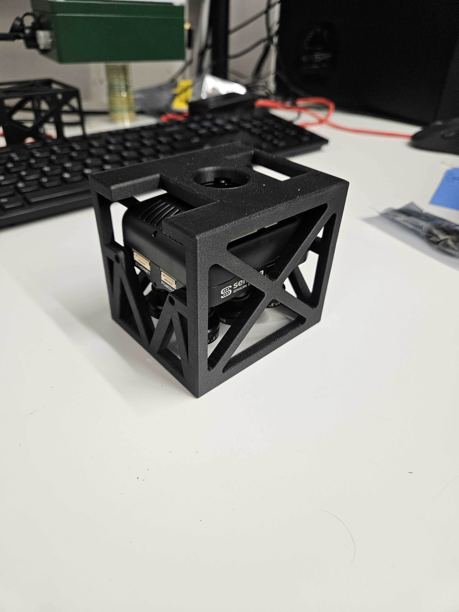
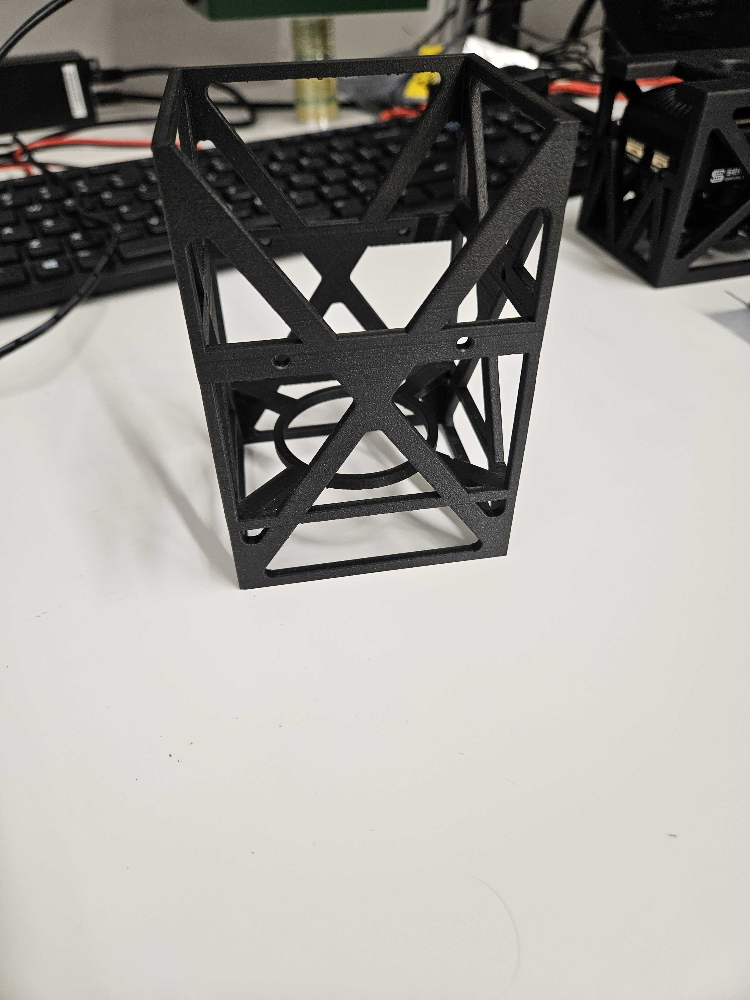
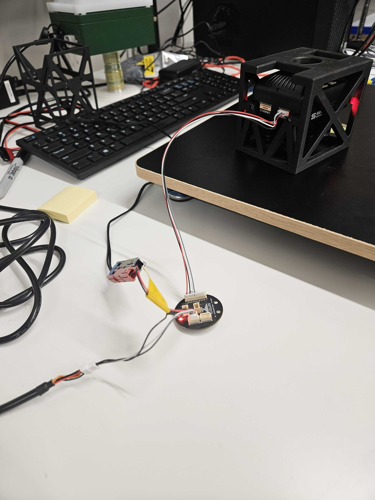

# ✅ Gimbal Stack

## Equipment

<table><thead><tr><th>COMS Boards</th><th valign="middle">Motor Controllers</th></tr></thead><tbody><tr><td>Non-John Deere Laptop</td><td valign="middle">TTL USB Cable</td></tr><tr><td>MPLAB ICE module (with USB cable and small cable)</td><td valign="middle">Y-connector</td></tr><tr><td>24V "NEW COMMS BOARD ONLY" AC Adapter</td><td valign="middle">12V AC Power Adapter</td></tr><tr><td>Anderson power adapter cable</td><td valign="middle">Power I/O cable</td></tr><tr><td>communication adapter cable</td><td valign="middle">Tweezers </td></tr></tbody></table>

## Notes

* Cables and Power Adapters will be located in labeled bags located next to laptop
* This guide is for 6X and 65R gimbals&#x20;

## Coms Board Programming Guide

1. Remove all cables from the COMs Board Bin
2. Plug in everything
   1. PLUG IN POWER LAST to COMS Board avoid any unwanted power surges or dips.
   2. Power via ac adapter and Anderson power adapter cable
   3. Communication from computer via MPLAB ICE comms box and adapter
   4.

       <figure><figcaption></figcaption></figure>
   5. COMS Board should have a green light when plugged in&#x20;
      1.

          <figure><figcaption></figcaption></figure>

3. Open the MPLAB X IPE v5.2 Software&#x20;
   1. Application should be located on the desktop&#x20;
4. Program the board
   1. Under 'Device:',confirm the model number of the PIC32 chip on the comms board
      1. The model number is on one side of the black microchip on the board.
      2. For 6X and 65R the model on the COMS board should be 'PIC32MX795F512L'.
5. <mark style="color:blue;">Click connect</mark>

<figure><figcaption></figcaption></figure>

5. Once Connected the Dialog box will display this message
   1.

       <figure><figcaption></figcaption></figure>

6. To the right of the 'Hex File' box, click on <mark style="color:blue;">Browse</mark>.

<figure><figcaption></figcaption></figure>

7. Find the correct hex file and open it into the program.
   1. Should be the first file you see (pic32-Gimbal2.DEFAULT3.2025073000.hex.)
      1. _Location of file if needed: \as-taurus.jdnet.deere.com\Production\Technical Packages\6X AND 65R GIMBAL\IN PROGRESS\6X AND 65R GIMBAL - Technical Data Package - ######\PROGRAMMING\Prerequisites and Programs\Hex File_
8. Click <mark style="color:blue;">Open</mark> to load that file&#x20;
9.

    <figure><figcaption></figcaption></figure>

10. Back on the main screen, the dialog box will display this message

<figure><figcaption></figcaption></figure>

11. Once hex file is loaded click <mark style="color:blue;">Program</mark>&#x20;
    1.

        <figure><figcaption></figcaption></figure>
    2. &#x20;The dialog box will display this message
    3.

        <figure><figcaption></figcaption></figure>

12. Once the programming process will says completed.  the COMs board should have a flashing green light alongside a solid red light.&#x20;
    1. See video below for what the heartbeat looks like


If the green light is not visible then click <mark style="color:blue;">program</mark> again. You should see the programming completed message and the flashing green light when finished.&#x20;




9. Click <mark style="color:blue;">Disconnect</mark> and unplug the board, power first.
10. Put COMS board back in the Static Bag and mark it completed with Sharpie&#x20;
11. Put all cables and equipment back into the COMs Board Bin

## Motor Controller Programming Guide

1. Remove all cables and equipment from the Motor Controller Bin
2. Carefully pull up all the Kapton Tape from the board and flip the switch to the 'ON' position.
3. Plug in all the required connections:
   1. AC Adapter (12V) into outlet
   2. TTL USB cable into computer
   3. Motor controller board to USB cable via Y adapter cable.
   4. Motor controller board to AC Adapter via Y adapter cable.
      1. Connect Anderson Power Pole connector LAST.
   5.

       <figure><figcaption></figcaption></figure>
4. <mark style="color:blue;">Open Partner Assistant</mark> (version 1.4.4) and login to your account
   1. Log into the Webpage now, which will be used later for Serial Number&#x20;
      1. If the intended serial number is not know, click on <mark style="color:blue;">Web Control Panel</mark>
         1. Log in and go to <mark style="color:blue;">Customers</mark>
         2. This website is only to view the last used serial number for the corresponding part number. In partner assist, use the next number in the series.&#x20;
5.  At the top left corner, if the box is empty, click on the <mark style="color:blue;">upside-down triangle</mark> and select the <mark style="color:blue;">COM port</mark> associated with the TTL cable.&#x20;

    <figure><figcaption></figcaption></figure>


NOTE: Do NOT click 'Connect'.


* Click <mark style="color:blue;">Test Board</mark>

<figure><figcaption></figcaption></figure>

6. You will automatically go to the Flashing Test Firmware Screen
7. Select the following board version below (Insert Page name)
   1. Select <mark style="color:blue;">3.3 "Tiny+" (256K) - low power, small size board</mark>
   2. Click <mark style="color:blue;">Flash</mark>
   3.

       <figure><figcaption></figcaption></figure>

   4. Dialog Box will display "<mark style="color:blue;">Your Code is Running</mark>" when finished
   5.

       <figure><figcaption></figcaption></figure>

   6. <mark style="background-color:yellow;">Select the "Auto-Next Step" to bypass clicking next on each step</mark>
8. On the Preparing Board for testing Page, select the following license below&#x20;
   1. \#2033 "Tiny" - small size, low power (retail), BOARD: Tiny+
   2.

       <figure><figcaption></figcaption></figure>
   3. Click <mark style="color:blue;">Next</mark> if not already automated
9. On the Testing Board Page
   1. Wait for the test to finish, It will display a red line at the bottom&#x20;
   2. This is a normal error, should be these numbers displayed
   3.

       <figure><figcaption></figcaption></figure>
   4. Click <mark style="color:blue;">Next</mark> if not already automated
10. On the Configuring Board Features Page
    1. Confirm the License is #203
    2. In the Board ID box, change the last few numbers to the serial number following the last used on the web control panel page. Refer to Step 4 in the Motor Controller Guide.&#x20;
    3. Click <mark style="color:blue;">Next</mark> if not already automated

<figure><figcaption></figcaption></figure>

11. On the Writing Secret Keys Page, wait for program to finish. it will display the screen below
    1.

        <figure><figcaption></figcaption></figure>
12. On the Preparing Board for Flashing Firmware Page
    1. This just confirms the switch on the motor controller is on
    2.

        <figure><figcaption></figcaption></figure>
    3. Click <mark style="color:blue;">Next</mark> if not already automated
13. On the Flashing Main Firmware Page
    1. Select the <mark style="color:blue;">2.70 REGULAR (no encoders) (1.09.2020) Firmware</mark>
    2. Click <mark style="color:blue;">Upload</mark>&#x20;
    3.

        <figure><figcaption></figcaption></figure>
    4. Wait for firmware to finish...It will say " Code is running, Set new firmware on server"
    5.

        <figure><figcaption></figcaption></figure>

    6. Click <mark style="color:blue;">Skip</mark> for the next 2 screens
14. On the Finished! Screen&#x20;
    1. Click <mark style="color:blue;">Cancel</mark>&#x20;
    2.

        <figure><figcaption></figcaption></figure>
15. Disconnect all the connections to the board, power first.&#x20;
16. Carefully flip the switch on the board to OFF
17. Place motor controller back in static bag, label completed
18. Put all cables and equipment back into the Motor Controller Bin

### IMU Calibration Guide


NOTE: This step should be completed using the camera intended to be used with the motor controller. Using a different camera may result in imperfect IMU calibration when on the gimbal.



This instruction set is the same for 6X and 65R cameras, pictures show the 65R.


1. Set up the leveling board.
   1. Screw in all feet completely and unscrew 2 adjacent feet at the same time as needed to level the board&#x20;
   2. Use the separate level as the board is not accurate
   3. Ensure bubble is centered in every direction on the board&#x20;




<figure><figcaption></figcaption></figure>




<figure><figcaption></figcaption></figure>



2. Install the Calibration Jig on the camera using 4 screws in the Motor Controller Bin, ensuring it will not move inside of it.




6X

<figure><figcaption></figcaption></figure>




65R

<figure><figcaption></figcaption></figure>



3. Plug in all the required connections: (keep Same Connections as Motor Contontroller programming, just add one cord from board to camera)
   1. AC Adapter (12V) into outlet.&#x20;
   2. TTL USB cable into computer.
   3. Motor controller board to USB cable via Y adapter cable.
   4. Motor controller board to AC Adapter via Y adapter cable.
   5. Camera PWR to motor controller output connector
      1. Connect Anderson Power Pole connector LAST.

<figure><figcaption></figcaption></figure>

4. Open the <mark style="color:blue;">Simple BGC GUI v2.7.0</mark> program
   1.

       <figure><figcaption></figcaption></figure>

5. Select the COM port associated with the TTL cable&#x20;
   1. Click <mark style="color:blue;">Connect</mark>
   2.

       <figure><figcaption></figcaption></figure>

6. One error will occur when connect, this is normal
   1. Click <mark style="color:blue;">OK</mark>
   2.

       <figure><figcaption></figcaption></figure>
7. At the top left, click <mark style="color:blue;">Board -> then Backup Manager</mark>
   1.

       <figure><figcaption></figcaption></figure>
8. In the <mark style="color:blue;">Restore from Backup</mark> section, click <mark style="color:blue;">Browse</mark>
   1.

       <figure><figcaption></figcaption></figure>

9. Find and upload the correct EEPROM file.
   1. For a 65R Camera: 65RMotorController.data
   2. For a 6X Camera: 6XMotorConteroller.data
      1. If location does not automatically appear follow this location
         1. _6X AND 65R GIMBAL - Technical Data Package - ######\PROGRAMMING\Prerequisites and Programs\EEPROM_
   3.

       <figure><figcaption></figcaption></figure>
   4. Click <mark style="color:blue;">Open</mark>
10. Click <mark style="color:blue;">Restore</mark>
    1.

        <figure><figcaption></figcaption></figure>
    2. Click <mark style="color:blue;">YES</mark>
    3.

        <figure><figcaption></figcaption></figure>
11. The screen should say 'Successfully restored from backup' when finished in the lower left corner
12. After this finishes, <mark style="color:blue;">close</mark> the window
13. Go to the <mark style="color:blue;">Hardware tab</mark> and Click <mark style="color:blue;">Calibrate IMU Sensors</mark>&#x20;
    1. You might need to scroll down to see the button&#x20;
    2.

        <figure><figcaption></figcaption></figure>


For Step 14, only use the left side of the IMU Calibration window. DO NOT click anything on the right side. Only use the right side for viewing the Gyroscope.&#x20;


14. On the left side/middle, click <mark style="color:blue;">Reset</mark>
    1.

        <figure><figcaption></figcaption></figure>
    2. All the blue check marks should disappear
15. Calibrate the accelerometer
    1. Use the calibration jig and rest the camera on each side.&#x20;
       1. The blue box represents the axis of each side
       2. It should move everytime you move the camera to a different side
    2. After the gyroscope gauge (White Line) rests in the green portion, click on the <mark style="color:blue;">Calibrate</mark> in the 'Accelerometer' section.
    3. Repeat for all 6 sides.&#x20;
    4. If you calibrate the line in the red section, please reset and start over.
    5. See video below for an example!



14. After calibration is complete with all sides calibrated, click <mark style="color:blue;">Close</mark>
15. Click <mark style="color:blue;">Disconnect</mark> on the main screen and disconnect all the connections, power first.&#x20;


Try to keep the paired motor controller and camera together. Failing to do so may result in inaccurate calibrations.

