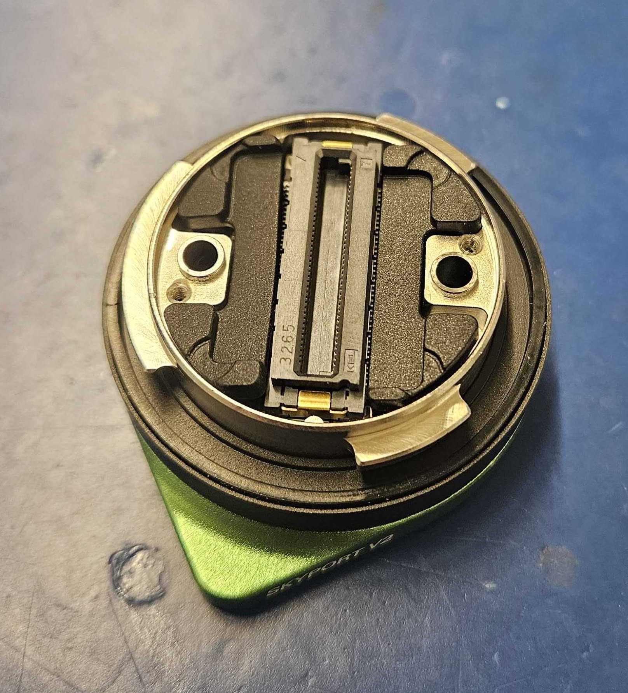
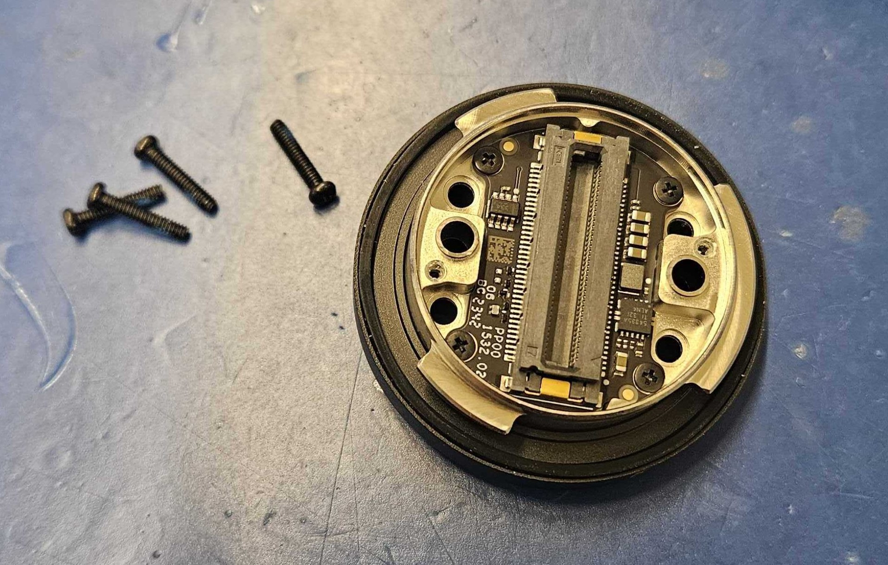
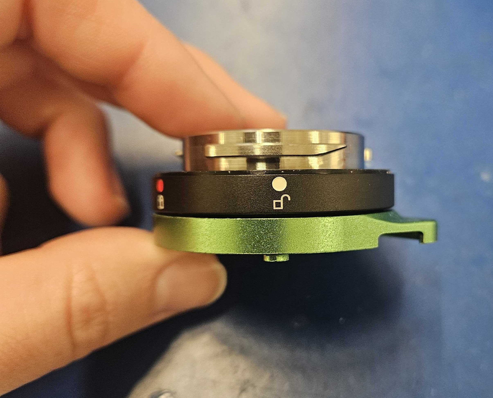
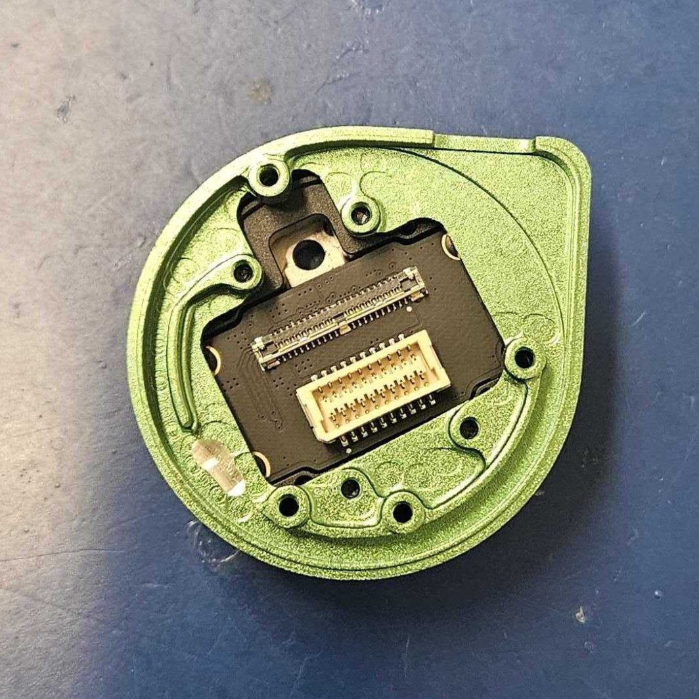

# DJI Skyport Stack Assembly

## Required Materials

In addition to everything listed on the BOM, the following items are required for this build.

## Notes

DO NOT use these instructions for a Skyport that will go on a PixelScout system. A PixelScout Skyport stack has a few key differences. Refer to this page for Pixelscout Skyport Stacks [3-a-1-skyport-top-stack-needs-pictures.md](../../../pixel-scout/assembly-steps/3-a-1-skyport-top-stack-needs-pictures.md "mention")

## Drawing&#x20;

Uploaded 3/23/2026

6X (21233)

65R (21238)

## Guide

1. Program your Coms Board and your Motor Controller
   1. For Coms Board: [comms-board-programming.md](../comms-board-programming.md "mention")
   2. For Motor Controller: [motor-controller-programming.md](../motor-controller-programming.md "mention")
2. Remove the 2 Hex screws and rubber inserts&#x20;

> .jpg>)     

3.Remove the 4 black screws

<figure><figcaption></figcaption></figure>

4. Attach the Interface (Item 9) and the USB-C Skyport Adapter (Item 3) together
   1. Use the 4 black screws removed from the interface&#x20;
   2. The screws are already pre-loctitied, do not use any threadlocker&#x20;
   3. Confirm the orientation is correct before tightening&#x20;

>  

5. Reinsert the rubber pads and cover plate&#x20;
   1. The screws are already pre-loctitied, do not use any threadlocker&#x20;

> .jpg>)   .jpg>)

6. Attach the PSDK cable to the programmed Coms board and the Interface&#x20;
   1. Allign the pins and then click fully into place&#x20;
   2.

       <figure><figcaption></figcaption></figure>
7. Attach the Yaw Enclosure (Item 7) with 4 screws (94017A108)
   1. Push the board to the front using the board-to-board connector while tightening to ensure it will line up later.

> .png>)    .png>)

8. Connect the programmed motor controller to the stack using thermal paste&#x20;

> .png>)     .jpg>)
>
> .png>)

9. Attach the gimbal frame to the stack using 3 screws (94017A156)
   1.

       <figure><figcaption></figcaption></figure>
10. Attach the the roll and pitch (2 black cables) and camera (muti-color cable) connectors
    1. Attach the camera to gimbal and test before putting on drone.&#x20;
    2. If camera freaks out and starts twisting out of control, switch the black cables with each other
11. &#x20;Attach cable cover (Item 5) with 2 screws (95836A512)
    1.

        <figure><figcaption></figcaption></figure>
