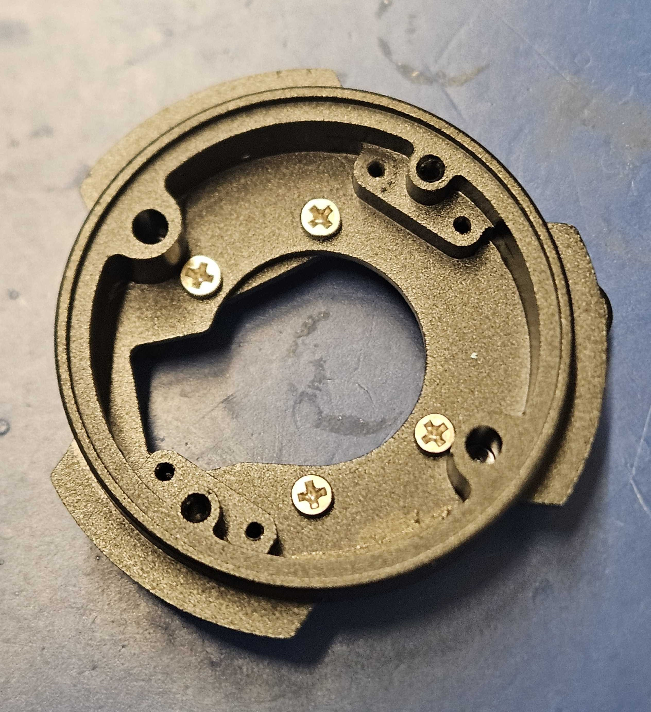
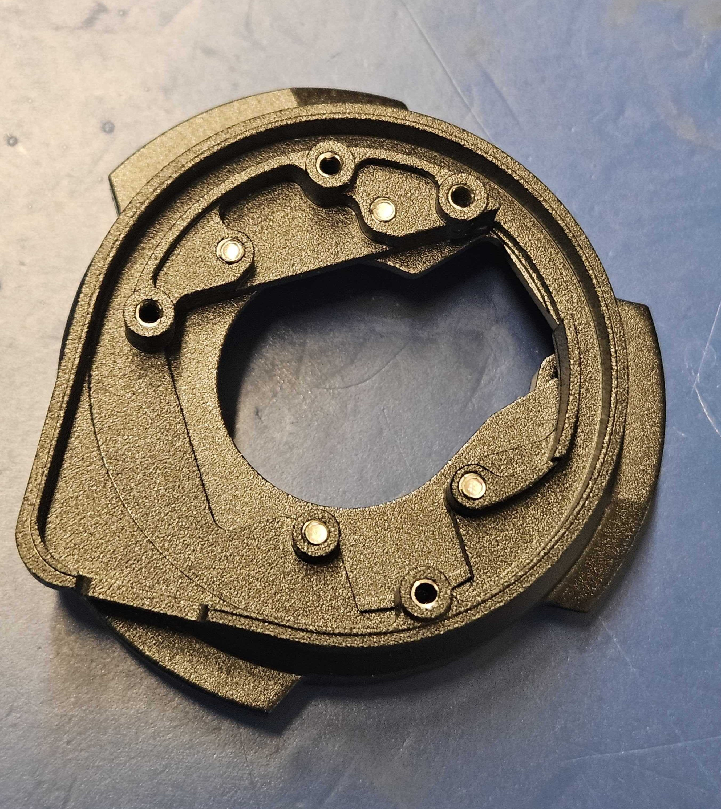
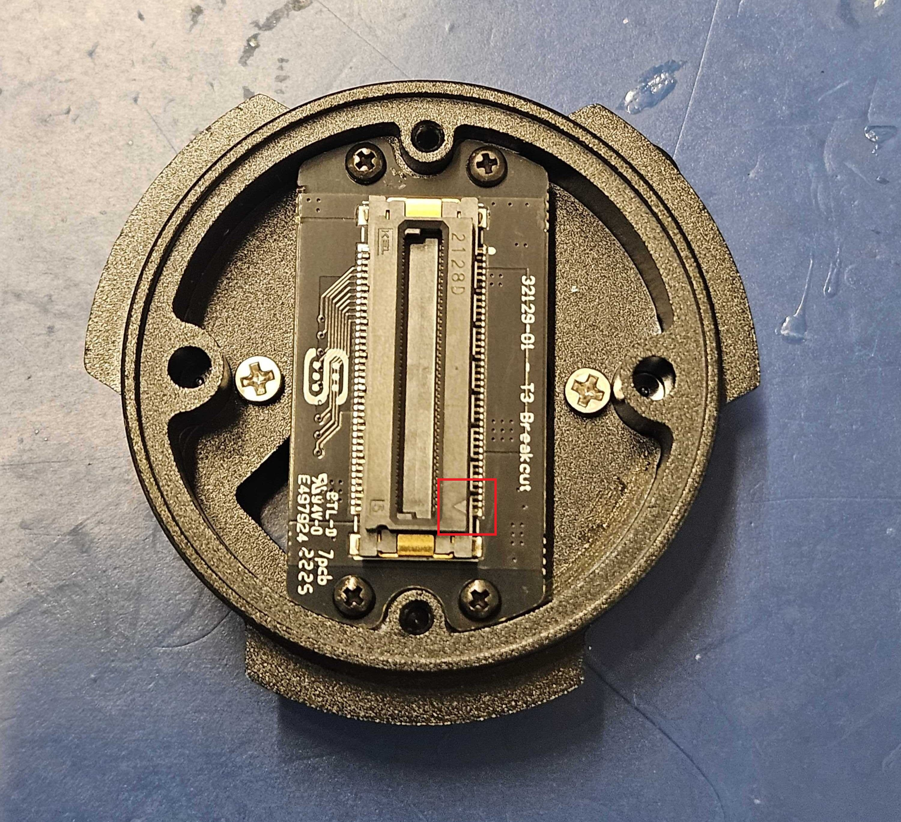
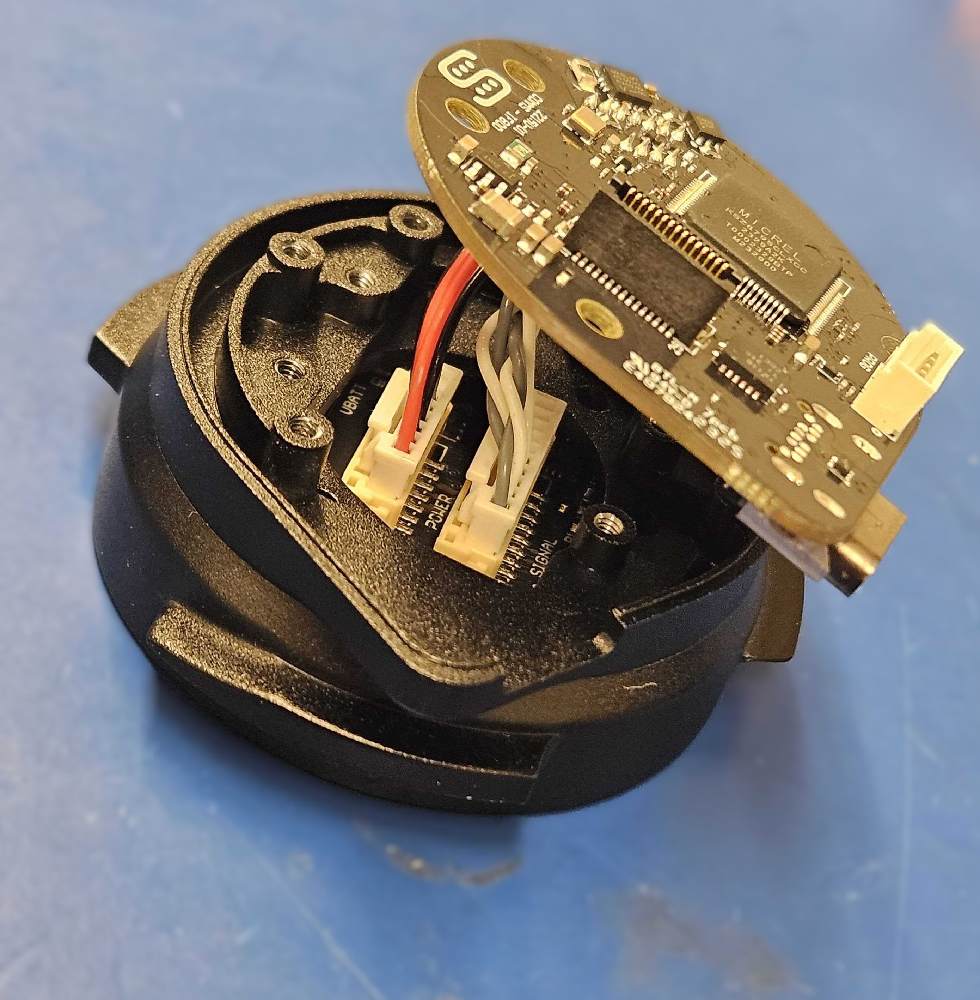
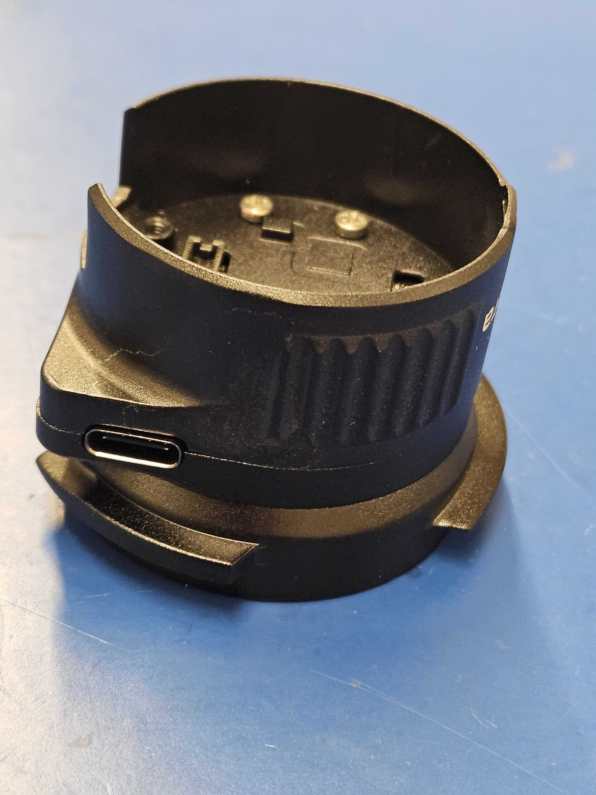
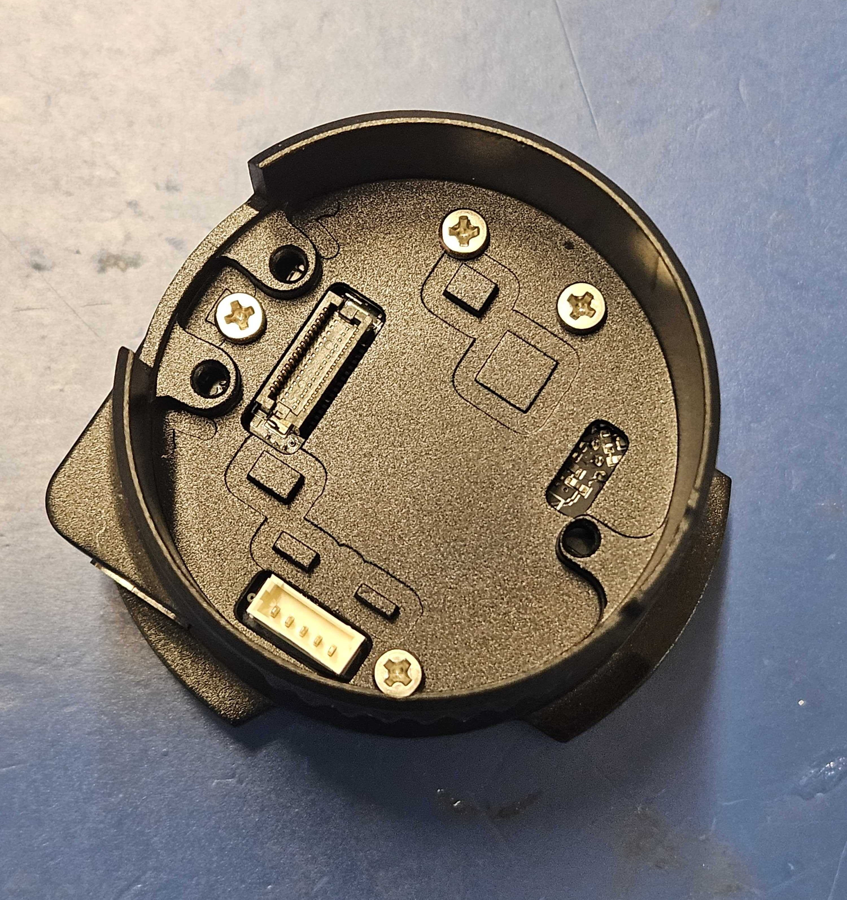
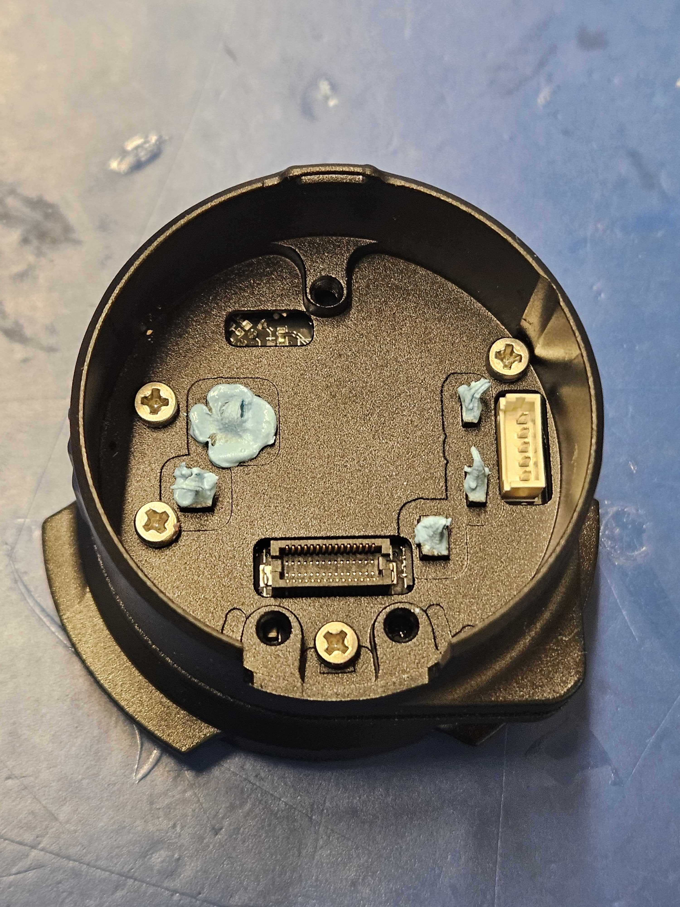
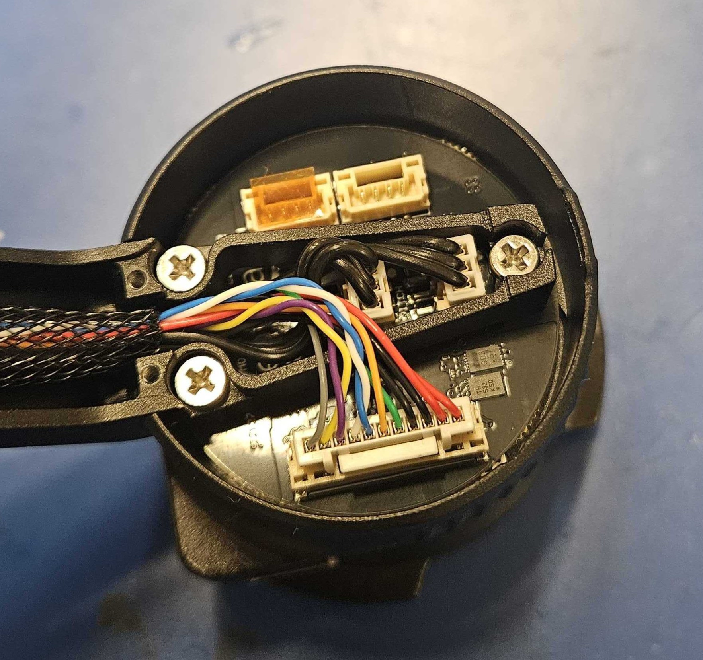

# Gremsy Stack Assembly

1. Program your Coms Board and your Motor Controller
   1. For Coms Board: [Broken link](/broken/pages/mexEYCWpMmW4uabAQvMk "mention")
   2. For Motor Controller: [motor-controller-programming.md](../motor-controller-programming.md "mention")
2. Attach the T3 Interface (Item 3) to the Yaw Adapter (Item 6)
   1. Insert 4 screws (Item 12) into the interface and to the adapter&#x20;

>      

2. Insert the T3 Breakout Board (Item 5) with 4 screws (Item 14)
   1. Take note of the arrow direction&#x20;
   2.

       <figure><figcaption></figcaption></figure>
3. Put the cover (Item 4) on the adapter using 2 hex screws (Item 15)
   1.

       <figure><figcaption></figcaption></figure>
4. Attach the Cable assembly from the T3 Breakout Board (Item 5) to the programmed Coms board (Item 9)

>     .jpg>)

5. Attach the Yaw Enclosure (Item 7) with 4 screws (Item 21)
   1. Push the board to the front using the board-to-board connector while tightening to ensure it will line up later.
   2.

       <figure><figcaption></figcaption></figure>

>      

6. Connect the programmed motor controller (Item 10) to the stack using thermal paste

>     .jpg>)

7. Attach the gimbal frame to the stack using 3 screws (Item 13)
   1.

       <figure><figcaption></figcaption></figure>
8. Attach the the roll and pitch (2 black cables) and camera (muti-color cable) connectors
9. Attach the camera to gimbal and test before putting on drone.&#x20;
10. If camera freaks out and starts twisting out of control, switch the black cables with each other&#x20;
11. Attach cable cover (Item 8) with 2 screws (Item 14)
    1.

        <figure><figcaption></figcaption></figure>
