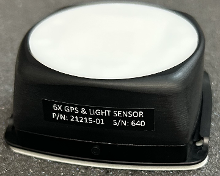

# 🚧 Light Sensor

<figure><figcaption></figcaption></figure>

## Equipment Needed

| USB C to A cable QTY 2 | Tweezers | Alcohol Wipes / Isopropyl |
| ---------------------- | -------- | ------------------------- |
| TTL cable              | Scissors | Kim wipes                 |
| MPLAB programmer       |          | loctite                   |

## Drawings&#x20;


[#light-sensor-greater-than-21215](../../space-and-general/drawings.md#light-sensor-greater-than-21215)


## Notes&#x20;

