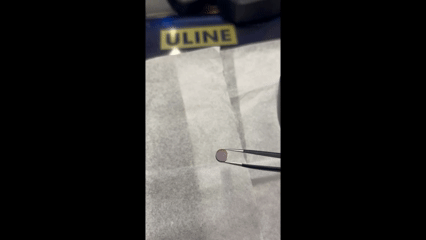
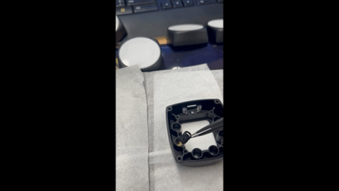
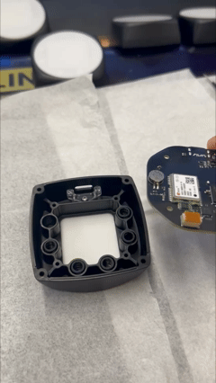
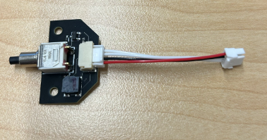
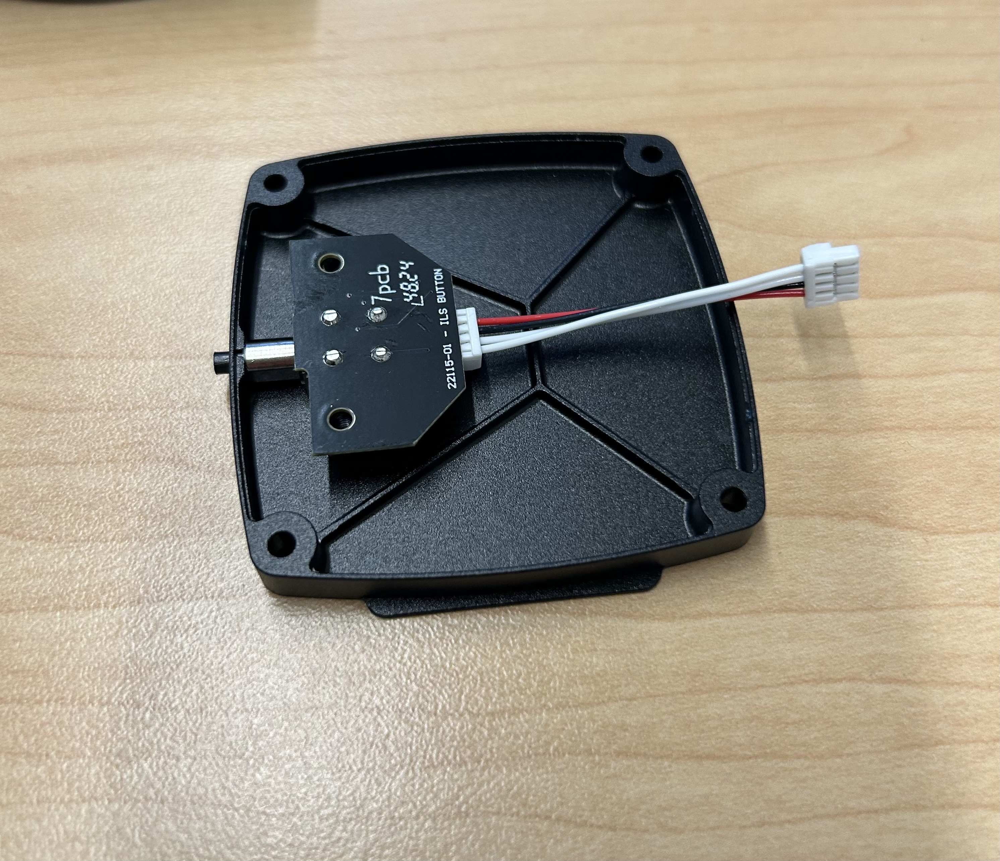
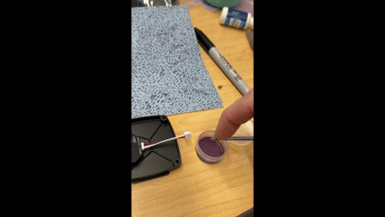
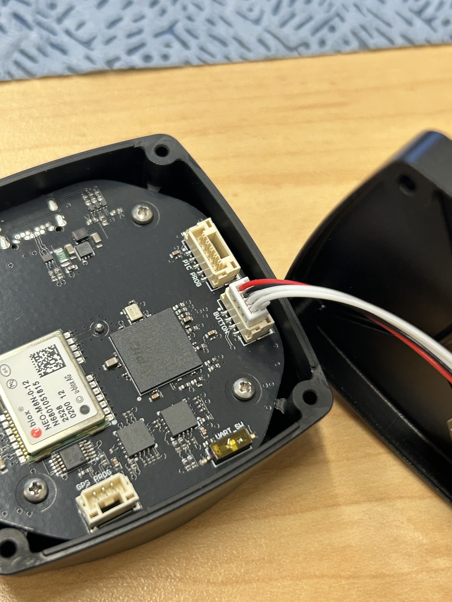
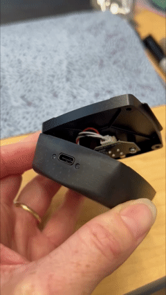

# 🚧 Assembly



### Adding the <mark style="color:yellow;">LED Diffuser (25248-00)</mark> to the <mark style="color:yellow;">Top Cover (25246-00)</mark> with screw <mark style="color:yellow;">Item#15 (92470A049)</mark>.

Using a tweezer along with the 75mm screw driver can be helpful.  This step should be done first to avoid scratching of the white diffuser. However can be done after the white diffuser has been applied.&#x20;

<figure><figcaption></figcaption></figure>



### <mark style="color:yellow;">Top Cover (25246-00)</mark> apply <mark style="color:yellow;">double-sided tape (8589)</mark>

Take an alcohol wipe and clean the top surface of the top. Let dry..png>)&#x20;



### Use jig for actual application of <mark style="color:yellow;">8589</mark>

Peel off one side of the double-sided tape and place this face up on the jig. Then you can place the Top Cover on for worry free applying.&#x20;

<figure><figcaption></figcaption></figure>



### Applying the <mark style="color:yellow;">White Diffuser (34475)</mark>

Now remove the other peel-off liner of the double sided tape. Carefully place the diffuser on top and firmly press down.

<figure><figcaption></figcaption></figure>



### Adding the filters

The Filter needs to be placed with the more mirrored side to face away from the sensor (down into the top cover).

<figure><figcaption></figcaption></figure>

Place filter onto a clean surface for review. Clean both sides of the filter with Kim wipes and Isopropyl if debris is found. Use your tweezer and hold filter at an angle to confirm the mirrored side and place into position 2 of the top cover as shown in the above diagram.

<figure><figcaption></figcaption></figure>

Right after filter is in place add <mark style="color:yellow;">25239-00</mark> on top of the filter.

<figure><figcaption></figcaption></figure>

&#x20;Complete this with all filters for each position.



### Adding CCA

Take <mark style="color:yellow;">23122-01 CCA</mark> carefully fit the C usb port into the slot on the cover with sensor side down. Then with QTY 4 screws <mark style="color:yellow;">Item#15 (92470A049)</mark> secure the CCA to the top cover.

<figure><figcaption></figcaption></figure>


STOP! Now move to programming instructions before moving to step 7




### Add cable and button

Take <mark style="color:yellow;">24195-00</mark> and connect it to <mark style="color:yellow;">23115-00</mark> it will not matter which end you connect. 



### Add button to the bottom cover

Take <mark style="color:yellow;">23115-00</mark> with the attached cable and place the button into the hole of the bottom cover <mark style="color:yellow;">25247-02</mark>.

<figure><figcaption></figcaption></figure>



### Securing the button to the bottom cover

Using the QTY 2 of the <mark style="color:yellow;">91772A076 item#21</mark> and your screw drive you will use loctite on the first two threads of the screw.&#x20;

<figure><figcaption></figcaption></figure>


Please dab off extra loctite before inserting into the bottom cover.




### Connect the bottom to the top

Now connect the cable from the button to the <mark style="color:yellow;">23122-01</mark> CCA. The PCB is labeled with the work button.

&#x20;

Securing the bottom but make sure the button is opposite of the usb C port.&#x20;

<figure><figcaption></figcaption></figure>



### Adding the adhesive back to the tray

Peel off one side of the double-sided tape <mark style="color:yellow;">8516</mark> and place this face up on the jig. Then you can place the mounting tray 25249-00 on top for worry free applying.

<figure><figcaption></figcaption></figure>



### Labeling the completed ILS

Print labels from the label computer place label on the button side slightly above it and centered.




STOP! Now move to programming instructions assembly is complete

