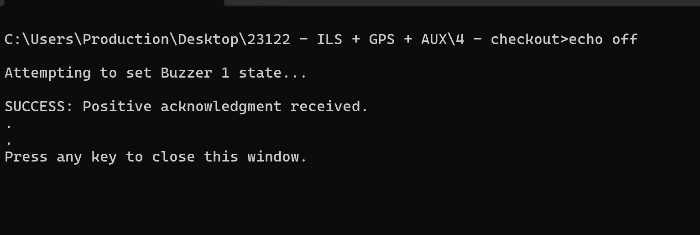
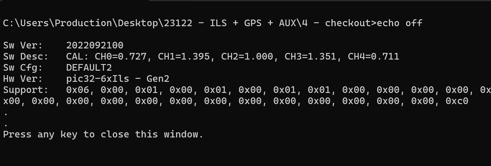
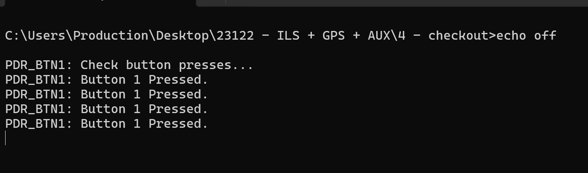
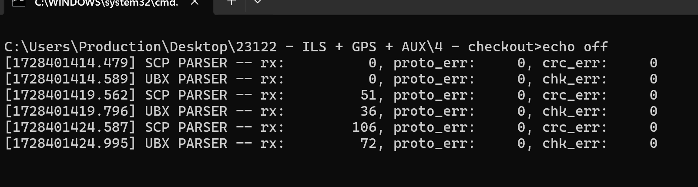

# ✅ Programming

## Notes&#x20;

Download the 23122 - ILS - GPS + AUX from taurus onto your desktop&#x20;


\as-taurus.jdnet.deere.com\Production\Sensors\21215-XX -- 6X Light Sensor\23122 - ILS + GPS + AUX


## Guide

#### 1-Program

Hardware programming is performed by the following process:


Step 1 is only to update the program&#x20;


If update is needed for program file (most recent is 23122)

Perform the instructions include in file _README.md_ in folder _1 – program_. This will vary depending on the Microchip device / cable assembly that is being used. Update accordingly.



1. Connect the USB cable between the board and the PC. (Below is the Microchip programmer between PC and pic32-6xIls board)

<figure><figcaption></figcaption></figure>

2. Verify the LED next to the USB connector illuminates GREEN (after briefly being RED for \~5 seconds)
3. Click on the <mark style="color:blue;">Program-23122</mark> file
4. Follow steps on the program&#x20;
5. Disconnect the USB cable between the board and the PC

#### 2- GNSS Configuration

Each board includes a u-blox GNSS module which must be configured.  The process to perform this is:

1. Flip the DIP switch to an ON position.
2. Connect the 3v3 TTL cable between the PC and the board's 4-pin JST _GPS PROG_ connector.

<figure><figcaption></figcaption></figure>

3. Open Device Manager on computer and find which port the TTL is using.
4. Connect the USB cable between the board and the PC.
5. Open u-center.
6. Within u-center, enabled autobauding if it isn’t already, at: Receiver > autobauding.
7. Connect to the TTL cable’s COM interface
   1. Open device manager -> ports for confirm COM#
   2. Example: Your COM port might be different

<figure><figcaption></figcaption></figure>

8. Select: Tools > GNSS Configuration …
9. Select the configuration file _cfg-v1.txt_ from folder _2 – gnss configuration_.
10. Verify that “Store configuration into BBR/Flash” is checked.
11. Select: File > GNSS.

<figure><figcaption></figcaption></figure>

12. If a warning message is displayed regarding firmware version click “YES” to continue
13. Perform steps 8-11 a second time.  This is required as a failure is experienced the first time most way through the update, because the baud rate of the interface is changed.
14. Select: View >> Packet Console.
15. Verify that messages are output at the following rates.  This can be accomplished by looking at a one second interval of the output messages.
    1. NAV-PVT: 5Hz
    2. NAV-DOP: 1Hz
    3. NAV-SAT: 1Hz&#x20;

<figure><figcaption></figcaption></figure>

16. Exit u-center.
17. Flip the DIP switch to an OFF position.
18. Disconnect the USB cable between the board and the PC.


Complete Assembly before moving onto Calibration [assembly.md](assembly.md "mention")


#### 3 - Calibration

Calibration is performed outdoors, where both a reference (i.e., golden) ILS and the ILS to be calibrated are used to collect a data sample.  This must be done under either of the following weather conditions:

* Full sun with no clouds (ideal)
* &#x20;Full cloud coverage

Sparse, cloudy weather could yield poor calibration results, and therefore calibration shouldn’t be performed under these conditions.  The calibration process is performed as follows:

1. Connect the reference ILS via USB to the computer.  Take note of the COM port for the sensor (viewable in the Device Manager).
2. Connect the new ILS via USB to the computer.  Take note of the COM port for the sensor (viewable in the Device Manager).
3. Within folder _3 – calibration_, double-click script _cal.bat_ and follow the on-screen prompts.
4. Use sticky notes to mark completed light sensors&#x20;

#### 4 - Checkout

Final checkout is performed to verify that everything is operating as expected. _Final checkout is performed by Sentera production to guarantee that the unit is operating as expected._

* Connect the ILS via USB to the computer. Take note of the COM port for the sensor (viewable in the Device Manager).
* Within folder _4 – checkout_ update file _cfg.txt_ with the COM port of the connected device.

1 - Get Info

1.

    <figure><figcaption></figcaption></figure>

    Within folder _4 – checkout_ double-click script _1 – get info.bat_.
2. Verify that the software identifies:
   1. Software version: _2022092100_

_Confirm results in program:_ CH0=<mark style="color:$info;">NIR</mark>, CH1=<mark style="color:$danger;">Red-Edge</mark>, CH2=<mark style="color:red;">Red</mark>, CH3=<mark style="color:green;">Green</mark>, CH4=<mark style="color:blue;">Blue</mark>

<figure><figcaption></figcaption></figure>

3. Take Screenshot of results and post on taurus&#x20;
   1.

       <figure><figcaption></figcaption></figure>

2 - Test Buzzer

1. Within folder _4 – checkout_ double-click script _2 – test buzzer.bat_.
2. Verify that you can hear an audible tone from the buzzer.
3. Take Screenshot of results and post on taurus&#x20;
   1.

       <figure><figcaption></figcaption></figure>

3 - Test Button

1. Within folder _4 – checkout_ double-click script _3 – test button.bat_.
2. Press the push-button 5 times.
3. Take Screenshot of results and post on taurus&#x20;
   1.

       <figure><figcaption></figcaption></figure>

4 - Test Communication

1. Within folder _4 – checkout_ double-click script _4 – test communication.bat_.
2. Verify that the _SCP PARSER_ identifies:
   1. _rx:_ incrementing.
   2. _proto\_err_: zero.&#x20;
   3. _crc\_err_: zero.&#x20;
3. &#x20;Verify that the _UBX_ _PARSER_ identifies (Below is correct anything else should be questioned):&#x20;
   1. _rx:_ incrementing.
   2. _proto\_err_: zero.&#x20;
   3. _crc\_err_: zero.&#x20;
4. Take a screeshot and post on taurus

<figure><figcaption></figcaption></figure>


Post images to Taurus in SN XXX folder&#x20;

\as-taurus.jdnet.deere.com\Production\Sensors\21215-XX -- 6X Light Sensor


SN XXX folder example on Taurus:&#x20;

<figure><figcaption></figcaption></figure>
