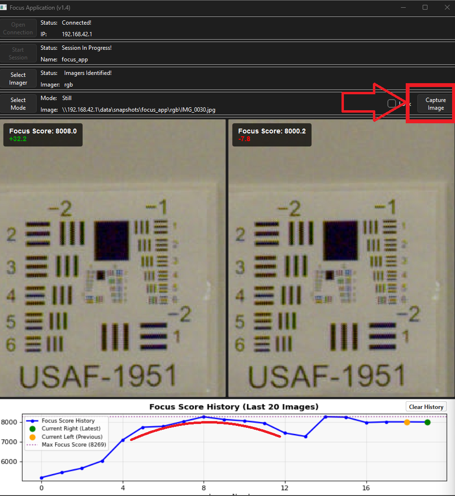
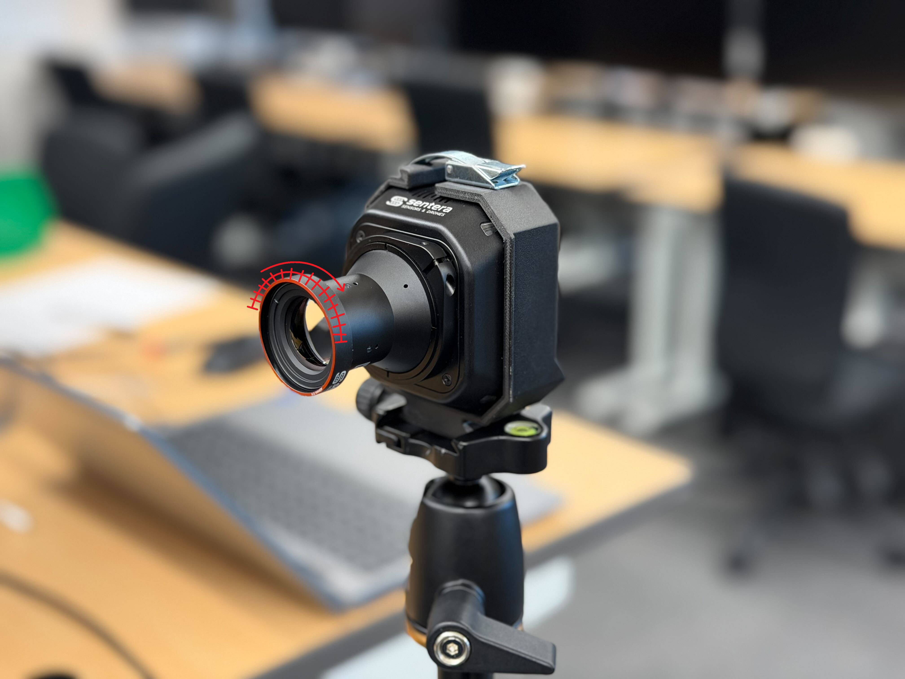

# 1-C PixelScout 65R Focusing

## Notes

The process for focusing a PixelScout 65R is different than a regular 65R. For a non-PixelScout 65R, refer to the 65R technical instructions.

## Materials/Equipment Required

* Camera Mount
* Tripod
* Focusing micro-USB cable
* Power Adapter
* 1.5 hex screwdriver

## Guide

### Prep

1. Ensure you have the focus app installed. If not, refer to the software installation guide on how to get it.
   1. [#focus-app-in-progress](../../../space-and-general/software-installation-guide.md#focus-app-in-progress "mention")
2. If not done already, remove the lens shroud from the camera using 2 screws.

### Setup

3. Turn on the lights at the focus station using the 3 remotes.
4. Secure the camera to the tripod using the 65R quick mount and point it towards the targets at the front of the office. Try to point it such that the middle target will be in the middle of the picture.

<figure><figcaption></figcaption></figure>

5. Power on the camera and connect it to a laptop using the focusing micro-USB cable.
6. In a browser, navigate to 192.168.42.1.
7. In the 'Image Adjustments' tab, change the following settings and click 'Apply'.
   1. Shutter MIN: 4,000 us
   2. Shutter MAX: 10,000 us
   3. Shutter Unlock: 100 ISO
   4. Image Sharpening: OFF

<figure><figcaption></figcaption></figure>

8. Create a focus artifacts folder for the camera by serial number
   1. In the folder, copy and paste the 'numbers template' file and rename it to 'numbers'.
   2. Record the serial number at the top.



9. Open 3 instances of the Focus App program.
10. 1st in one instance than in the other two, do the following.
    1. Click 'Open Connection'
    2. Click 'Start Session'
       1. If a session is already started, this step will be skipped
    3. Click 'Select Imager' and select 'rgb' and 'ok'.
    4. Click 'Select Mode' and select 'Still' and 'ok'.

<figure><figcaption></figcaption></figure>


The focus app will take one picture automatically, take a second picture manually and scroll around to make sure the two frames are synced correctly. If not, close and reopen all 3 instances of the focus app.


11. Ensure the following.
    1. All 3 targets are in frame.
    2. The center target is about center. (does NOT need to be exact)
    3. The camera is somewhat level. (does NOT need to be exact)
12. Pan each instance of the focus app to a different target; left, middle, and center.
    1. position the target in the frame as shown with the bottom left corner just outside of frame. Keep this consistent throughout the focus process to ensure consistent numbers.

### Focusing

<figure><figcaption>
Example Focus App Session: Note the two peaks and returning to a balance between them.
</figcaption></figure>

13. Take a picture using either the 'Capture Image' button or click 'c' on your keyboard.

<figure><figcaption></figcaption></figure>

14. Adjust the framing if needed so that the target is as shown. The bottom left corner should be slightly out of view.


Note: The previous score, indicated by the orange dot may change while adjusting the frame. Once a new picture is taken, it will return to the score it was before the next picture was taken.&#x20;

For example, adjusting the current frame may put the previous frame in the blank wall and lower the score dramatically. Then, when another picture is taken, the score will be corrected to when it was on the target.


15. Turn the lens clockwise (facing the camera) to adjust focus outward.
16. Repeat steps 13-15 until the center target is ALMOST in focus.
    1. This is to make sure you don't miss the peak. start making smaller steps before the target is completely in focus.
17. Repeat steps 13-15 with small changes in the focus and step through focus for each target. You should be able to see peaks in each graph that indicates when each target is most in-focus.
    1. After each peak, record the 'max' score in the notepad file and calculate the threshold or target.

<figure><figcaption></figcaption></figure>

<figure><figcaption></figcaption></figure>

18. Again repeat steps 13-15 but adjust focus such that the scores satisfy the requirements in the notepad file.

### Wrap up/Saving artifacts

19. Record the final score for each target in the notepad file as well as the percentage of the max score. Save the notepad file.
20. Take a screenshot of the focus app instances to record the final resting point. Save these pictures to the serial numbered focus artifact folder.
21. Power cycle the camera.
22. Navigate back to the webpage (192.168.42.1 in a browser)
23. Create a new session named 'Focus'.

    <figure><figcaption></figcaption></figure>
24. Take many pictures, placing a target in each of the following locations in frame for at least one photo each. This is so that focus can be checked at many locations around the frame.

<figure><figcaption></figcaption></figure>

25. Put the lens cap over the lens and take a photo. Rename this one in the file explorer to 'Cap Photo'.
26. Download the focus session folder to the serial numbered focus artifact folder.

<figure><figcaption></figcaption></figure>

27. Upload the entire serial-numbered focus artifact folder to taurus in the following folder.
    1. "\as-taurus.jdnet.deere.com\Production\Sensors\21030-XX -- 65R Sensor\21030-04"

