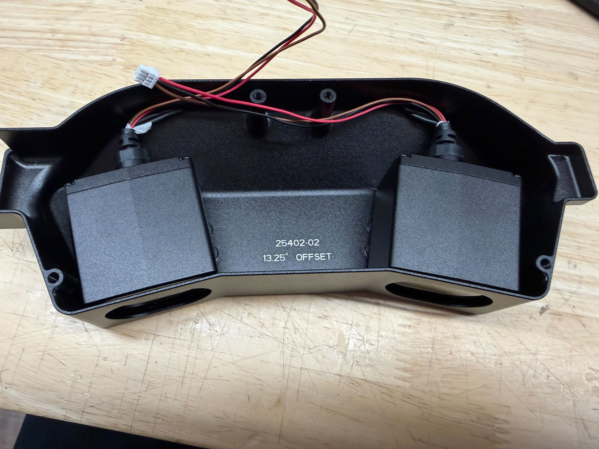
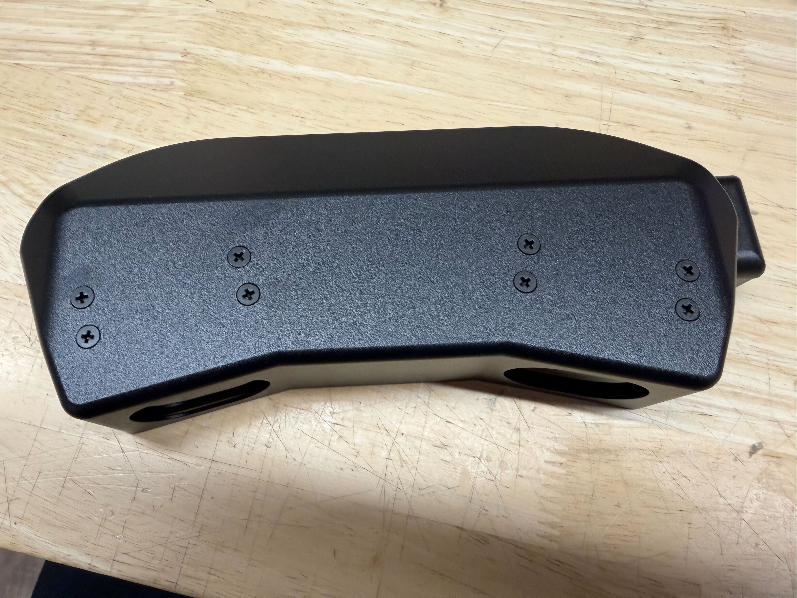
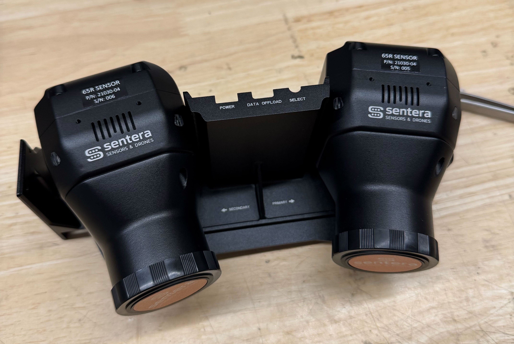
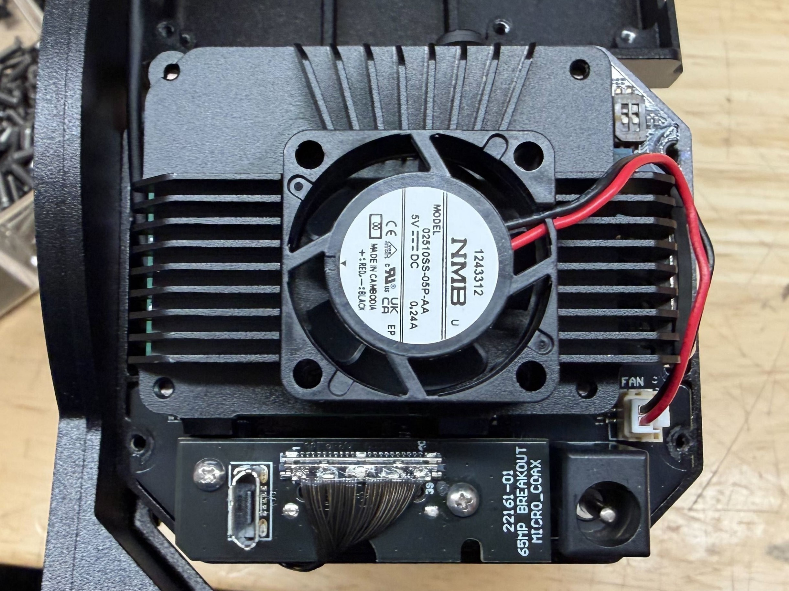
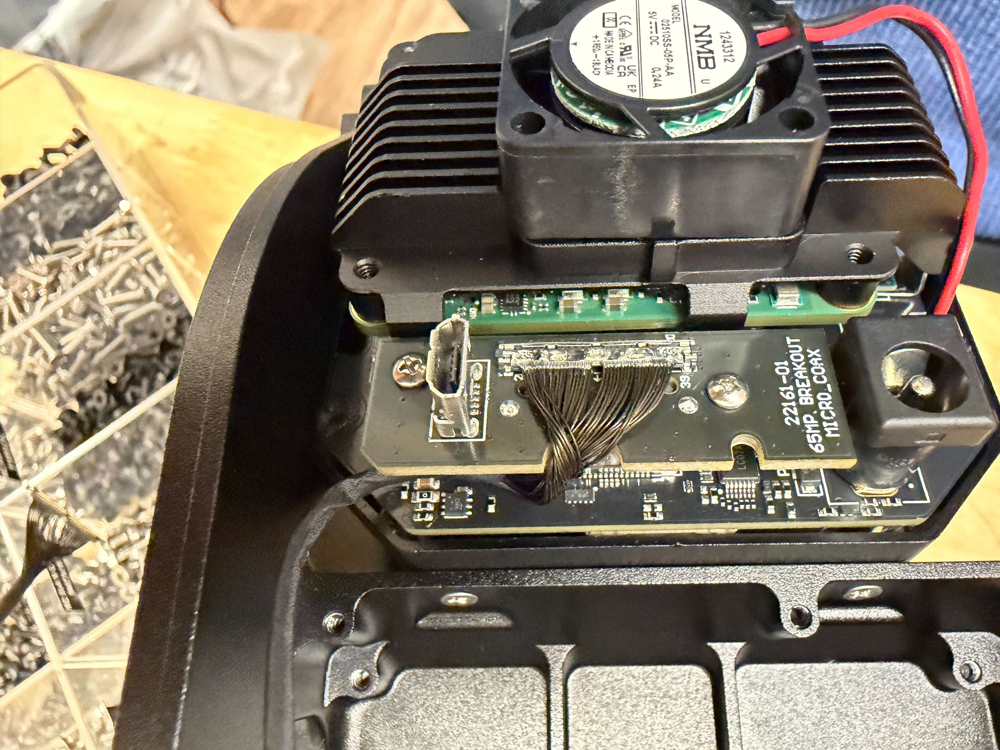
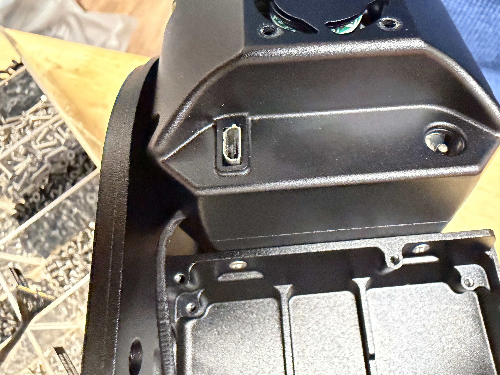

# ✅ 2-A Camera Pod Assembly

## Required Equipment/Materials

| Loctite        | Small Heat Shrink | Heat gun |
| -------------- | ----------------- | -------- |
| Wire-strippers |                   |          |
|                |                   |          |

## Notes:

These instructions end with two separate components, the back with the rangefinders and the front with the cameras. These halves will be joined in a later instruction set.

## Drawing


[#pixelscout-v4-camera-pod-greater-than-21283](../../../space-and-general/drawings.md#pixelscout-v4-camera-pod-greater-than-21283)


## Guide

### Rangefinders

1. If not done already, prep the rangefinders by cutting the wires and applying a small \~1" strip of heat shrink to the open ends.
2. Insert the rangefinders into the rear housing. Secure using 4 screws (<mark style="color:yellow;">91698A302 M3x6 Flt Hd Blk</mark>) each and Loctite.



<figure><figcaption></figcaption></figure>



<figure><figcaption></figcaption></figure>



### Cameras

3. Assign primary and secondary cameras by serial number.
   1. The cameras used should be in succession.&#x20;
   2. The LOWER serial number camera will be designated as the PRIMARY.

<figure><figcaption></figcaption></figure>

4. Attach the Cameras to the camera pod assembly in their designated mounts. Secure using 4 screws (<mark style="color:yellow;">93085A015 2-56x.188" Flat Head from #22 of 6X screw bin</mark>) EACH and Loctite.
   1. Hold the cameras in place and insert the screws about halfway with Loctite before going back and tightening all of them.
   2.  It may be easiest to screw in the back ones first.

       <figure><figcaption></figcaption></figure>

### Micro-Coax Cables

5. Remove the back covers of each camera using 7 screws on the rear.

<figure><figcaption></figcaption></figure>

6. Attach the PSDK micro coax cable to the micro-USB breakout board.

<figure><figcaption></figcaption></figure>

7. Route the cable to the correct corner (relative to the micro-coax breakout board) and place the cover back on, ensuring the cable stays in place and is not pinched.
   1. Primary will go to the close corner (shown)
   2. Secondary will go to the far corner



<figure><figcaption></figcaption></figure>



<figure><figcaption></figcaption></figure>



| Primary                                                                           | Secondary                                                                         |
| --------------------------------------------------------------------------------- | --------------------------------------------------------------------------------- |
|  |  |

7. Re-apply Loctite to the screws and secure the cover.
