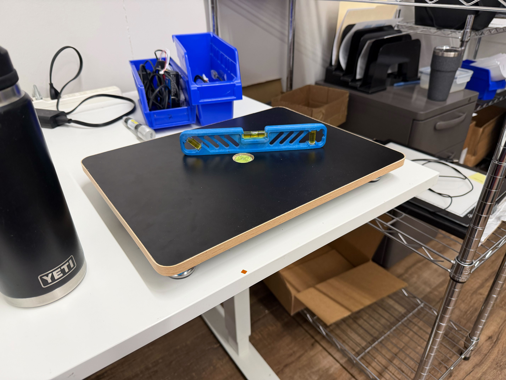
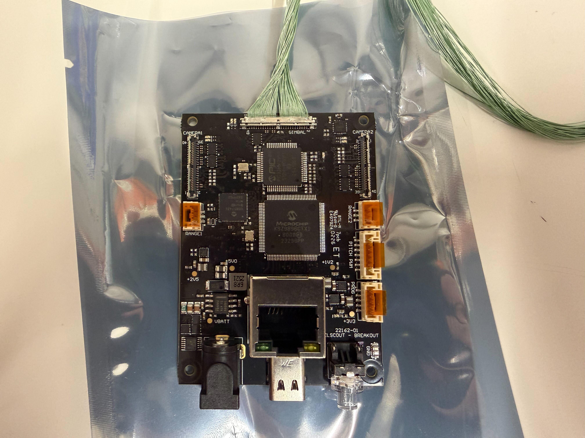
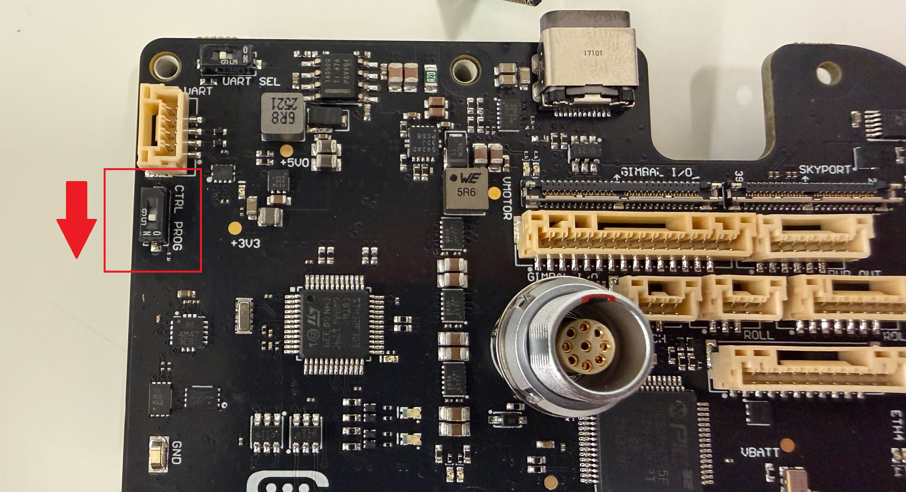
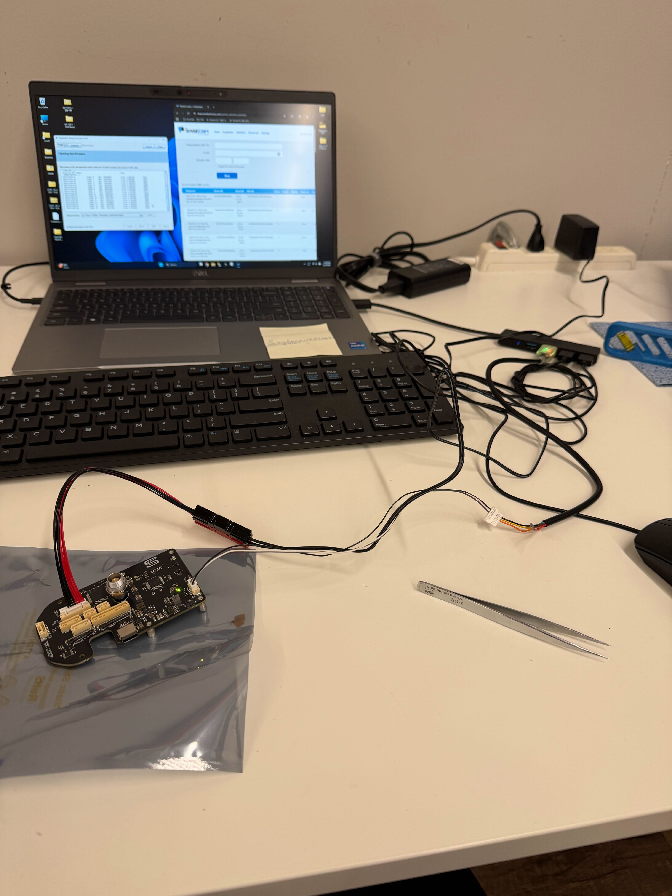
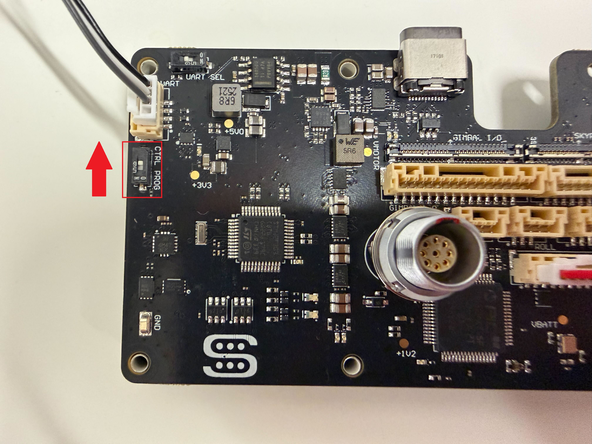
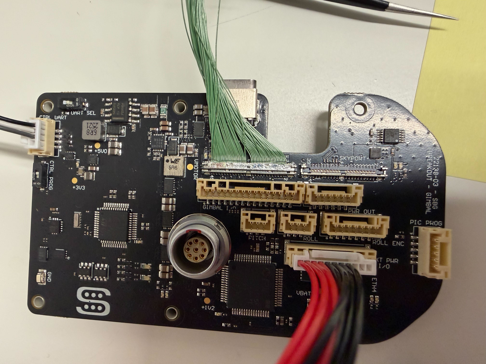
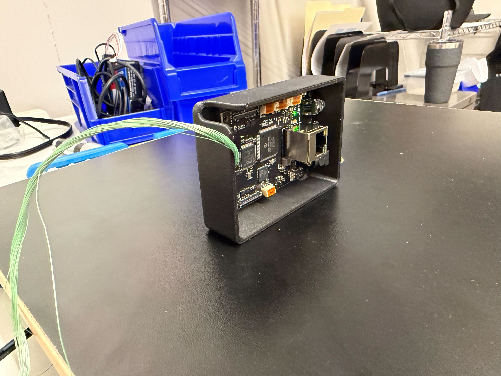

# ✅ 2-C Gimbal Programming

## Required Materials

| Gimbal Programming kit | Leveling Board | Level |
| ---------------------- | -------------- | ----- |
| Production Laptop      |                |       |
|                        |                |       |

## Notes

The process of programming these board is very similar to that of the 6x/65R. The main differences are the cables.

## Guide

### Preparation

1. Level the leveling board using an external level.

<figure><figcaption></figcaption></figure>

2. Open <mark style="color:blue;">Partner Assistant</mark> and log in.
3. Connect one end of the green micro coax cable to the 'Gimbal' port on the end of the PixelScout breakout board.

<figure><figcaption></figcaption></figure>

4. Place the PixelScout breakout board into the rectangular jig and secure barely snugly using the 2 black course threaded screws included.

<figure><figcaption></figcaption></figure>

5. Switch the 'CTRL PROG' Switch on the SBG Breakout Board to 'ON'.

<figure><figcaption></figcaption></figure>

6. Plug in all the required connections
   1. Computer to board via TTL cable and adapter.
      * Plug into CTRL UART port on board.
   2. Power Adapter into EXT PWR I/O port on board.
   3. AC Adapter into wall outlet.


Warning: Plug in the Power connection LAST to avoid electrical damage.


<figure><figcaption></figcaption></figure>

### Programming Steps

#### Partner Assistant


If the serial number required is not known, click on 'Web Control Panel'. Sign in and click 'Customers' and the top. The required serial number will be the next highest 23138-03\_rev- Serial Number.


1. Click on the <mark style="color:blue;">drop down</mark> in the top left corner and ensure the correct COM port is selected.


Do NOT click 'Connect'


<figure><figcaption></figcaption></figure>

2. Click <mark style="color:blue;">Test Board</mark>

<figure><figcaption></figcaption></figure>

3. Select <mark style="color:blue;">3.3 "Tiny+</mark> and click <mark style="color:blue;">FLASH</mark>.



<figure><figcaption></figcaption></figure>



<figure><figcaption></figcaption></figure>



4. Select/Adjust the following settings and click <mark style="color:blue;">Next</mark>.
   1. License: <mark style="color:blue;">**#5033**</mark>
   2. 3 axis driver: <mark style="color:blue;">**unchecked**</mark>
   3. Battery Voltage Sensor: <mark style="color:blue;">**Checked**</mark>
   4. Motor Power: <mark style="color:blue;">**80**</mark>

<figure><figcaption></figcaption></figure>


NOTE: some errors may pop up. This is okay, just click 'OK'.


5. Select <mark style="color:blue;">Flash new secret keys</mark> page, click <mark style="color:blue;">Next</mark>.

<figure><figcaption></figcaption></figure>

6. Select/Adjust the following settings and click <mark style="color:blue;">Next</mark>.
   1. License: <mark style="color:blue;">**#5033**</mark>
   2. 3 axis driver: <mark style="color:blue;">**unchecked**</mark>
   3. Battery Voltage Sensor: <mark style="color:blue;">**Checked**</mark>
   4. Reference Voltage: <mark style="color:blue;">**12.05 V**</mark>
   5. Reference Current: <mark style="color:blue;">**0 A**</mark>
   6. Board ID: <mark style="color:blue;">**23138-03\_rev-\_SNXXX**</mark>**.** (where XXX denotes the next few numbers from the Basecam website.

<figure><figcaption></figcaption></figure>

7. Click <mark style="color:blue;">NEXT ></mark>.

<figure><figcaption></figcaption></figure>

8. Click <mark style="color:blue;">NEXT ></mark> again.

<figure><figcaption></figcaption></figure>

9. Select firmware <mark style="color:blue;">2.70.0 ENCODERS (18.12.2020)</mark> and click <mark style="color:blue;">UPLOAD</mark>.

<figure><figcaption></figcaption></figure>

10. Once it says '<mark style="color:$success;">OK</mark>, Set new firmware on server...' click <mark style="color:blue;">cancel</mark>

<figure><figcaption></figcaption></figure>

11. Flip the 'CTRL PROG' switch on the SBG Breakout Board to 'OFF'.

<figure><figcaption></figcaption></figure>

#### Basecam SimpleBGC GUI

1. Connect the other end of the green microcoax cable to the 'Gimbal' connection on the Pixelscout Breakout Board.

<figure><figcaption></figcaption></figure>

2. Open 'SimpleBGC GUI'.
3. Reconnect the power cable to the board.
4. In SimpleBGC GUI, towards the top, ensure the correct COM port is selected. Click <mark style="color:blue;">Connect</mark>.



<figure><figcaption></figcaption></figure>



<figure><figcaption></figcaption></figure>




Notes:&#x20;

1. Some errors may pop up. That is okay. just click 'OK'.&#x20;
2. The main error that might come up is 'Serial Data Corrupted'. If this happens, check that the 'CTRL PROG' switch on the SBG Breakout Board is set to 'OFF' and power cycle the board.


5. At the top, click <mark style="color:blue;">Board</mark> > <mark style="color:blue;">Backup Manager</mark>.

<figure><figcaption></figcaption></figure>

6. In the 'Restore from backup' section, click <mark style="color:blue;">browse</mark>.

<figure><figcaption></figcaption></figure>

7. Find the PixelScout Phase 4 'Starting Point' EEPROM file and select <mark style="color:blue;">Open</mark>, then <mark style="color:blue;">Restore</mark> and <mark style="color:blue;">Yes</mark>.



<figure><figcaption></figcaption></figure>



<figure><figcaption></figcaption></figure>





<figure><figcaption></figcaption></figure>







8. Click on the <mark style="color:blue;">Hardware</mark> tab on Basecam GUI.
9. Click on <mark style="color:blue;">Calibrate IMUs</mark>.

<figure><figcaption></figcaption></figure>


Warning: Do not click on any of the options in the 'Gyroscope' section. The boards are not designed to have these settings.


10. In the 'Accelerometer' side (Left), click <mark style="color:blue;">Reset</mark>.

<figure><figcaption></figcaption></figure>

11. Orient the board in the jig on any face, wait for the bar on the right to reach green, click <mark style="color:blue;">Calibrate</mark> and repeat for another face until all 6 are checked.



<figure><figcaption></figcaption></figure>



<figure><figcaption></figcaption></figure>





<figure><figcaption></figcaption></figure>

<mark style="color:red;">BAD</mark>




<figure><figcaption></figcaption></figure>

<mark style="color:$success;">GOOD</mark>




12. Once the board IMU is calibrated, export the calibration data.
    1. At the bottom of the 'Sensor Calibration Helper' window, click <mark style="color:blue;">Backup...</mark>.
    2. Name: sbgc\_IMU\_calib\_phase4SNXXX' where 'XXX' denotes the pixel scout gimbal serial number.
    3. Folder: New folder titled the 3 digit serial number
    4. Click <mark style="color:blue;">Save</mark>.



<figure><figcaption></figcaption></figure>



<figure><figcaption></figcaption></figure>



13. Board Programing is complete! At the top, click <mark style="color:blue;">Disconnect</mark> and disconnect all of the board connections.

<figure><figcaption></figcaption></figure>
