# 📷 3-A-1 Skyport Top Stack

## Required Materials

| Table Vise | Paper Towels | Loctite |
| ---------- | ------------ | ------- |
|            |              |         |
|            |              |         |

## Notes

This assembly is very close to a normal Skyport top stack with 2 exceptions:

1. Spacers in place of comms and motor controller boards.
2. Bend the top cap.

## Guide

1. Use a vise to carefully bend the tab on the yaw cable cover so that it is flat.

<figure>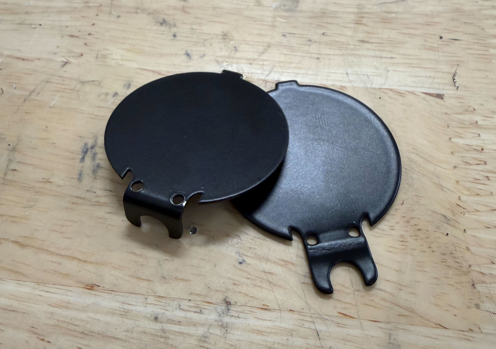<figcaption></figcaption></figure>

2. Remove the two Torx T5 screws on the top of the Skyport

<figure>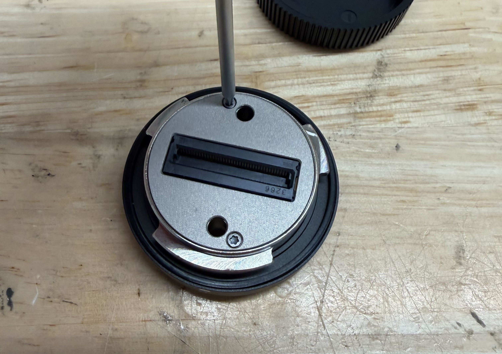<figcaption></figcaption></figure>

3. Remove the plate and two rubber pieces.
4. Line up the yaw adapter as shown. Secure with the 4 screws already in place.

<figure>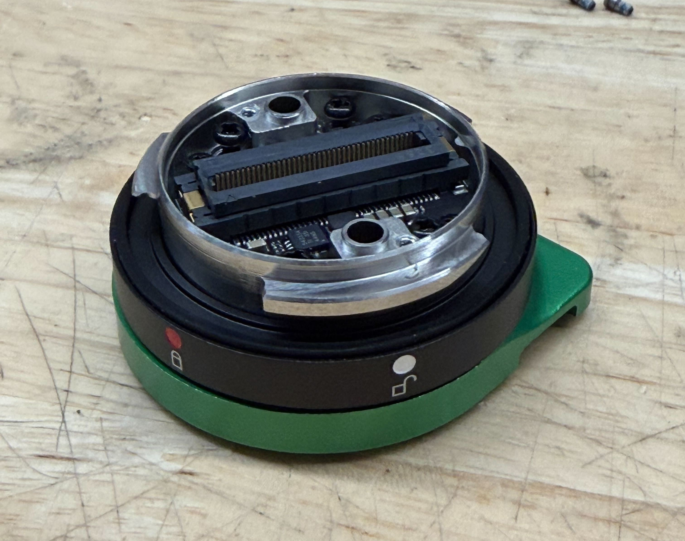<figcaption></figcaption></figure>

5. Replace the rubber pieces (nub side up) and top plate. Secure using the same Torx T5 screws from step 2.

<figure>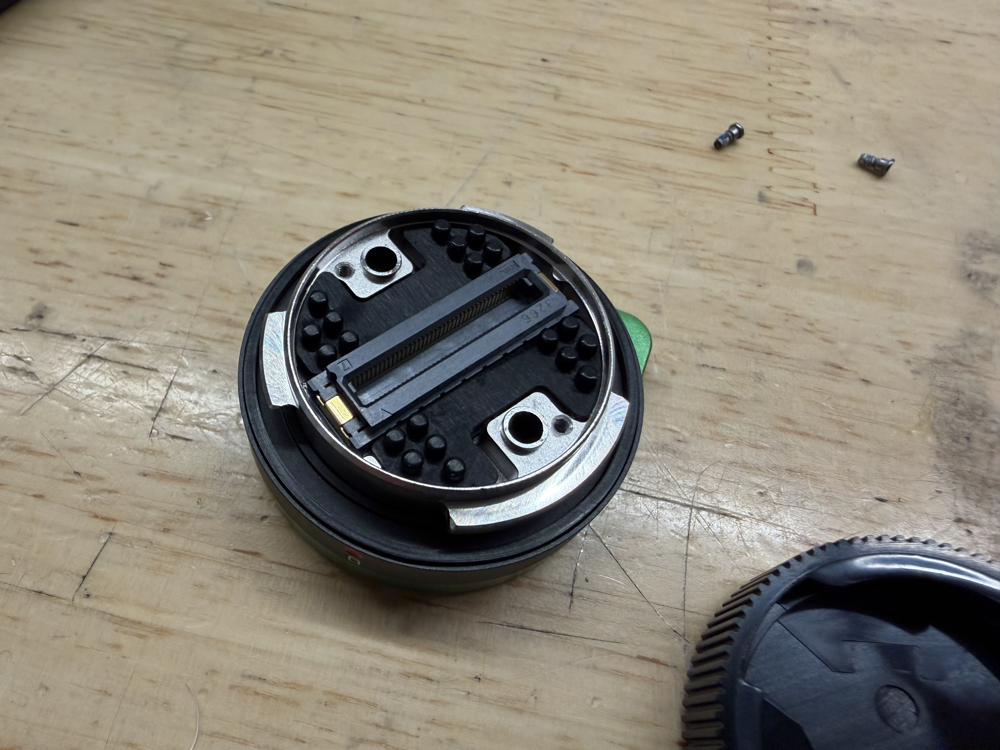<figcaption></figcaption></figure>

<figure>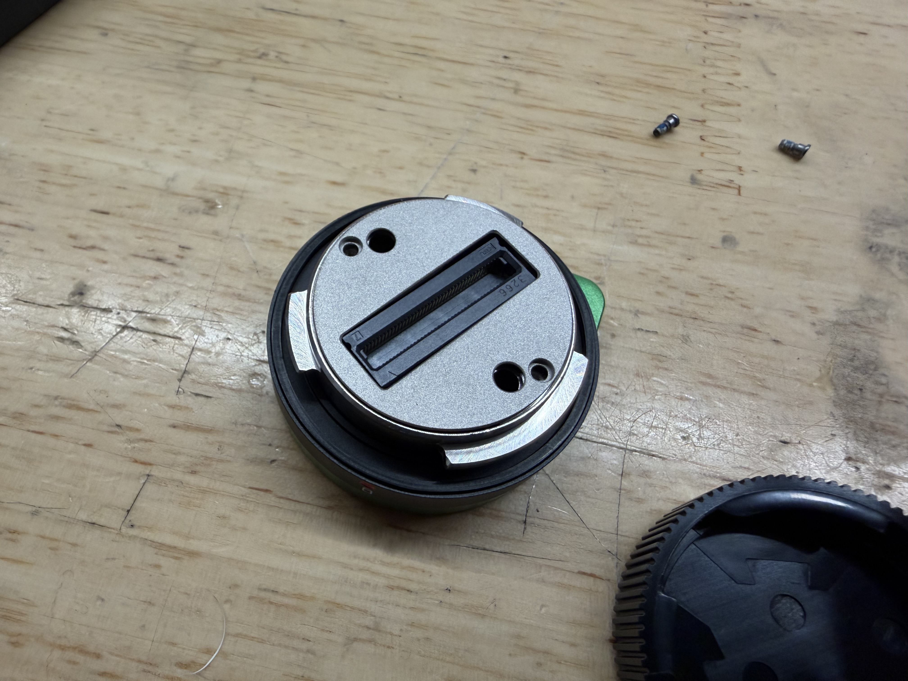<figcaption></figcaption></figure> <figure>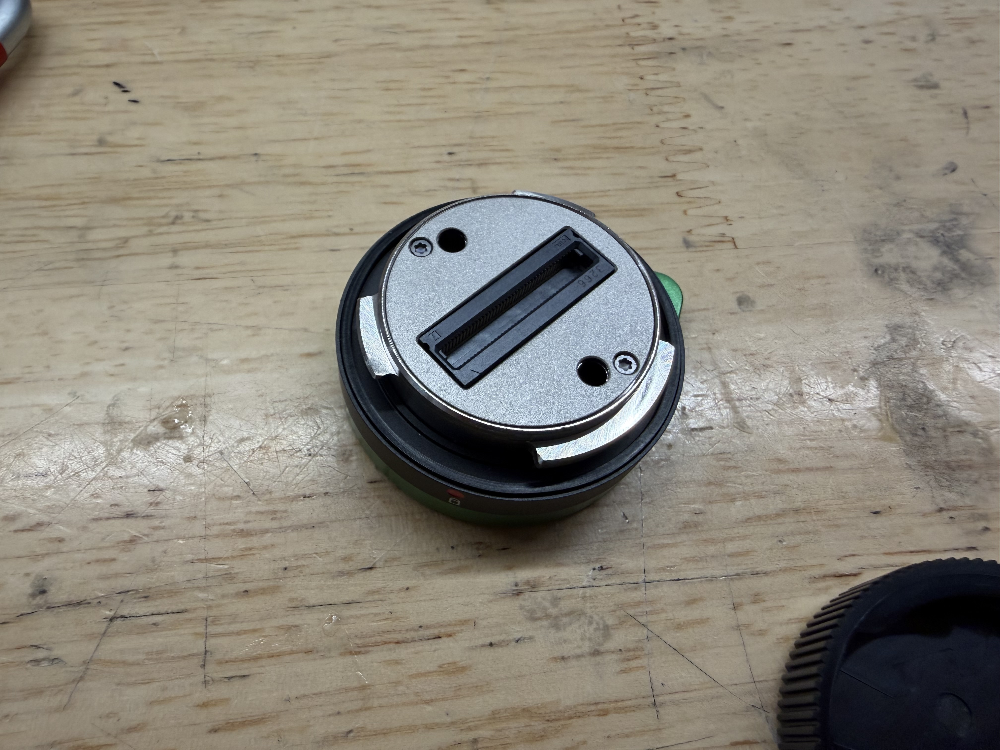<figcaption></figcaption></figure>

6. Place the cover back on top of the Skyport to avoid damaging the port.

<mark style="color:red;">Pictures here</mark>

7. Carefully plug in the PSDK cable to the board in the Skyport.

<figure>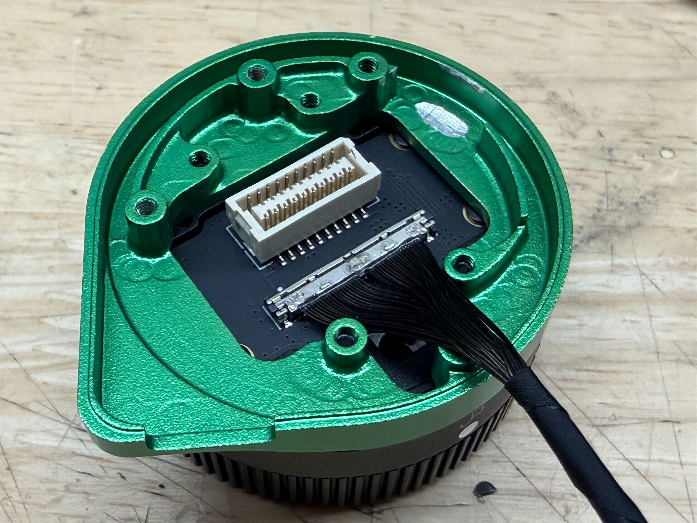<figcaption></figcaption></figure>

8. Place the comms board spacer on the skyport adapter lining it up using the USB-C port.

<figure>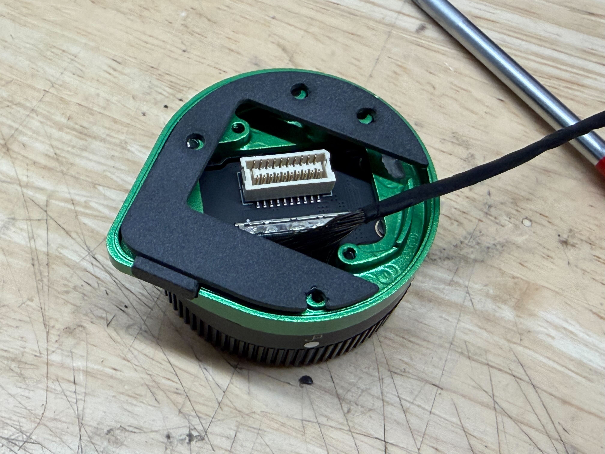<figcaption></figcaption></figure>

9. Thread the cable through the large hold in the yaw enclosure. Line it up on the top of the spacer being careful to keep the holes lined up. Secure using 4 screws (<mark style="color:yellow;">94017A108 M2x8 Narrow Cheese Head</mark>) and Loctite.


Due to the greater load induced by the weight of the PixelScout system, apply a liberal amount of Loctite and tighten **slightly** more than usual.


<figure>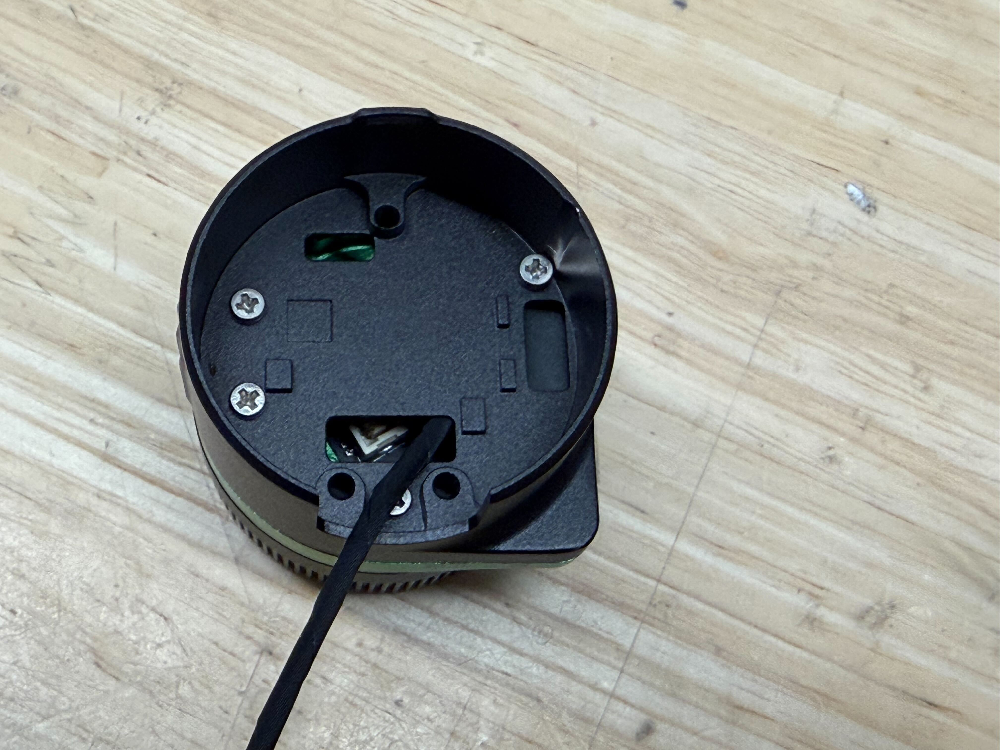<figcaption></figcaption></figure>

10. Place the motor controller spacer where the motor controller board would normally go. Line up the 3 screw holes.

<figure>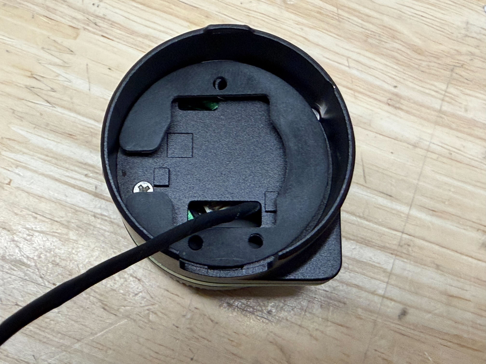<figcaption></figcaption></figure>

11. Line up the top of the gimbal using the 3 screw holes. Secure using 3 screws (<mark style="color:yellow;">94017A156 M2.5x10 Narrow Cheese Head</mark>) and Loctite.


Due to the greater load induced by the weight of the PixelScout system compared to a normal camera, apply a liberal amount of Loctite and tighten slightly more than usual.


<figure>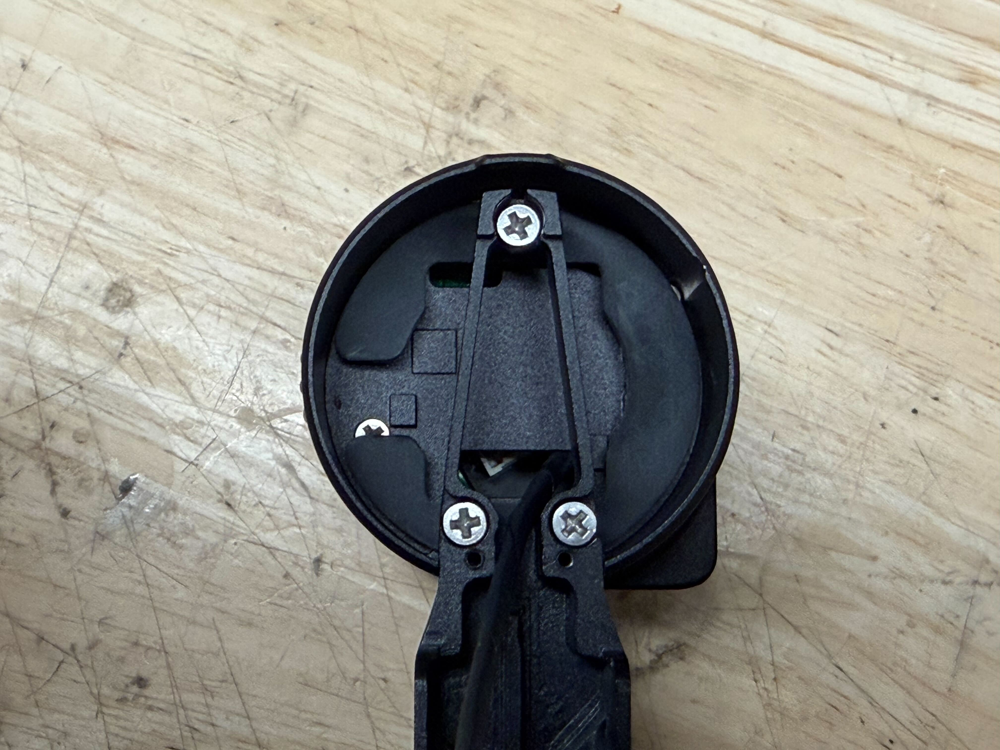<figcaption></figcaption></figure>

12. Place the yaw cable cover over the stack by inserting the tab into the slot. Secure using 2 screws (<mark style="color:yellow;">95836A512 M1.6x4 Pan Head Black</mark>) and Loctite.

<figure>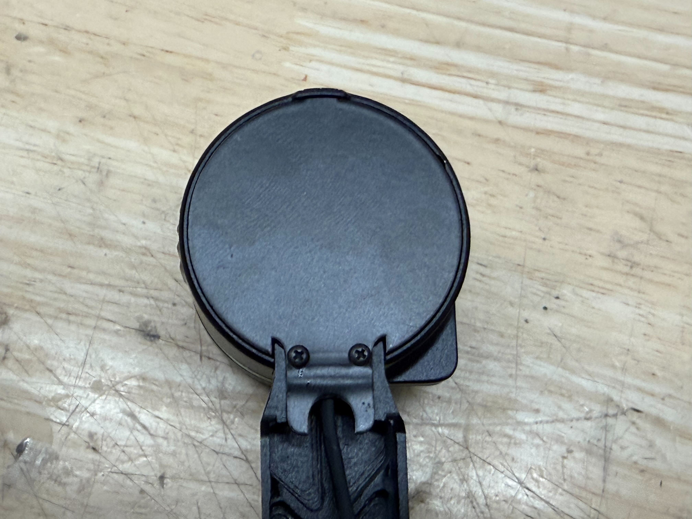<figcaption></figcaption></figure>
