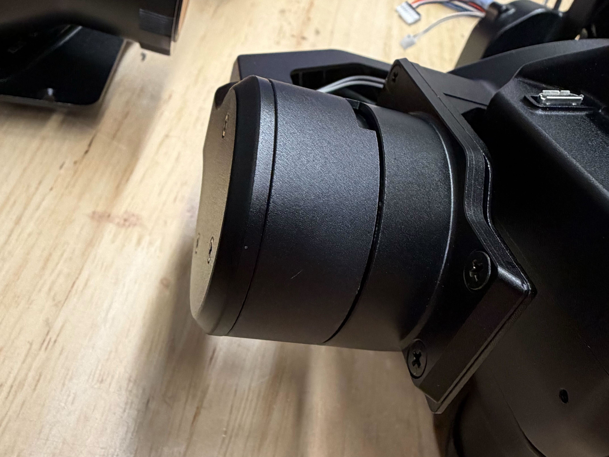
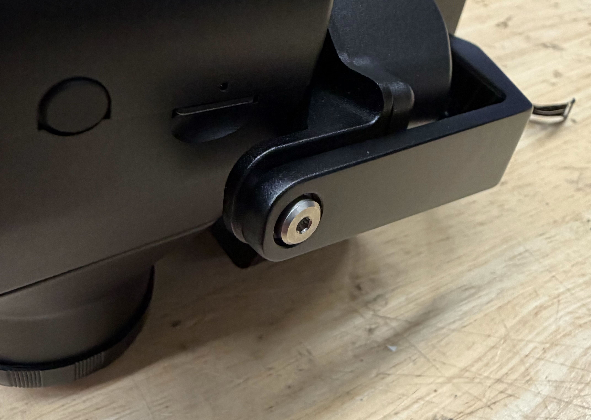
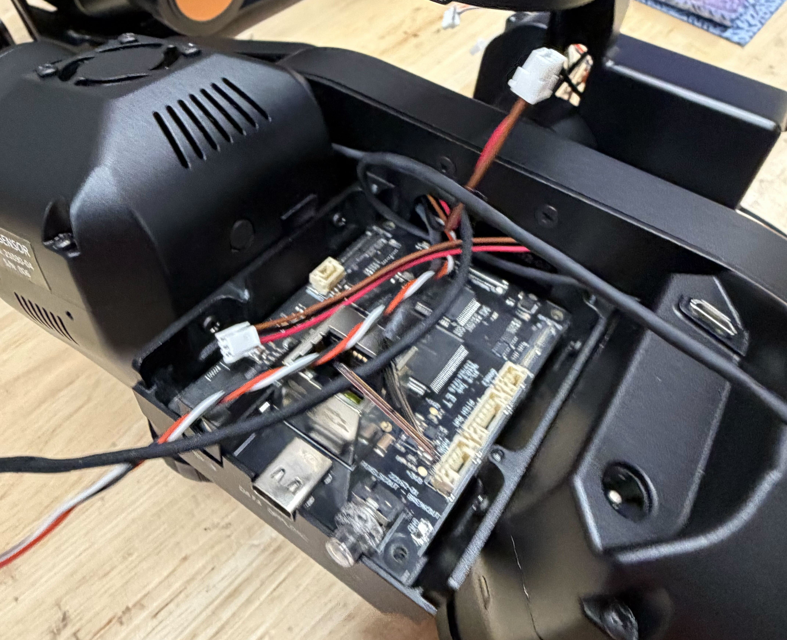
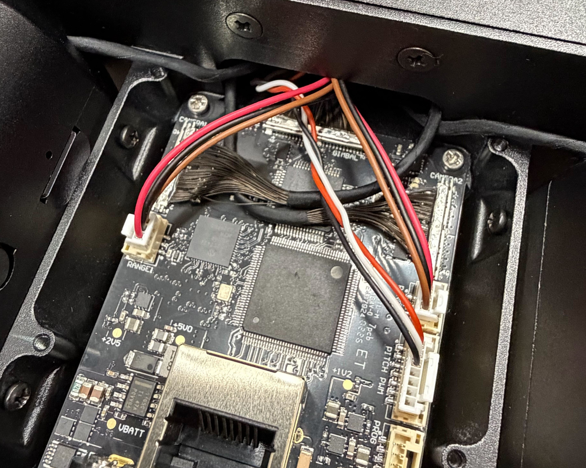
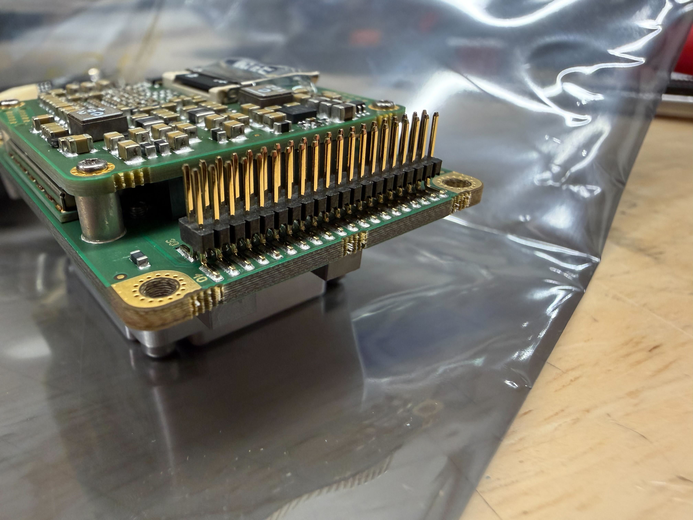
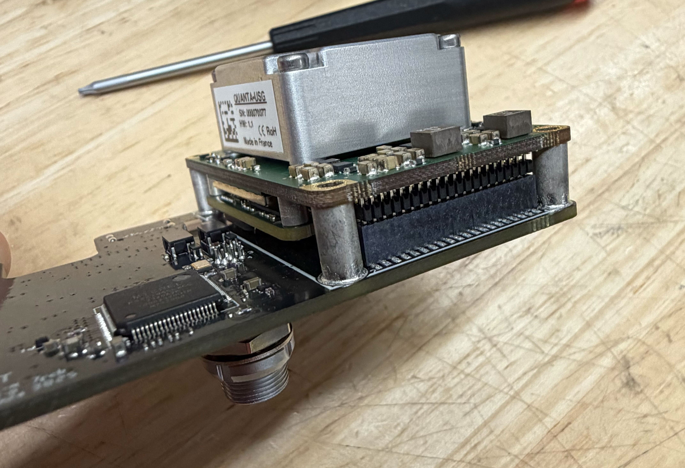
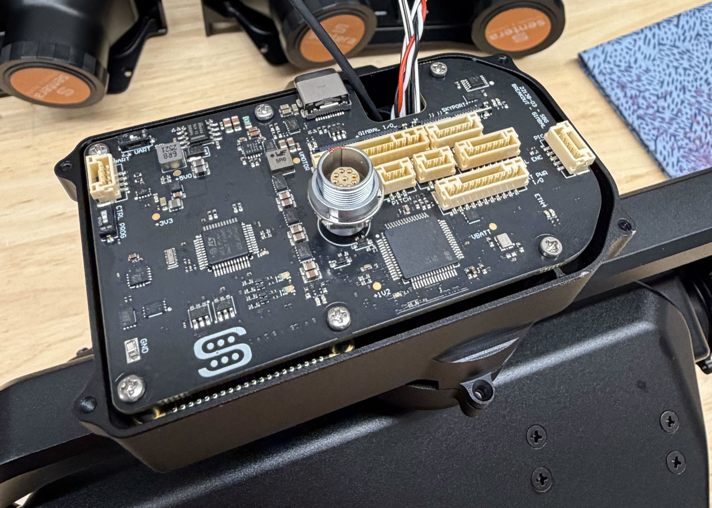
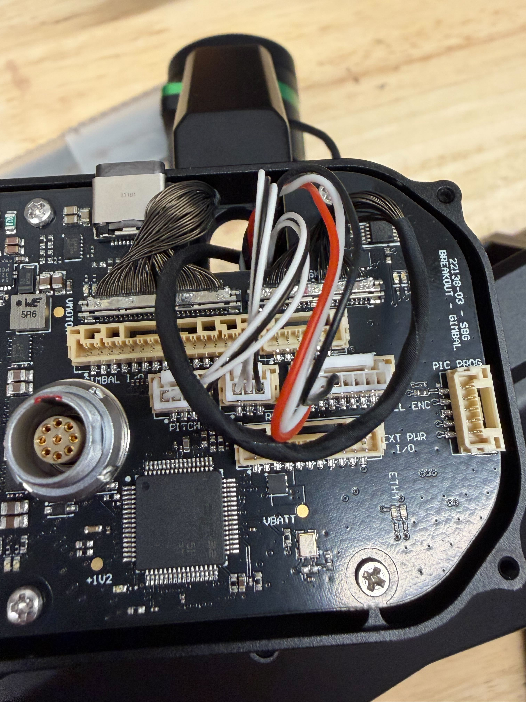

# 3-A Complete Gimbal Assembly

## Required Items

In addition to the BOM, the following items are required:

* Loctite

## Notes

* This instruction set finishes with the gimbal fully built excep the back and middle covers. Before they are installed, Tuning and Programing must be performed. Do not forget to secure the covers afterwards.

## Assembly Guide

1. Feed the two cables from the rangefinders through the back opening of the camera pod.
2. Feed the two wires from gimbal through the side hole of the camera pod and in through the back opening.

<figure><figcaption></figcaption></figure>

3. Ensure the cut wires on each rangefinder are tucked in a way that they won't be pinched or cause any gaps.
4. Place the back cover on the camera pod, secure using 4 screws (M3x6 Flat Head BLK 91698A302) and Loctite.

<figure><figcaption></figcaption></figure>

3.  While pulling the 2 gimbal cables taught, match the mating surfaces between the camera pod and the gimbal. Secure using 4 screws (M3x6 Flat Head BLK 91698A302) and Loctite.

    <figure><figcaption></figcaption></figure>
4. Double check that 6 cables are present:
   1. gimbal micro-coax from back opening.
   2. gimbal cable from back opening.
   3. 2 rangefinder cables from back opening.
   4. 2 micro-coax cables from the cameras.
   5. If any are missing, refer to previous steps to find how to correct it.
5.  Secure the other side of the camera pod using a shoulder screw, bearing, and Loctite.

    <figure><figcaption></figcaption></figure>
6. Attach the gimbal micro-coax to the center board in the rear-center position.
7. Place the center board in place, making sure no wires are pinched. Feed the excess from the gimbal micro-coax into the rear cover. Secure the board using 4 screws and Loctite.
   1.  Either (M2x6 N Cheese 94017A106) or (M2x4 N Cheese 94017A101). figure out which one from wayne.

       <figure><figcaption></figcaption></figure>
8. Connect all the wires as shown.
   1. 'CAMERA1': micro-coax from secondary camera
   2. 'RANGE1' from rangefinder behind secondary camera
   3. 'CAMERA2' micro-coax from primary camera
   4. 'RANGE2' from rangefinder behind primary camera
   5. 'PITCH PWM' from gimbal.
   6. Tuck all excess into back cover


NOTE: "1" and "2" on the board don't correspond to primary and secondary, match cables to the components on the respective SIDES of the camera pod.


<figure><figcaption></figcaption></figure>

11. Inspect the pins on the IMU board to ensure they are all straight and in line with each other.

<figure><figcaption></figcaption></figure>

12. Carefully attach the IMU to the rear board using the 30 (?) pin board to board connector. Do not secure with screws yet.

<figure><figcaption></figcaption></figure>

13. Place the combined IMU/rear board into the casing. Route the wires through the opening in the board. Secure the board using 4 long screws (M2x14 Pan 92000A0200), 2 short screws (M2x4 N Cheese 94017A101) and Loctite.

    1. Place the 4 long screws around the IMU.

    <figure><figcaption></figcaption></figure>
14. Plug in all the following cables into the rear board.
    1. 'PITCH': Pitch motor cable.
    2. 'ROLL': Roll motor cable (marked with black sharpie).
    3. 'ROLL ENCODER': Roll encoder cable (marked with black sharpie).
    4. 'GIMBAL I/O': matching-sized micro-coax cable coming from gimbal.&#x20;
    5. 'SKYPORT': matching-sized micro-coax cable coming from skyport stack.


The two micro-coax cables are different sized and therefore should only plug in on or the other, not both. If it is hard to tell, double check by looking into the gap or tugging on the cables behind the board.


<figure><figcaption></figcaption></figure>

15. Organize the cables as shown.
    1. Tuck the gimbal I/O micro-coax cable into the enclosure behind the board.
    2. Make sure none of the other cables are pinched or creased. They can rest higher up as the rear cover allows some space for them.
16. Tune the gimbal.
    1. Refer to the 'Gimbal Tuning' page for this step.


[4-a-gimbal-tuning.md](4-a-gimbal-tuning.md)


17. Program the gimbal.
    1. Refer to the 'Gimbal Programing' page for this step.


[4-b-system-configuration.md](4-b-system-configuration.md)


18. Attach the rear cover to the gimbal. Secure using 4 screws (91239A704 M2x6 Button head hex).
19. Attach the center cover over the board. Secure using 4 screws (91239A704 M2x6 Button head hex).
