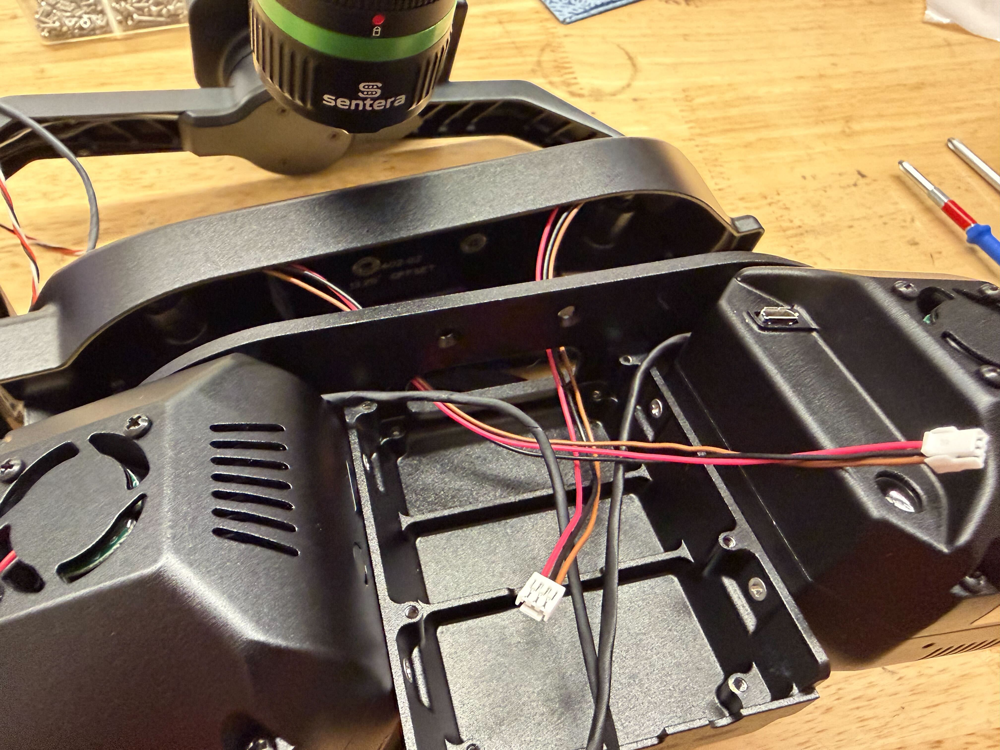
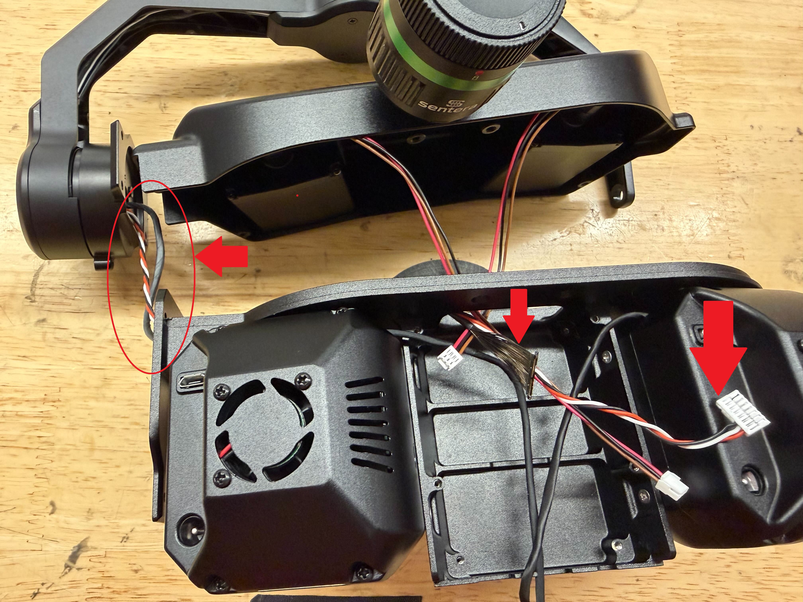
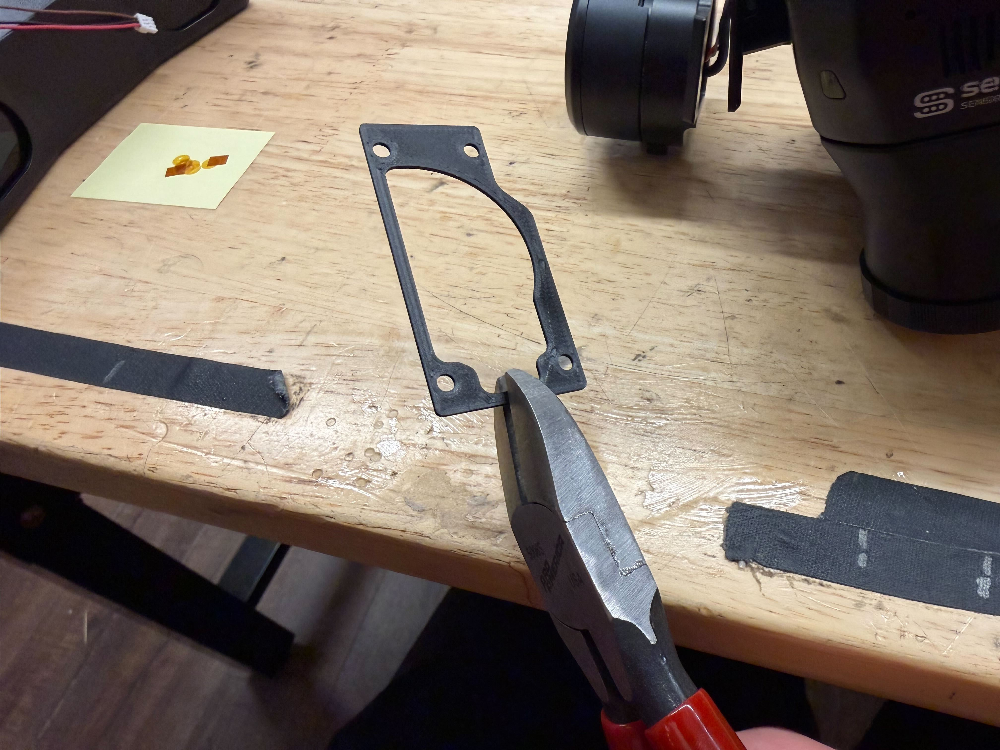
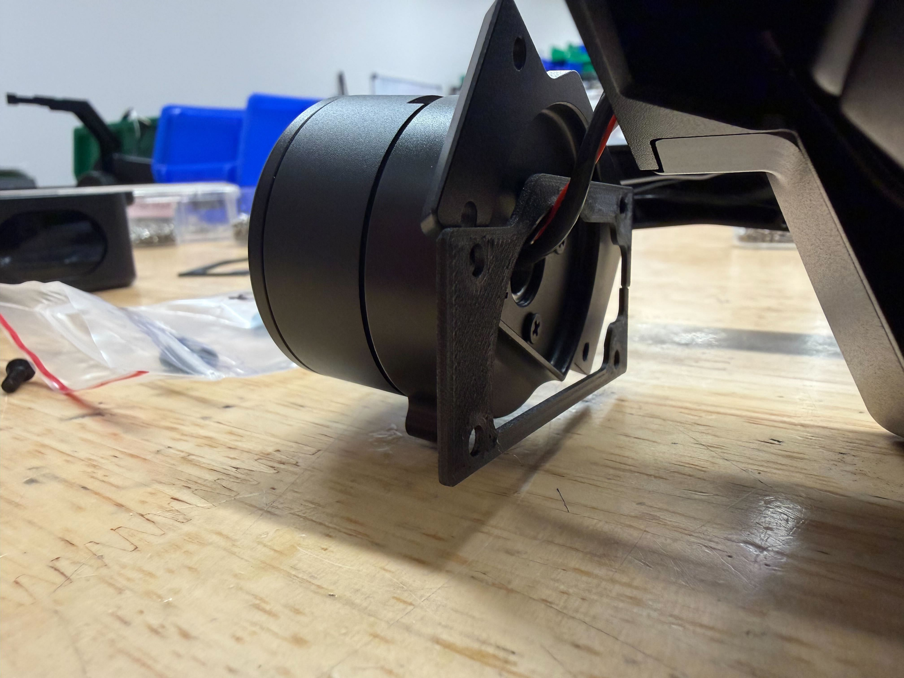
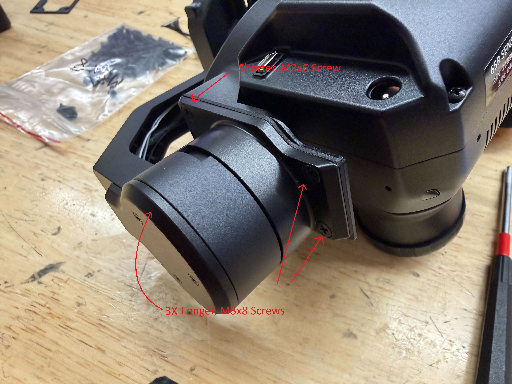
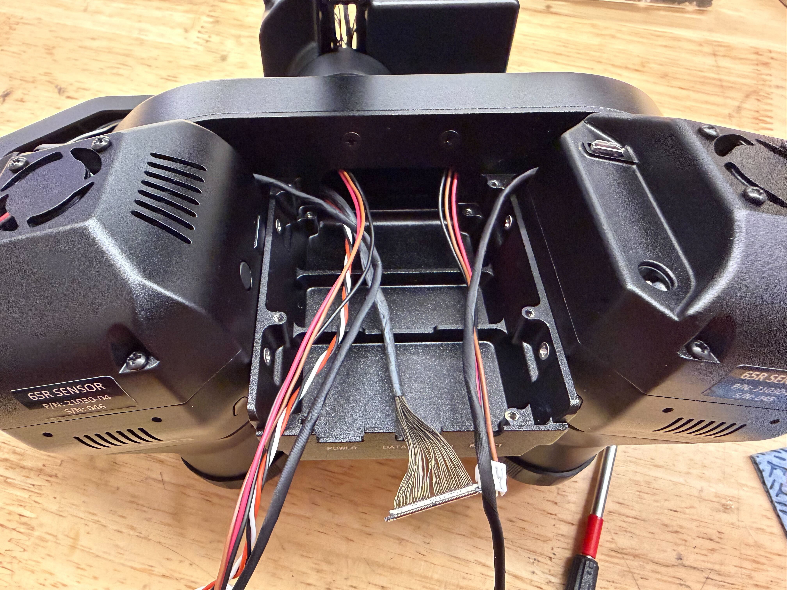
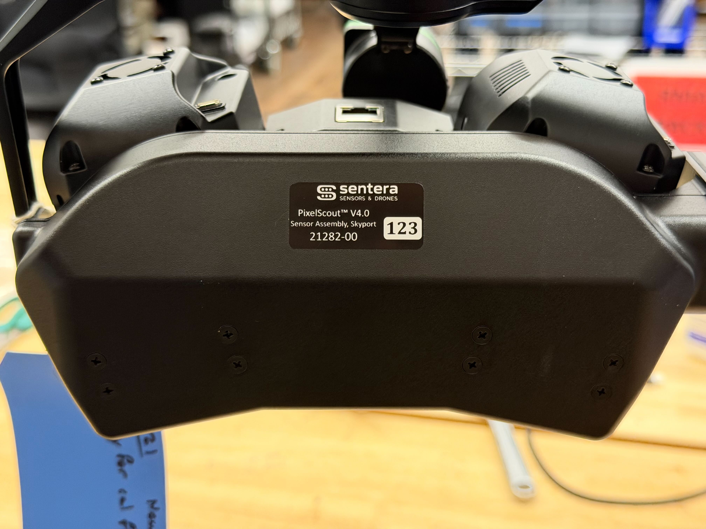

# 📷 3-A End Gimbal Assembly

## Required Items

| Loctite |   |   |
| ------- | - | - |
|         |   |   |
|         |   |   |

## Needs

* Fix numbering

## Notes

* This instruction set finishes with the gimbal fully built excep the back and middle covers. Before they are installed, Tuning and Programing must be performed. Do not forget to secure the covers afterwards.

## Drawing


[#pixelscout-v4-greater-than-21282](../../../space-and-general/drawings.md#pixelscout-v4-greater-than-21282)


## Assembly Guide

1. Feed the two cables from the rangefinders through the back opening of the camera pod.

<figure><figcaption></figcaption></figure>

2. Feed the two wires from gimbal through the side hole of the camera pod and in through the back opening.

<figure><figcaption></figcaption></figure>

3. Ensure the cut wires on each rangefinder are tucked in a way that they won't be pinched or cause any gaps.
4. Place the back cover on the camera pod, secure using 4 screws (<mark style="color:yellow;">91698A302 M3x6 Flat Head BLK</mark>) and Loctite.

<figure><figcaption></figcaption></figure>

5. Cut a 3D printed 45 mil spacer and insert it between the camera pod and gimbal with the wires passing through the middle

<figure><figcaption></figcaption></figure>

6. While pulling the 2 gimbal cables slightly taught, match the mating surfaces between the camera pod and the gimbal, sandwhiching the 3D printed spacer. Secure using 3 longer screws (<mark style="color:yellow;">91698Axxx M3x8 Flat Head BLK</mark>) and 1 shorter screw (<mark style="color:yellow;">91698A302 M3x6 Flat Head BLK</mark>) and Loctite.
   1. The shorter screw will only have a couple threads worth of engagement, be careful not to overtighten and strip the threads.

<figure><figcaption></figcaption></figure> <figure><figcaption></figcaption></figure>

7. Double check that 6 cables are present:
   1. gimbal micro-coax from back opening.
   2. gimbal cable from back opening.
   3. 2 rangefinder cables from back opening.
   4. 2 micro-coax cables from the cameras.
   5. If any are missing, refer to previous steps to find how to correct it.

<figure><figcaption></figcaption></figure>

8. Secure the other side of the camera pod using the shoulder screw, bearing, and Loctite.
   1. If using the 45 mil spacer, use a smaller shoulder screw (<mark style="color:yellow;">XXXXX Shoulder Screw</mark>)

<figure><figcaption></figcaption></figure>

9. Attach the gimbal micro-coax to the center board in the rear-center position.
   1. It is easier to attach this before attaching the board to the pod to avoid accidentally dropping the wire into the back cover.

<mark style="color:red;">Picture here</mark>

10. Place the center board in place, making sure no wires are pinched. Feed the excess from the gimbal micro-coax into the rear cover. Secure the board using 4 screws (<mark style="color:yellow;">94017A101 M2x4 N Cheese</mark>) and Loctite.

<figure><figcaption></figcaption></figure>

11. Connect all the wires as shown.
    1. 'CAMERA1': micro-coax from secondary camera
    2. 'RANGE1' from rangefinder behind secondary camera
    3. 'CAMERA2' micro-coax from primary camera
    4. 'RANGE2' from rangefinder behind primary camera
    5. 'PITCH PWM' from gimbal.
    6. Tuck all excess into back cover


NOTE: "1" and "2" on the board don't correspond to primary and secondary, match cables to the components on the respective SIDES of the camera pod.


<figure><figcaption></figcaption></figure>

12. Inspect the pins on the IMU board to ensure they are all straight and in line with each other.

<figure><figcaption></figcaption></figure>

13. Carefully attach the IMU to the rear board using the 40 pin board to board connector. Do not secure with screws yet.

<figure><figcaption></figcaption></figure>

14. Place the combined IMU/rear board into the casing. Route the wires through the opening in the board. Secure the board using 4 long screws (<mark style="color:yellow;">92000A0200 M2x14 Pan</mark>), 2 short screws (<mark style="color:yellow;">94017A101 M2x4 N Cheese</mark>) and Loctite.
    1. Place the 4 long screws around the SBG IMU.

<figure><figcaption></figcaption></figure>

15. Plug in all the following cables into the rear board.
    1. 'PITCH': Pitch motor cable.
    2. 'ROLL': Roll motor cable (marked with black sharpie).
    3. 'ROLL ENCODER': Roll encoder cable (marked with black sharpie).
    4. 'GIMBAL I/O': matching-sized micro-coax cable coming from gimbal.&#x20;
    5. 'SKYPORT': matching-sized micro-coax cable coming from Skyport stack.


The two micro-coax cables are different sized and therefore should only plug in on or the other, not both. If it is hard to tell, double check by looking into the gap or tugging on the cables behind the board.


<figure><figcaption></figcaption></figure>

16. Organize the cables as shown.
    1. Tuck the gimbal I/O micro-coax cable into the enclosure behind the board.
    2. Make sure none of the other cables are pinched or creased. They can rest higher up as the rear cover allows some space for them.
17. Place a sticker with the correct serial number on the back of the cover as shown.

<figure><figcaption></figcaption></figure>

17. Tune the gimbal.
    1. Refer to the 'Gimbal Tuning' page for this step.


[4-a-gimbal-tuning.md](4-a-gimbal-tuning.md)


18. Program the gimbal.
    1. Refer to the 'System Configuration' page for this step.


[5-system-configuration.md](5-system-configuration.md)


19. Attach the rear cover to the gimbal. Secure using 4 screws (<mark style="color:yellow;">91239A704 M2x6 Button head hex</mark>).
20. Attach the center cover over the board. Secure using 4 screws (<mark style="color:yellow;">91239A704 M2x6 Button head hex</mark>).
