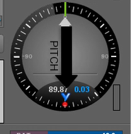
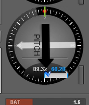

# 📷 4-A Gimbal Tuning

## Required Equipment/Materials

| Bag of weights    | Spacers           | Loctite |
| ----------------- | ----------------- | ------- |
| Gimbal tuning kit | Production Laptop |         |
|                   |                   |         |

## Notes

While changing values through Basecam GUI, click 'write' **often** (especially after adjusting **any** value) to upload the correct values to the gimbal. Additionally, click 'Restart' fairly often to make sure the gimbal will act accordingly. If the gimbal is making any unexpected actions, click write and/or restart to see if that fixes it.

## Pre-tuning Balancing

Before the gimbal is tuned, it must be balanced as much as possible for the most effective tune.

1. Connect the gimbal to a drone, do not turn it on.
2. If the gimbal leans all the way left (facing the gimbal), tape a weight on the high side of the gimbal frame until it's balanced, noting how heavy it is.
3. Take the gimbal off and unscrew the 4 M3x6 screws on the pitch motor side of the camera pod.
4. Choose a spacer to start with based on what weight was used to balance the gimbal.

| Weight                     | Spacer Thickness |
| -------------------------- | ---------------- |
| minimal (Skyport Cap, etc) | 30 mil           |
| 6 grams                    | 40 mil           |
| 12 grams                   | 60 mil           |

5. Insert the spacer between the pitch motor and camera pod. Re-secure using 4 new screws (<mark style="color:yellow;">91698A304 M3x8 Flat Head Black</mark>) and Loctite.
6. Double check how balanced the gimbal is, repeat with a new size spacer if needed until the gimbal is fairly level.

## Tuning Setup

1. Attach the camera gimbal to a DJI M300 or M350.
2. Connect a USB TTL cable from a computer to the back of the gimbal.
3. Power on the drone.

<figure><figcaption></figcaption></figure>

## Tuning

1. Open SimpleBGC GUI.
2. Select the corresponding COM port and click <mark style="color:blue;">connect</mark>.

<mark style="color:red;">Picture Here</mark>

3. Restore the 'Starting Point' EEPROM.
   1. At the top, go to <mark style="color:blue;">Board</mark> > <mark style="color:blue;">Backup Manager</mark>.
   2. In the 'Restore from Backup' tab, click on <mark style="color:blue;">browse</mark> and find the '**Starting point**' EEPROM.
   3. Click <mark style="color:blue;">Open</mark> > <mark style="color:blue;">Restore</mark> > <mark style="color:blue;">Yes</mark>
   4. Once it finishes, click <mark style="color:blue;">Close</mark>.



<figure><figcaption></figcaption></figure>



<figure><figcaption></figcaption></figure>





<figure><figcaption></figcaption></figure>



<figure><figcaption></figcaption></figure>





<figure><figcaption></figcaption></figure>



<figure><figcaption></figcaption></figure>



4. Go to the <mark style="color:blue;">Hardware</mark> tab and ensure the roll output is disabled and the pitch output is enabled.

<figure><figcaption></figcaption></figure>

5. The P and I values may need to be lowered in the <mark style="color:blue;">stabilization</mark> tab.
   1. 'P' values for the pitch and roll may be set to \~80.
   2. 'I' value for the top one may be set to \~5.
6. Under the <mark style="color:blue;">Encoders</mark> tab, click <mark style="color:blue;">E Field Calibration</mark> and allow the gimbal to self-calibrate.

<figure><figcaption></figcaption></figure>

7. Click <mark style="color:blue;">Offset Calib</mark> and allow the gimbal to self-calibrate again.
   1. Note the offset value. Add or subtract **4096** to correct it.
   2. The white arrow in the 'Pitch' circle on the right should be perpendicular to the black.
      1. <-5,000 --> ADD 4096
      2. \>-5,000 --> SUBTRACT 4096
      3. If later in the tuning process, the gimbal is not able to tune the roll offset, this may need to be switched (added instead of subtracted, etc)


In this case, the offset value returns as -16,076 which is less than -5,000. For this reason, 4,096 is added to -16,076 to get **-11980.**




<figure><figcaption></figcaption></figure>



<figure><figcaption></figcaption></figure>





<figure><figcaption></figcaption></figure>



<figure><figcaption>
Parallel: BAD
</figcaption></figure>

<figure><figcaption>
Perpendicular: GOOD
</figcaption></figure>



8. Under the <mark style="color:blue;">Hardware</mark> tab, enable the roll output.
   1. Keep the Pitch enabled as well.
   2. Click <mark style="color:blue;">Write</mark>
   3. Click the <mark style="color:blue;">Restart arrow</mark>

<figure><figcaption></figcaption></figure>

9. Under the <mark style="color:blue;">Encoders</mark> tab, click <mark style="color:blue;">E Field Calibration</mark> and allow the gimbal to self-calibrate.

<figure><figcaption></figcaption></figure>

10. Click <mark style="color:blue;">Offset Calib</mark> and allow the gimbal to self-calibrate again.
    1. If the self-calibration fails twice, try switching adding/subtracting 4096 to the PITCH offset.

<figure><figcaption></figcaption></figure>

11. Readjust the PITCH offset value to the same as previously calculated.
    1. Click <mark style="color:blue;">Write</mark>.
    2. Click the <mark style="color:blue;">restart arrow.</mark>

<figure><figcaption></figcaption></figure>

12. Under the <mark style="color:blue;">Stabilization</mark> tab, click on <mark style="color:blue;">Auto</mark> in the 'PID Controller' area.
    1. Click <mark style="color:blue;">Start</mark> and allow the gimbal to self-tune itself.
    2. Ensure the errors are staying <\~20 (<\~10 is ideal)
    3. Click <mark style="color:blue;">Stop</mark> once the auto-tuning is complete



<figure><figcaption></figcaption></figure>

<figure><figcaption></figcaption></figure>



<figure><figcaption></figcaption></figure>

<figure><figcaption></figcaption></figure>



13. Gently shake the entire drone around to ensure there are no points in the range of motion where the gimbal freaks out/gets stuck.
14. Backup a tuned version of the EEPROM to the SN folder corresponding to the gimbal.
    1. Go to <mark style="color:blue;">Board</mark> > <mark style="color:blue;">Backup Manager</mark>.
    2. Click <mark style="color:blue;">Browse</mark> in the 'Save Backup' section.
    3. name the file 'sbgc\_IMU\_calib\_phase4SNXXX\_tuned' where XXX is the serial number of the system
    4. Click <mark style="color:blue;">save</mark>.
    5. Click <mark style="color:blue;">save</mark> again.
    6. Click <mark style="color:blue;">close</mark>.



<figure><figcaption></figcaption></figure>

<figure><figcaption></figcaption></figure>

<figure><figcaption></figcaption></figure>



<figure><figcaption></figcaption></figure>

<figure><figcaption></figcaption></figure>



15. Backup the IMU Calibration
    1. Go to <mark style="color:blue;">Board</mark> > <mark style="color:blue;">Backup IMU calibration</mark> > <mark style="color:blue;">Main IMU...</mark>
    2. Name the file sbgc\_IMU\_calib\_phase4SNXXX.data where XXX is the serial number of the system.
    3. Click <mark style="color:blue;">Save</mark>.



<figure><figcaption></figcaption></figure>



<figure><figcaption></figcaption></figure>



16. Click <mark style="color:blue;">Disconnect</mark> and power down the drone.

<figure><figcaption></figcaption></figure>

When completed: return to 3-A End Gimbal Assembly page

[3-a-end-gimbal-assembly.md](3-a-end-gimbal-assembly.md "mention")
