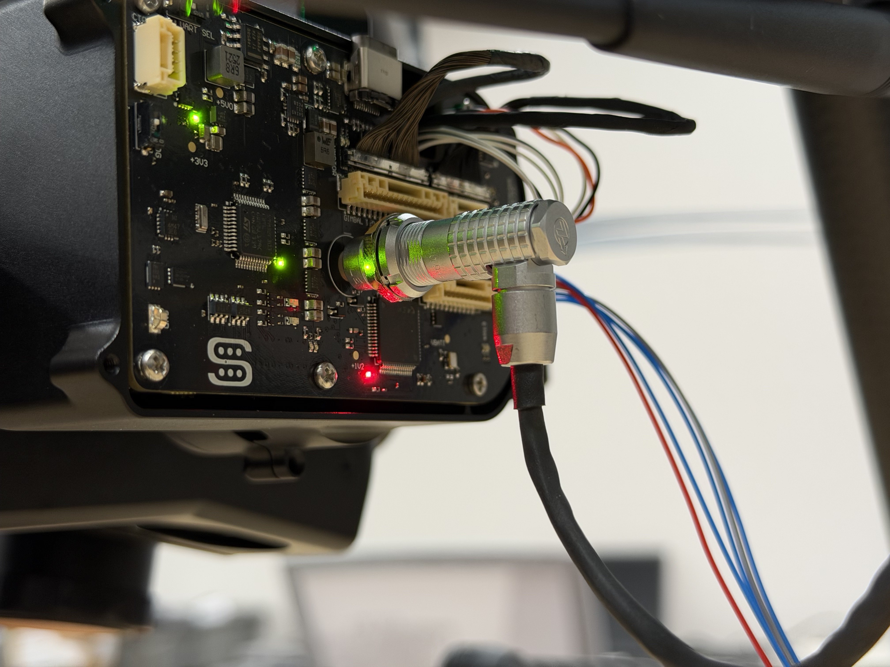
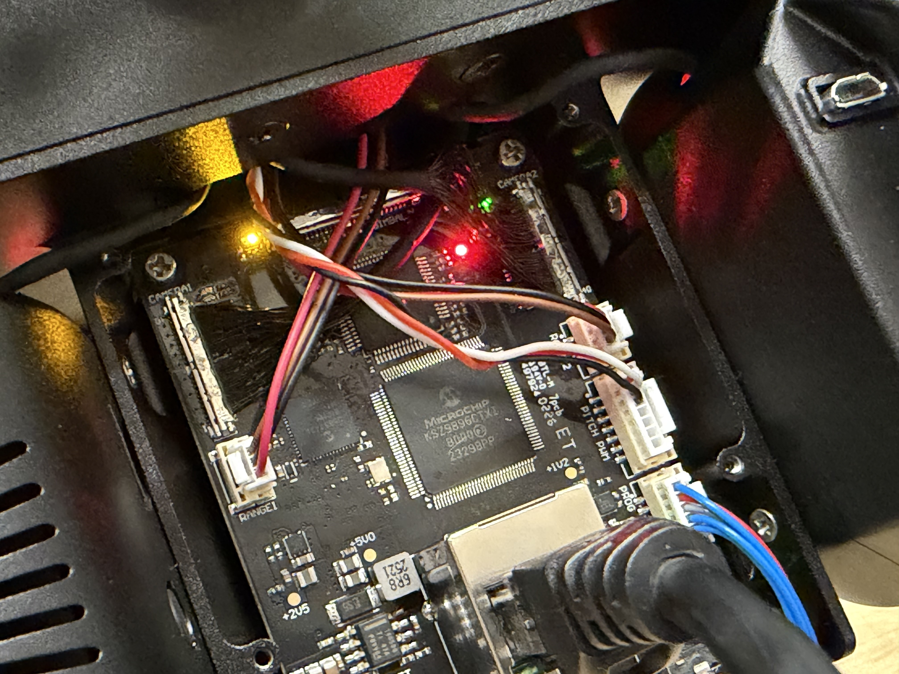
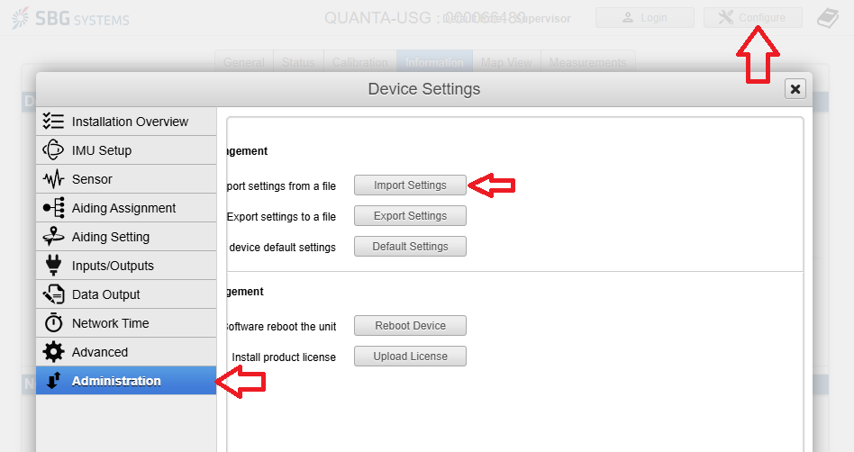

# 🚧 5 System Configuration

## Required Materials

|   |   |   |
| - | - | - |
|   |   |   |
|   |   |   |

## Notes

Changes needed:\
\- check bpr

**Checking Factory Config**

1. Open Command Prompt
2. Connect to the powered-on gimbal using ethernet.
3. Type the following **one line at a time** hitting 'enter' after each one.


Note: when typing in the root password (6636cedar), it will not show up on screen that you're typing. This is a privacy feature. Just type it anyways.


```
del .ssh\known_hosts
ssh root@192.168.5.141
yes
6636cedar
cd /media/persist/camera-app/factory-config/
cat meta.yaml
```

3. Look for 'name:pixelscout4-1-spot' for the primary camera.
4. Type:

```
exit
```

5. Repeat steps 3-5 using '192.168.5.142' and look for 'name:pixelscout4-2' for the secondary camera

<div><figure><figcaption></figcaption></figure> <figure><figcaption></figcaption></figure></div>

## Prep

* Go to taurus>Production>Technical Packages>PIXELSCOUT PHASE 4
* Download the entire 'Configuration Files' folder to your machine. This has all the programs required to configure different parts of the system

## Guide

### Gimbal

All files for this section are in the '1. Gimbal' folder in the configuration files

1. Gimbal PIC32
   1. Plug into the rear gimbal board using the Pickit™ 3 into the 'PROG' port.
   2. In the configuration files, go to <mark style="color:blue;">1. Gimbal</mark> > <mark style="color:blue;">1. Gimbal PIC32</mark> > <mark style="color:blue;">SW-23138 — Dual Gimbal</mark> > <mark style="color:blue;">program-23138-03</mark>.
   3. Edit the <mark style="color:blue;">'program.bat'</mark> file in notepad
   4. Set the 6th line to say 'SET pgmDev=<mark style="color:blue;">PK3</mark>'
   5. Turn on the drone
   6. Run the program
   7. Check that the heartbeat LED is flashing (Red light on the bottom, pictured).
   8. Turn off the drone.
   9. Flip the DIP switch at the top to the ON position (right).

<figure><figcaption></figcaption></figure>



<figure><figcaption><p>Red Light at the bottom is the Heartbeat LED</p></figcaption></figure>



<figure><figcaption><p>DIP Switch at the top is to be switched to the ON Position (right)</p></figcaption></figure>




2. Comms PIC32
   1. Plug the Pickit™ 3 into the center board 'PROG' and an ethernet cable into the center board.
   2. In the 'Configuration files' folder, go to <mark style="color:blue;">1. Gimbal</mark> > <mark style="color:blue;">2. Comms PIC32</mark> > <mark style="color:blue;">SW-23162 — Dual Comms</mark> > <mark style="color:blue;">program</mark>
   3. edit the .bat file in notepad to use PK3 in the same way as the first step.
   4. Turn on the drone
   5. run the program
   6. Check that the heartbeat LED is flashing (upper right side, pictured)
   7. The gimbal should go limp when ethernet is plugged in because the boards are talking to each other.
   8. Turn off the drone and unplug the Pickit™ 3.

<figure><figcaption><p>Red light is the Heartbeat LED</p></figcaption></figure>

3. Check the status of both boards just programmed.
   1. Turn the drone back on with the ethernet cable still plugged it.
   2. In a webpage, go to <mark style="color:blue;">192.168.5.130</mark>.
      1. 'Software Status' should say "Good: Normal Operation - PPS: Boom"
   3. Go to <mark style="color:blue;">192.168.5.131</mark>
      1. 'Software Status' should say "Good: Normal Operation"



<figure><figcaption><p>192.168.5.130</p></figcaption></figure>



<figure><figcaption><p>192.168.5.131</p></figcaption></figure>




4. Encoder Calibration
   1. Keep the ethernet cable plugged in.
   2. In the 'Configuration Files' folder, go to <mark style="color:blue;">1. Gimbal</mark> > <mark style="color:blue;">2. Encoder Calibration</mark> and open the 'Encoder Calibration Procedure.docx' file.
   3. Follow these steps to calibrate the encoders.
   4. When finished, verify values read as follows (-/neutral/+)
      1. Pitch: -35/7/110
      2. Roll: -25/0/25
5. SBG
   1. In the 'Configuration Files' folder, go to <mark style="color:blue;">1. Gimbal</mark> > <mark style="color:blue;">4. SBG</mark>
   2. In a browser, go to <mark style="color:blue;">192.168.5.202</mark>
   3. go to the <mark style="color:blue;">information</mark> tab.
   4. In the <mark style="color:blue;">Firmware & GNSS</mark> field, click <mark style="color:blue;">Upload Firmware.</mark>
   5. Navigate to the SBG folder and select the .sar file with '6.0.5585' in its name.
   6. Wait for the firmware update to finish. You may need to refresh the page.
   7. In the webpage, go to <mark style="color:blue;">Configure</mark> > <mark style="color:blue;">Administration</mark> > <mark style="color:blue;">Import Settings</mark> > <mark style="color:blue;">Import</mark>
   8. Apply .json configuration file with 'DJI - PixelScout-v4.0' in its name.
   9. Address will change to <mark style="color:blue;">192.168.5.132</mark>. You will have to navigate to the new address.
   10. Double check the firmware version.
   11. Turn off the drone

|                                                                                                                 |                                                                                  |
| --------------------------------------------------------------------------------------------------------------- | -------------------------------------------------------------------------------- |
|                                 |  |
| <p></p><p></p> |   |

6. Cameras
   1. Pull both SD cards out of the cameras, being careful to remember which one is which.
   2. Using the computer, copy the config folder from the info folder into firmware folder on both SD Cards
   3. For both cameras, in the newly copied config folder (in the firmware folder), open the 'network.yaml' file and change the following settings.
      1. eth0 address
         1. 192.168.5.141 for Primary
         2. 192.168.5.142 for Secondary
      2. eth0 gateways
         1. 192.168.5.1 for both
      3. ros\_domain\_id
         1. 0 for Primary
         2. 1 for Secondary



<figure><figcaption></figcaption></figure>

Primary Settings



<figure><figcaption></figcaption></figure>

Secondary Settings



7. Power cycle the drone twice
   1. Turn on, wait a couple minutes, turn off, turn on, continue
8. Apply the 4.5.1 firmware update through website.
   1. Go to <mark style="color:$primary;">192.168.42.1</mark> (or <mark style="color:blue;">42.2</mark> for secondary) in a browser.
      1. or <mark style="color:blue;">192.168.5.141/142</mark> if using ethernet
   2. Go to the 'Update firmware' page.
   3. Drag the file into the section on the page.
   4. The firmware file is in the Camera folder in the 'Configuration Files' folder.

<figure><figcaption></figcaption></figure>

9. Change configurations
   1. Still in the webpages, go to the 'Configuration' page.
   2. Change the configurations to the following.&#x20;
      1. Primary - Spotting
      2. Secondary
   3. Set these as the factory defaults
      1. copy the config folder to the firmware folder, rename to 'factory-config'
      2. Power Cycle the drone to apply this change
      3. Check the factory config using the steps in the Notes section of this page.

<div><figure><figcaption></figcaption></figure> <figure><figcaption></figcaption></figure></div>

<div><figure><figcaption></figcaption></figure> <figure><figcaption></figcaption></figure></div>

<figure><figcaption></figcaption></figure>

<figure><figcaption></figcaption></figure>


10. If the <mark style="color:blue;">hw\_config</mark> has anything other than 'defaults' for calibration and zeros for rig\_relatives, change it to that.

<figure><figcaption></figcaption></figure>

11. Connect both a high speed usb cable and an ethernet cable and verify through webpage that each camera has the following shown in the <mark style="color:$primary;">diagnostics</mark> tab.

<figure><figcaption></figcaption></figure>

12. Skyport V2
    1. Connect a USB-C cable to the top of the drone.
    2. Open <mark style="color:$primary;">DJI Assistant</mark> and sign in.
    3. Update the firmware through DJI assistant
       1. Go to <mark style="color:$primary;">firmware update</mark> > <mark style="color:$primary;">DJI Skyport V2.0 (Primary)</mark>
          1. Note: DJI Assistant usually opens to this screen.
       2. If the current version isn't <mark style="color:$primary;">V01.03.0500</mark>, click on the <mark style="color:$primary;">upgrade</mark> button next to that version
    4. Bind the Skyport-V2 puck
       1. <mark style="color:$primary;">Payload SDK</mark> > Click <mark style="color:$primary;">Bind</mark>

<div><figure><figcaption></figcaption></figure> <figure><figcaption></figcaption></figure></div>

<div><figure><figcaption></figcaption></figure> <figure><figcaption></figcaption></figure></div>

<figure><figcaption></figcaption></figure>


12. Ensure BPR step has been completed
    1. In the camera files, go to <mark style="color:blue;">SD Card</mark> > <mark style="color:blue;">Info</mark>
    2. Ensure the bpr\_map.csv file is in the folder alongside the hw\_config file.
    3. In a browser, go to <mark style="color:$primary;">192.168.5.141</mark> and <mark style="color:$primary;">192.168.5.142</mark>
    4. Go to the <mark style="color:$primary;">Image Adjustment</mark> tab and ensure <mark style="color:$primary;">Bad Pixel Replacement</mark> is checked.

<mark style="color:red;">Screenshot here</mark>

### Ground Radio

The files for this section are in the '2. Ground Radio' folder in the configuration files.

1. P900 Programming
   1. Follow the steps in the P900 Radio Programming Page to progarm the radio if not done already.
      1. [3-c-p900-radio-programming.md](3-c-p900-radio-programming.md "mention")
   2. Check that the radio is configured properly by plugging it into a laptop using a usb-c cable and turn on the drone.
      1. The ground radio should switch from scrolling to solid green.

### Boom (Antenna)

The files for this section are in the '3. Boom (Antenna)' folder in the configuration files.

1. PIC32
   1. in the Boom folder, navigate to 1. PIC32 > SW-23163 — DGR Boom > program
   2. change the program.bat file to include the PK3
   3. Plug it into the 'PROG' port on the board.
   4. Power the board either using the drone/gimbal or the barrel jack on the bottom.
   5. Run the .bat program

<mark style="color:red;">Pictures here</mark>

2. P900
   1. Ensure the P900 board on the antenna is configured correctly
   2. While the antenna is being powered on the drone, plug the ground radio into a laptop using a USB-C cable and ensure it connects to the antenna (Solid green lights on the ground radio).

<mark style="color:red;">Pictures here</mark>

3. U-blox
   1. Ensure the firmware on both the Rover and Moving base are up to date (HPG-1.51 release)
   2. U-Center > connections > network > new > tcp://192.168.5.135:6059X
      1. Rover: X = 2
      2. Moving Base: X = 3
   3. If the boards are not up to date, refer to the 'F9P programming' page
      1. [3-b-f9p-board-programming.md](3-b-f9p-board-programming.md "mention")
      2. Find the firmware update file in the 'Configuration files' folder in 3. Boom (Antenna) > 3. U-Blox > SW-33026-01 - ZED F9P > firmware

<div><figure><figcaption></figcaption></figure> <figure><figcaption></figcaption></figure></div>


<figure><figcaption></figcaption></figure>

<mark style="color:red;">more pictures here</mark>


When completed: return to 3-A End Gimbal Assembly page

[3-a-end-gimbal-assembly.md](3-a-end-gimbal-assembly.md "mention")
