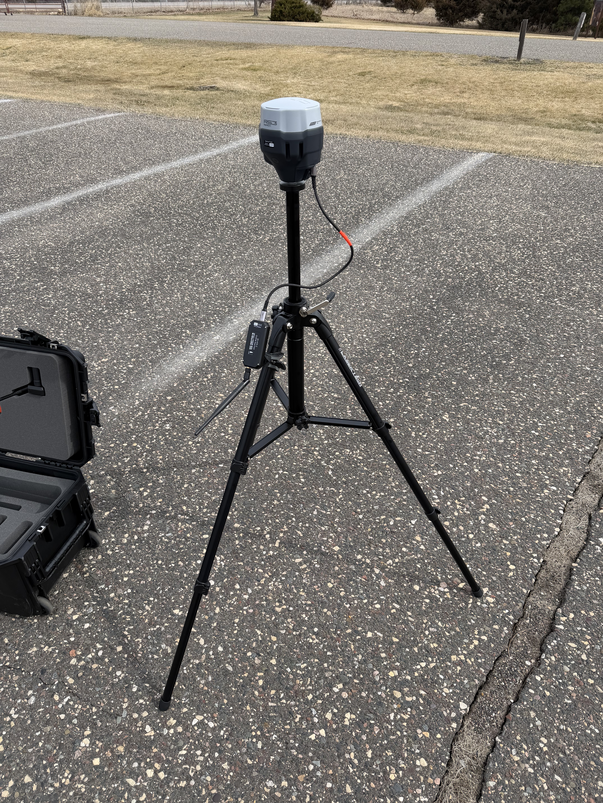
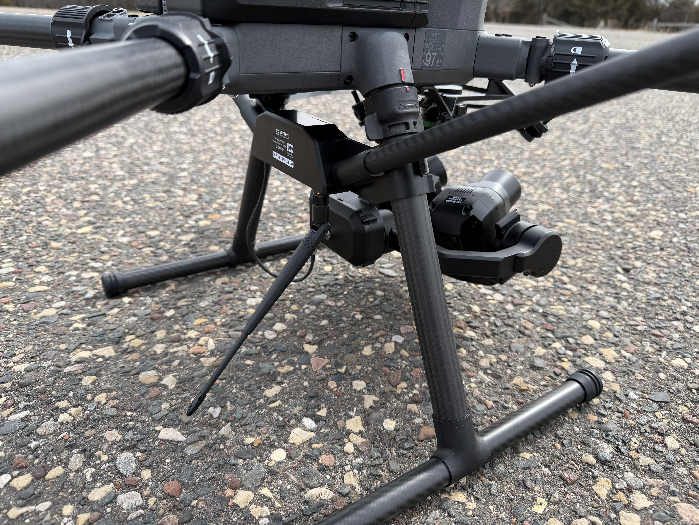
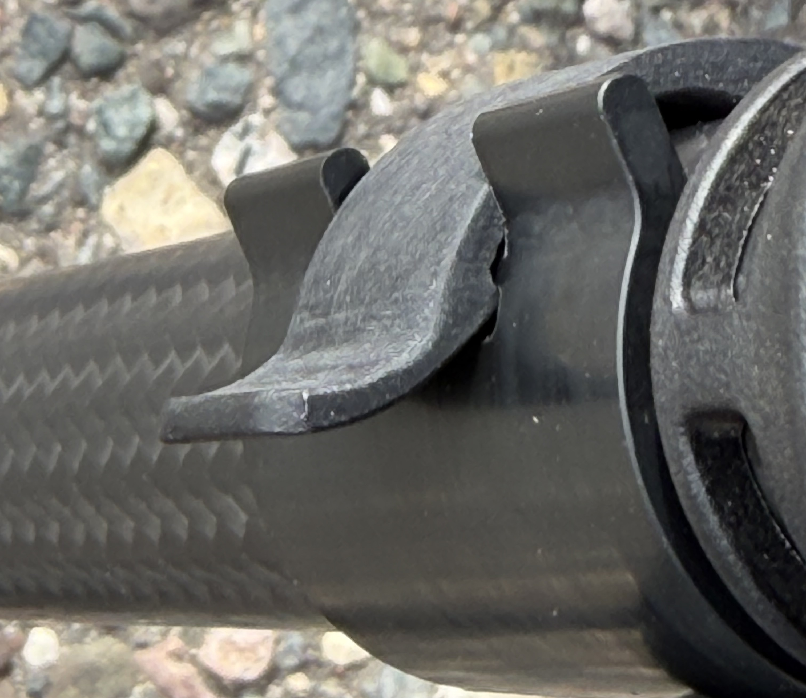
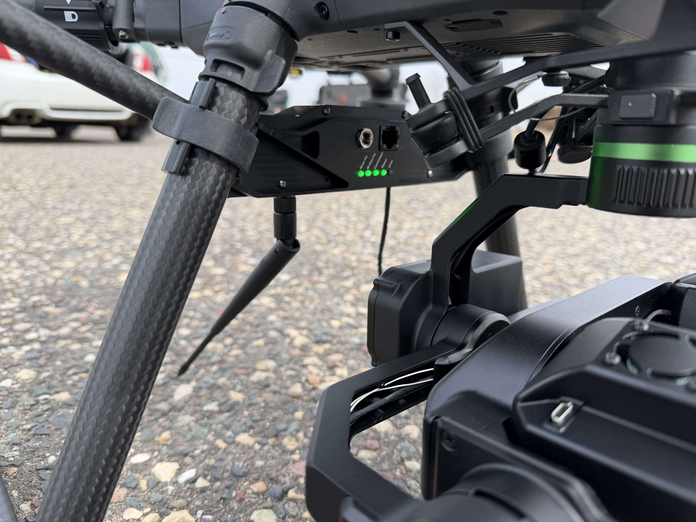
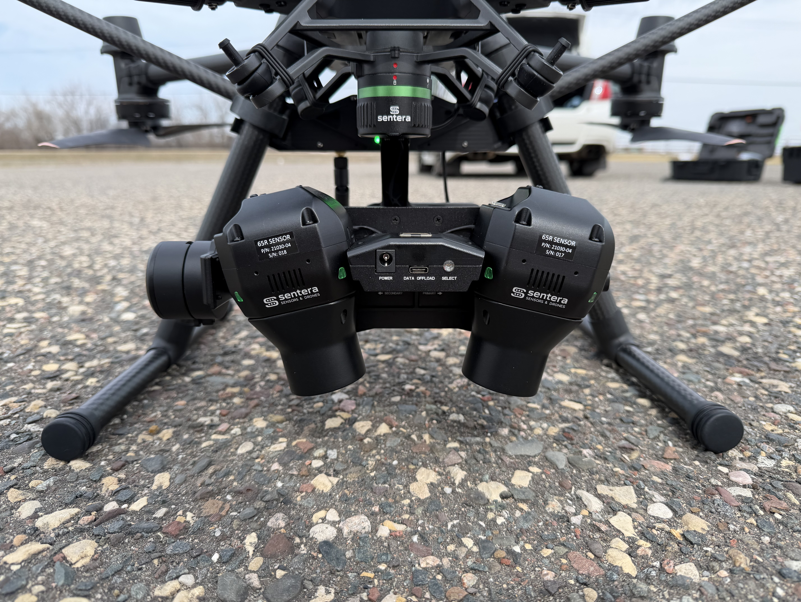

# Ground Test (needs pictures)

## Materials/Equipment Needed

1. Big 3
   1. Gimbal
   2. Antenna
   3. Base Station/Ground module
2. Production case

## Notes

This instruction set assumes the reader is already familiar with setting up and flying a DJI drone and may not give enough context for someone to learn how to do so.

Do this outside to ensure the system can reach an RTK FIX solution.

## Setup

### Base Station Setup (do first)

This is so that the base station has time to reach RTK status before you are ready to fly.

1. Refer to the 'Field Setup' page for this. [field-setup-not-complete.md](../emlid-base-station/field-setup-not-complete.md "mention")

<figure><figcaption></figcaption></figure>

### Drone Setup

1. Attach the gimbal to the drone using the Skyport connection (push up and twist).

<mark style="color:red;">Picture here</mark>

2. Clip the antenna to the legs of the drone with the lights facing forward and the sticker saying 'This side faces rear' facing rear. Tilt the antenna down and aft.

<figure><figcaption></figcaption></figure>

3. Ensure the clips on the antenna are fully clipped with the lip in the slot, not just clipped around the leg.



<figure><figcaption></figcaption></figure>

<mark style="color:red;">BAD</mark>



<figure><figcaption></figcaption></figure>

<mark style="color:$success;">GOOD</mark>



4. Plug in the antenna to the back of the gimbal and ensure it is secure.

<mark style="color:red;">Picture here</mark>

5. Set up all the regular things of a normal drone flight (arms, etc.)

<mark style="color:red;">Picture here</mark>

6. Turn on the drone and hand controller.

## Checks

If anything is not as expected, refer to the fault isolation manual for a guide on how to fix it.

[pixelscout-fault-isolation.md](../../../fault-isolation/pixelscout-fault-isolation.md "mention")

1. The antenna lights should show 4 green lights with one red light NOT illuminated.
   1. If the red light is illuminated, refer to the fault isolation manual

<figure><figcaption></figcaption></figure>

2. Both cameras should start sessions (turn green)

<figure><figcaption></figcaption></figure>
