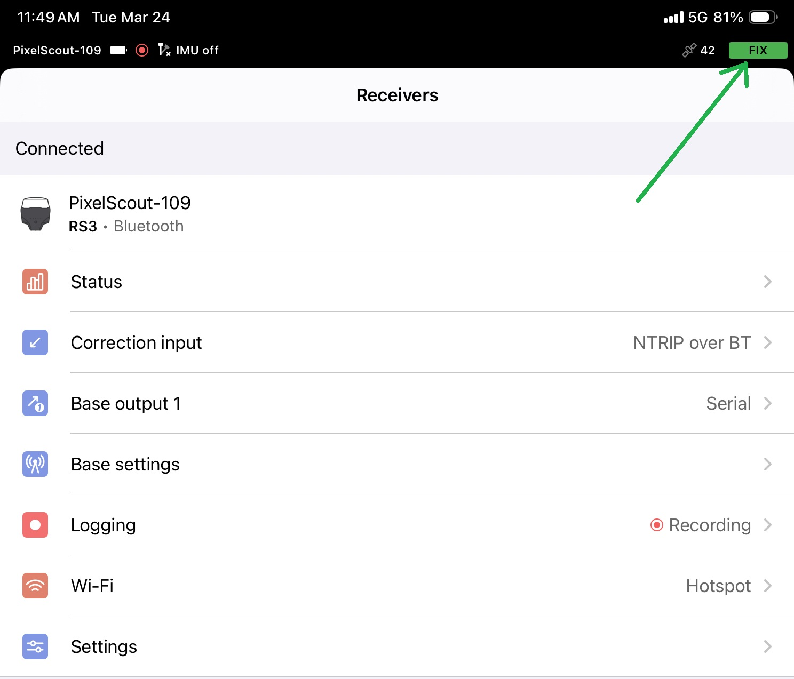
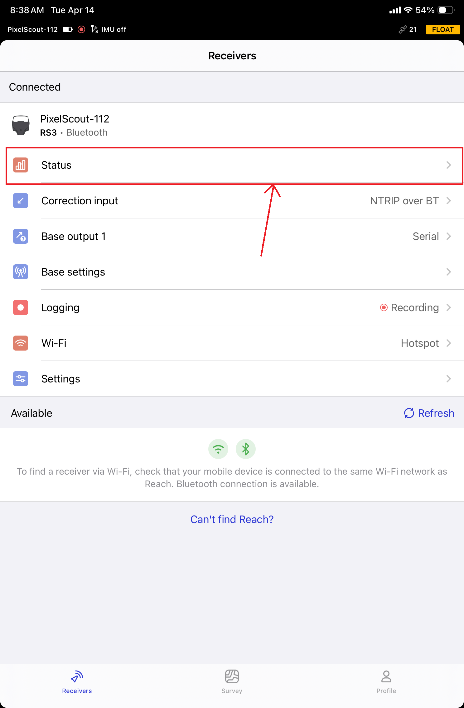
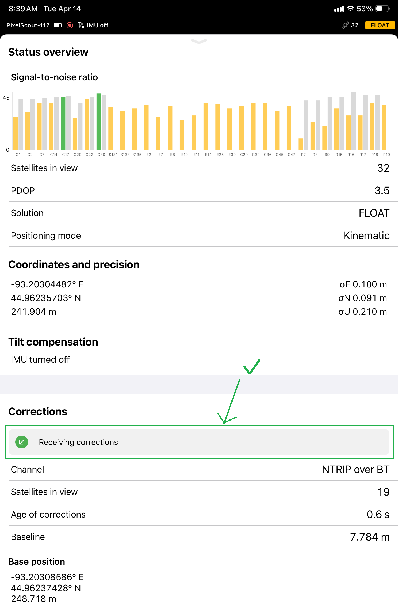
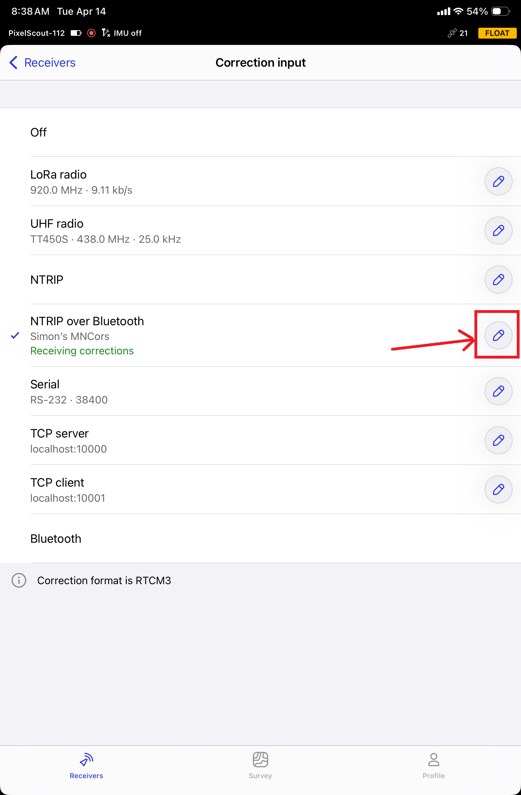
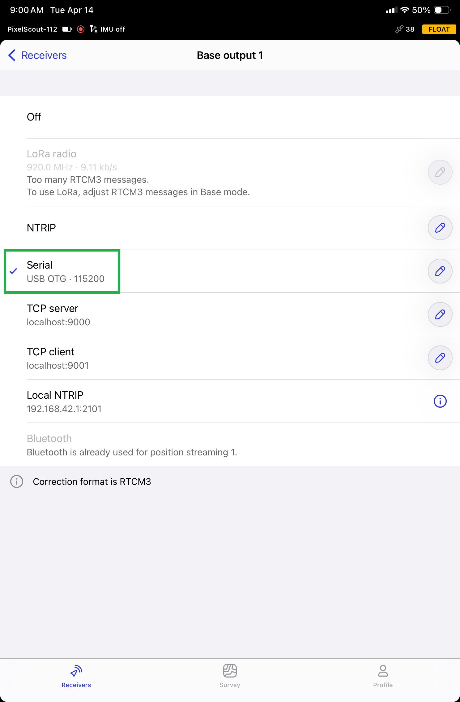
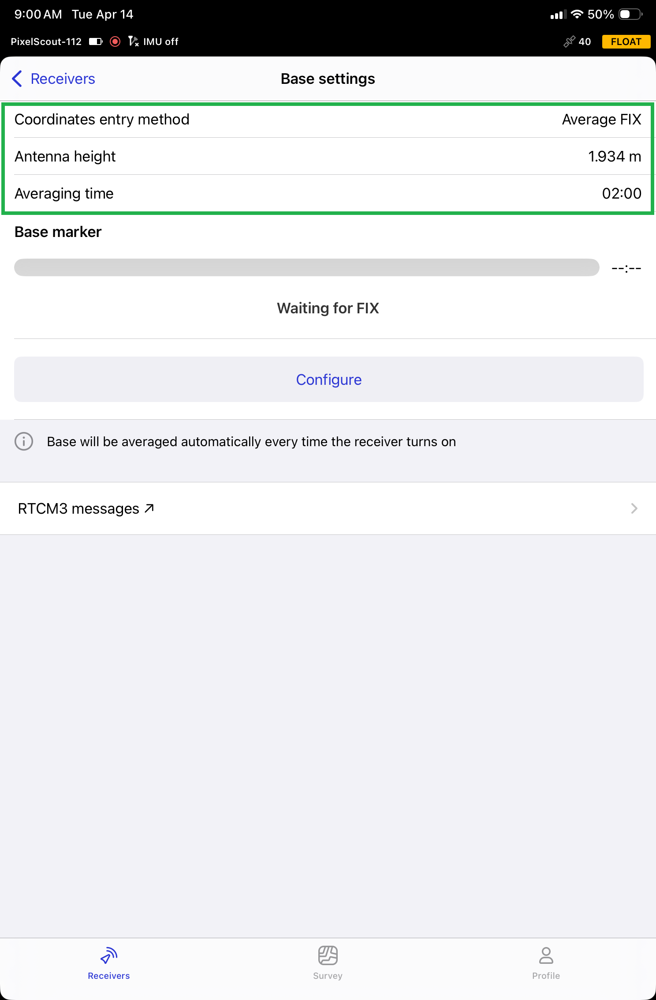
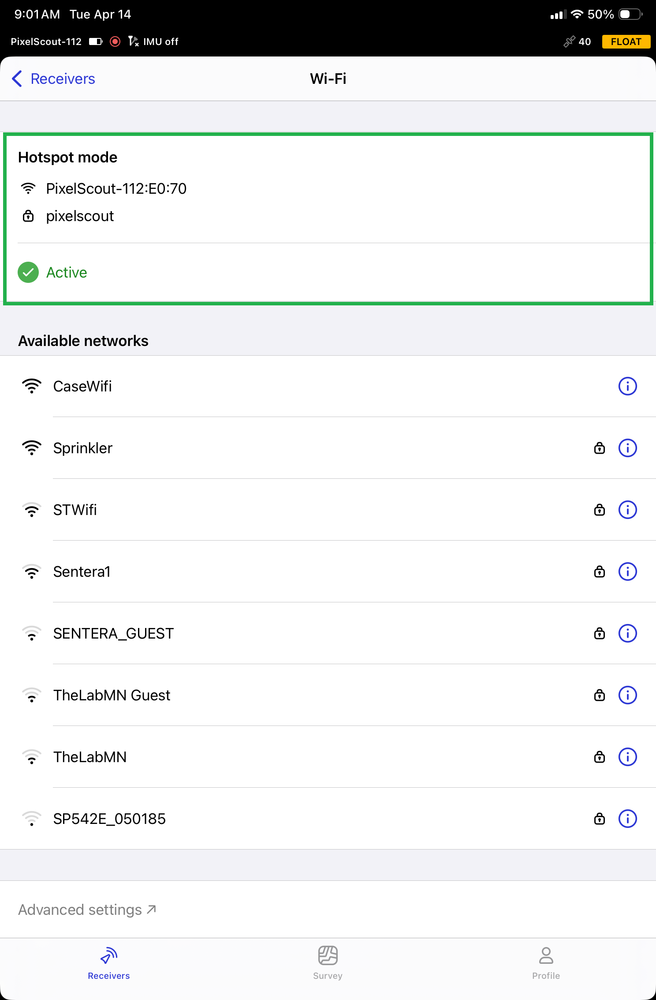
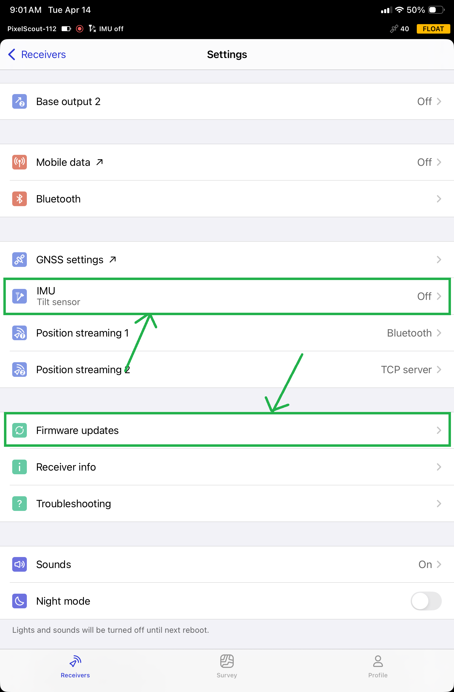

# ✅ Field Setup

## Setup

1. Extend the legs all the way and spread the legs all the way.
2. Crank the upper extension all the way.
   1. Hold it at the top while locking it with the hand screw.
3. Connect a USB-C cable to the base station and RTK/PPK ground module.

<figure><figcaption></figcaption></figure>

4. Turn on the base station by holding the button until the two lights turn on on either side of the button.
5. Open the Emlid Flow app on a device.
6. Connect to the base station using Bluetooth

<figure><figcaption></figcaption></figure>

7. Ensure the Base Station makes a chime sound and displays 'FIX' in green in the upper right-hand corner.

<figure><figcaption></figcaption></figure>

8. Check the following settings in different pages to ensure it is set up correctly.
   1. If anything is not set up correctly, refer to the [initial-setup.md](initial-setup.md "mention") page for instructions on how to set each setting.

Status

6. Click on <mark style="color:blue;">Status</mark> and ensure it says "Receiving Corrections"
   1. If it doesn't, check again after checking the Corrections Input menu (next)

<figure><figcaption></figcaption></figure> <figure><figcaption></figcaption></figure>

Correction input

1. Click on the Correction input menu
2. Ensure it says 'Receiving Corrections'
3. If it doesn't say 'Receiving Corrections', ensure your NTRIP credentials are inputted correctly by clicking on the pencil icon.

<figure><figcaption></figcaption></figure> <figure><figcaption></figcaption></figure>

Base output 1

Ensure the Base output setting is set to 'Serial: USB OTG, 115200'

<figure><figcaption></figcaption></figure> <figure><figcaption></figcaption></figure>

Base Settings

Click on <mark style="color:blue;">Base Settings</mark> and ensure the 3 settings at the top are correct

| Coordinates entry method | Average FIX |
| ------------------------ | ----------- |
| Antenna Height           | 1.934m      |
| Averaging Time           | 2:00        |

<figure><figcaption></figcaption></figure>

Wi-Fi

Check that the Wi-Fi bar on the main menu shows 'Hotspot' and the settings at the top of the <mark style="color:blue;">Wi-Fi</mark> page are correct.

<figure><figcaption></figcaption></figure> <figure><figcaption></figcaption></figure>

Settings

In the <mark style="color:blue;">Settings</mark> menu, ensure the IMU is off and there are no firmware update indicators (red dots next to 'Firmware Updates'

<figure><figcaption></figcaption></figure> <figure><figcaption></figcaption></figure>

