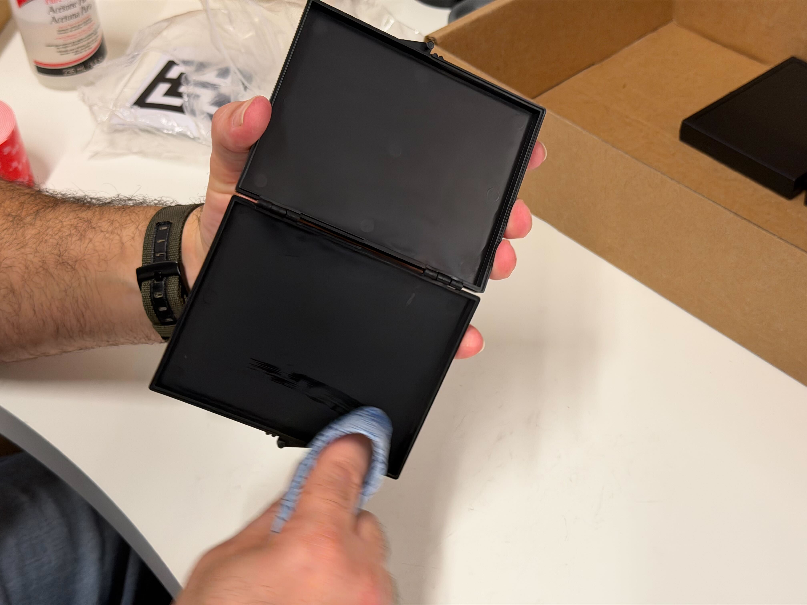
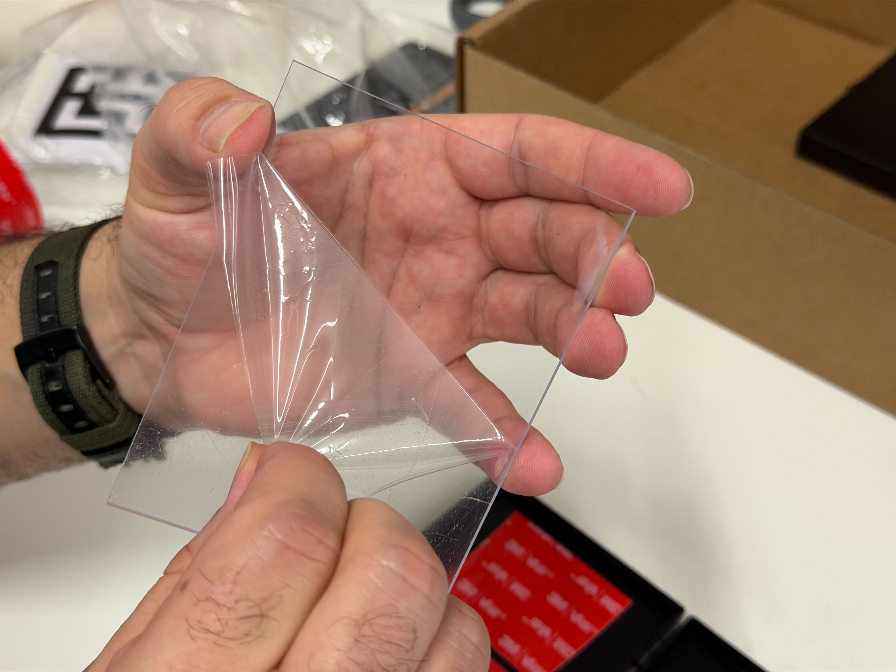
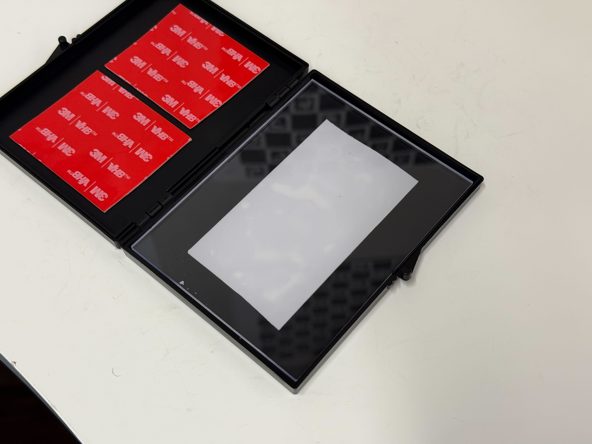
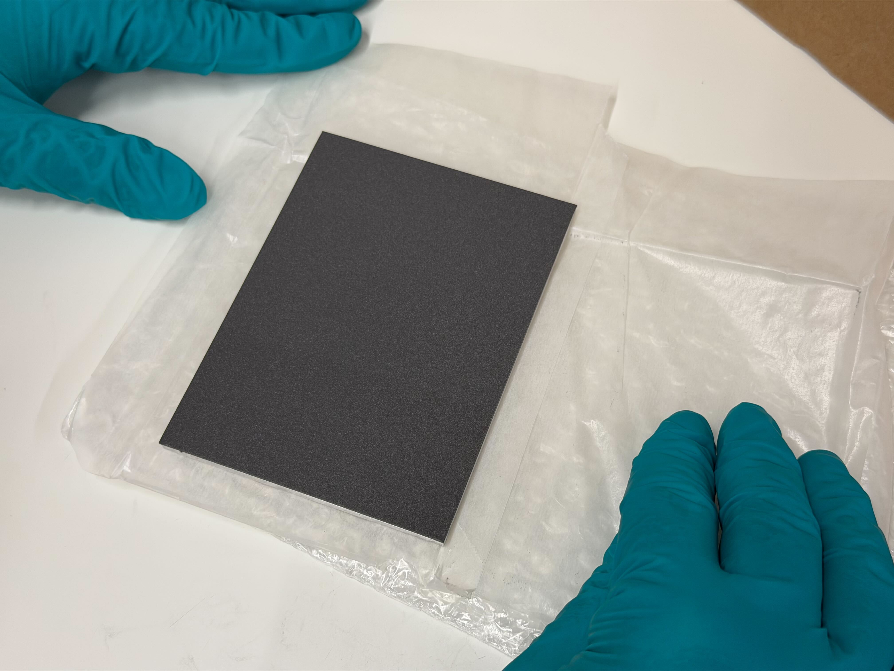
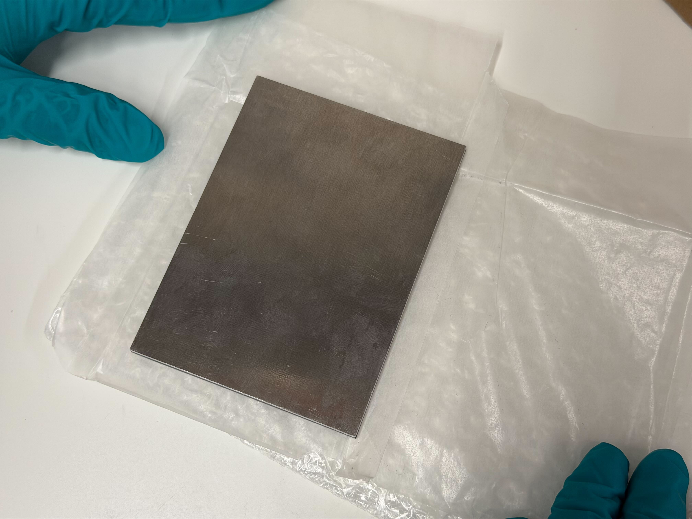
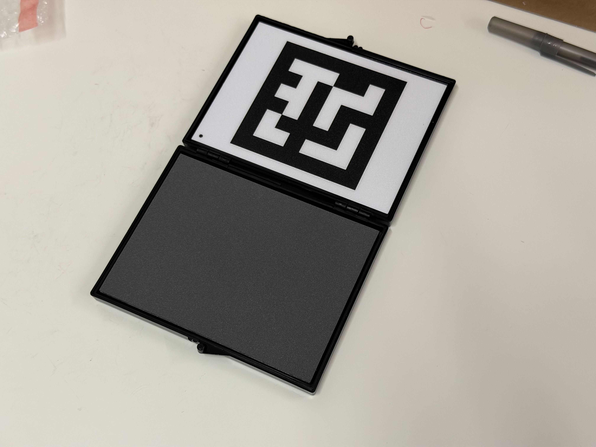
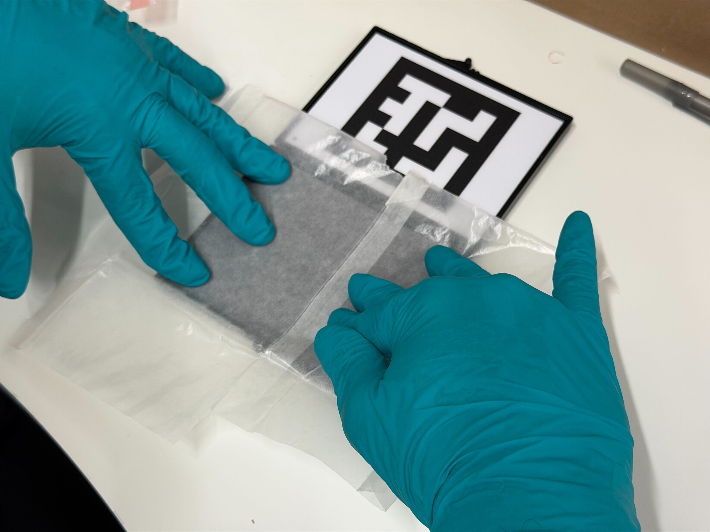
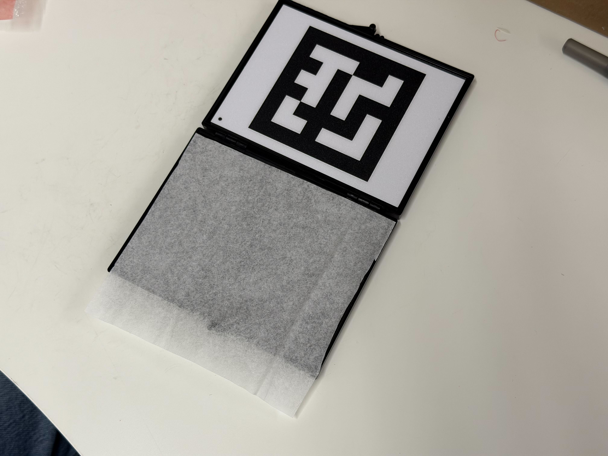
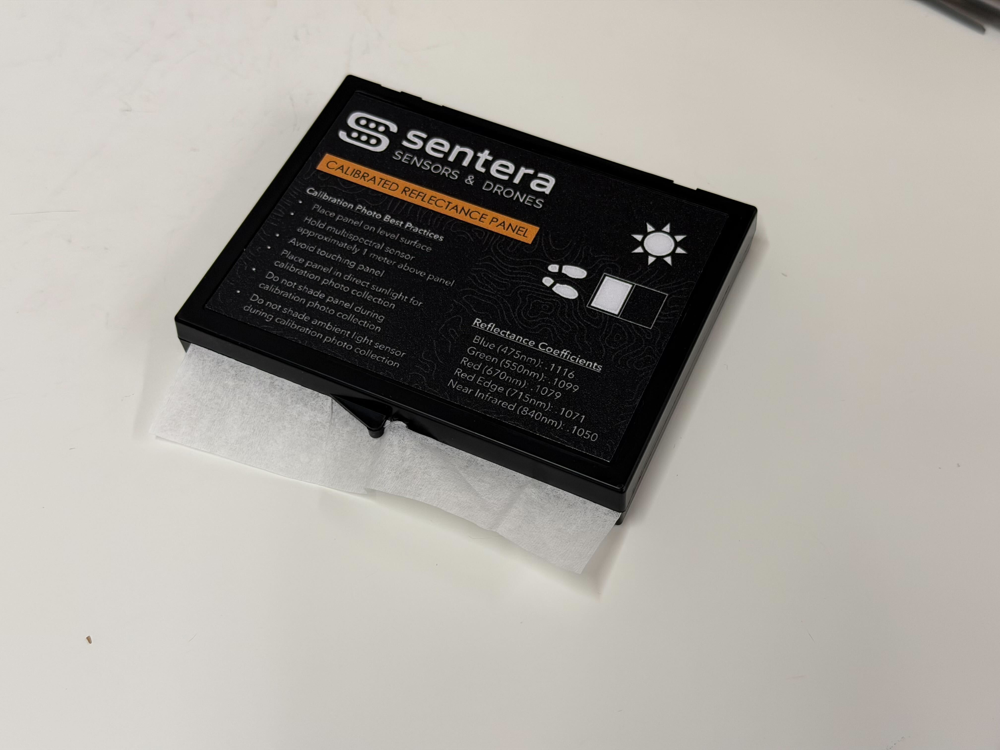

# 🚧 Reflectance Panel Assembly

## Equipment

|                              |        |   |
| ---------------------------- | ------ | - |
| Isopropyl Alcohol            | Gloves |   |
| Paper Towels                 |        |   |
| Acid free Tissue Paper Sheet |        |   |

## Notes

Before starting, ensure someone else will be able to QC the panels within 24 hours

## Prep

* Clear workspace and wipe down with cleaning spray or wipes to ensure it is very clean
* Gather all materials necessary

## Guide

1.  If present, remove any stickers with acetone and foam from the cases

    <figure><figcaption></figcaption></figure>
2.  Wipe down inside and out with isopropyl alcohol

    <figure><figcaption></figcaption></figure>
3.  Cases should come with the outside sticker and inside QR code already installed.&#x20;

If stickers are not pre-installed. Follow these steps. 

*   Cut Strips of foam tape and attach to the inside faces of the containers as shown, ensuring edges of the tape match closely with the container walls

    <figure><figcaption></figcaption></figure>
* Remove adhesive covering from each **upper** strip of tape and film from **both** sides of the polycarbonate sheet.
  1.  One of the pieces of film on the polycarbonate sheet is very transparent. Ensure **both** films are removed.

      <figure><figcaption></figcaption></figure>
* Place the polycarbonate sheet in the **upper** section, applying even pressure to ensure secure attachment.

<figure><figcaption></figcaption></figure>

<figure><figcaption></figcaption></figure>

1. Remove adhesive covering from the tape in the lower section.
2. **Put on a new pair of disposable gloves**.
3. Carefully remove the reflectance panel from its packaging.
4. Place the panel **metallic side down** on the bottom adhesive strips with light even pressure.



<figure><figcaption></figcaption></figure>

Reflectance Side



<figure><figcaption></figcaption></figure>

Metalic Side



<figure><figcaption></figcaption></figure>

12. Press down to make sure the glue sticks using the inside side of the original panel packaging as it is clean and free of oils and debris.

<figure><figcaption></figcaption></figure>

13. Cut and place a S-23029 tissue paper sheet over the panel with it overlaping the front.

    <figure><figcaption></figcaption></figure>
14. Close the panel on the tissue paper.

<figure><figcaption></figcaption></figure>
