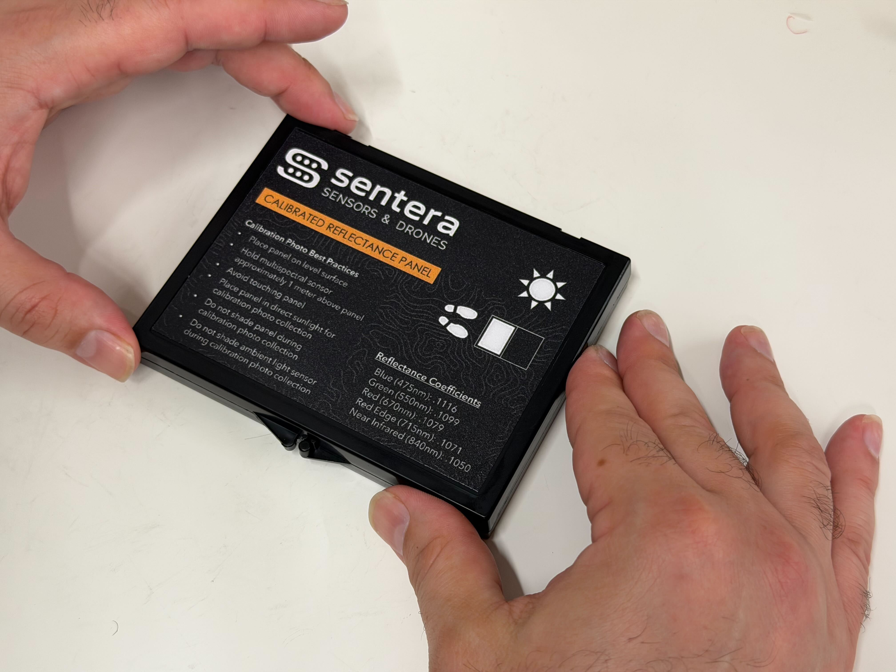
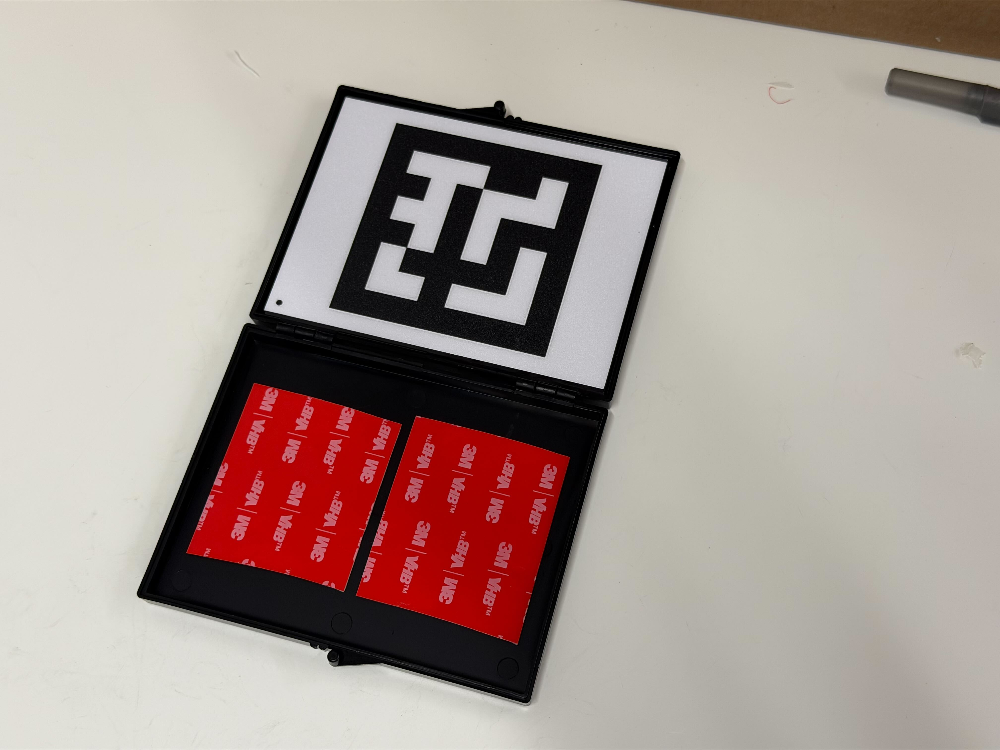

# Reflectance Panel Assembly

## Notes

Before starting, ensure someone else will be able to QC the panels within 24 hours

## Materials

* Isopropyl Alcohol
* Paper Towels
* 21226-00 — Reflectance Panel Kit, 6X
* S-23029 — Acid Free Tissue Paper Sheet
* Gloves

## Prep

* Clear workspace and wipe down with cleaning spray or wipes to ensure it is very clean
* Gather all materials necessary

## Assembly

1.  If present, remove any stickers and foam from the cases

    <figure><figcaption></figcaption></figure>
2.  Wipe down inside and out with isopropyl alcohol or acetone.

    <figure><figcaption></figcaption></figure>
3. Place outer label onto the clean top surface ensuring even placement and no air bubbles
   1.  Find the top by placing the latch facing you, the upper arm (that points downward) should be on your left.

       <figure><figcaption></figcaption></figure>
4.  Cut Strips of foam tape and attach to the inside faces of the containers as shown, ensuring edges of the tape match closely with the container walls

    <figure><figcaption></figcaption></figure>
5. Remove adhesive covering from each **upper** strip of tape and film from **both** sides of the polycarbonate sheet.
   1.  One of the pieces of film on the polycarbonate sheet is very transparent. Ensure **both** films are removed.

       <figure><figcaption></figcaption></figure>
6.  Place the polycarbonate sheet in the **upper** section, applying even pressure to ensure secure attachment.

    <figure><figcaption></figcaption></figure>
7.  Remove the backing from the internal label and place on top of the polycarbonate sheet with the **black dot in the lower left corner.**

    <figure><figcaption></figcaption></figure>
8. Remove adhesive covering from the tape in the lower section.
9. **Put on a new pair of disposable gloves**.
10. Carefully remove the reflectance panel from its packaging.
11. Place the panel **metallic side down** on the bottom adhesive strips with light even pressure.



<figure><figcaption></figcaption></figure>

Reflectance Side



<figure><figcaption></figcaption></figure>

Metalic Side



<figure><figcaption></figcaption></figure>

12. Press down to make sure the glue sticks using the inside side of the original panel packaging as it is clean and free of oils and debris.

<figure><figcaption></figcaption></figure>

13. Cut and place a S-23029 tissue paper sheet over the panel with it overlaping the front.

    <figure><figcaption></figcaption></figure>
14. Close the panel on the tissue paper.

<figure><figcaption></figcaption></figure>
