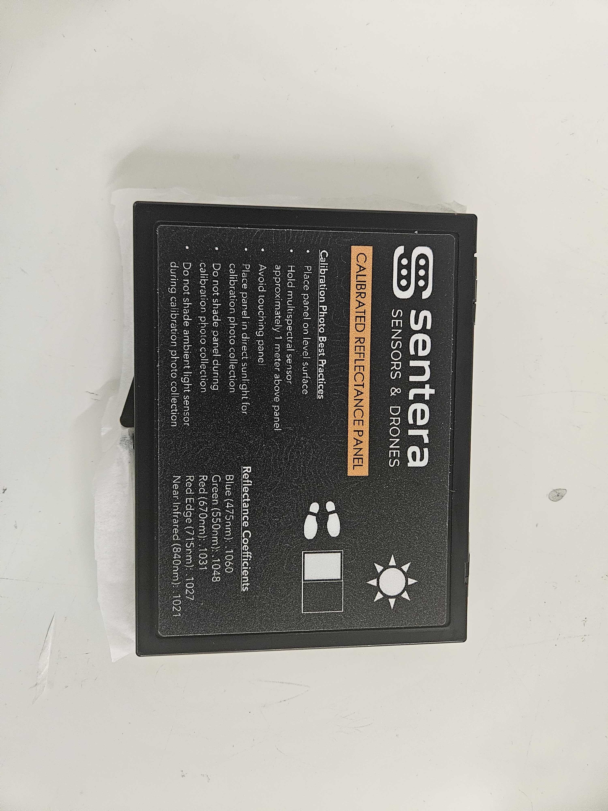
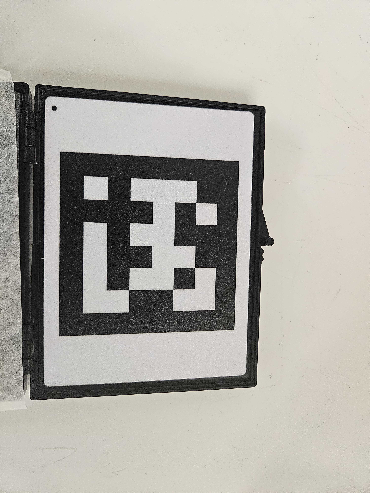
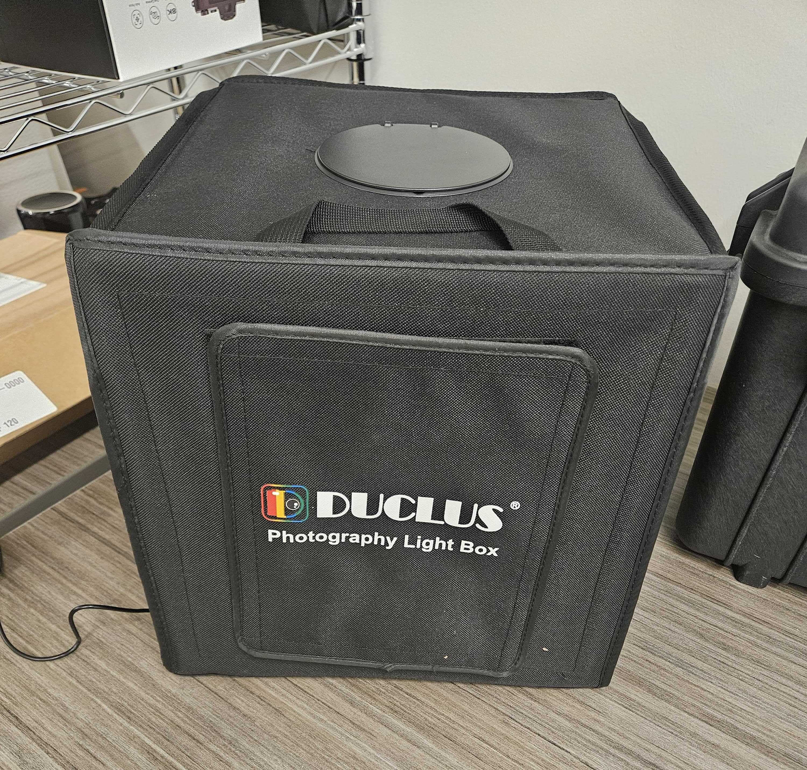
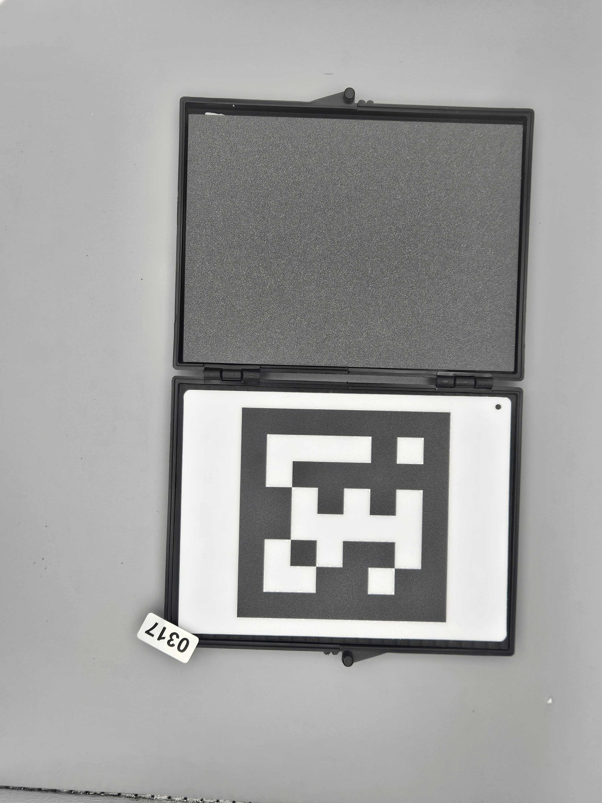
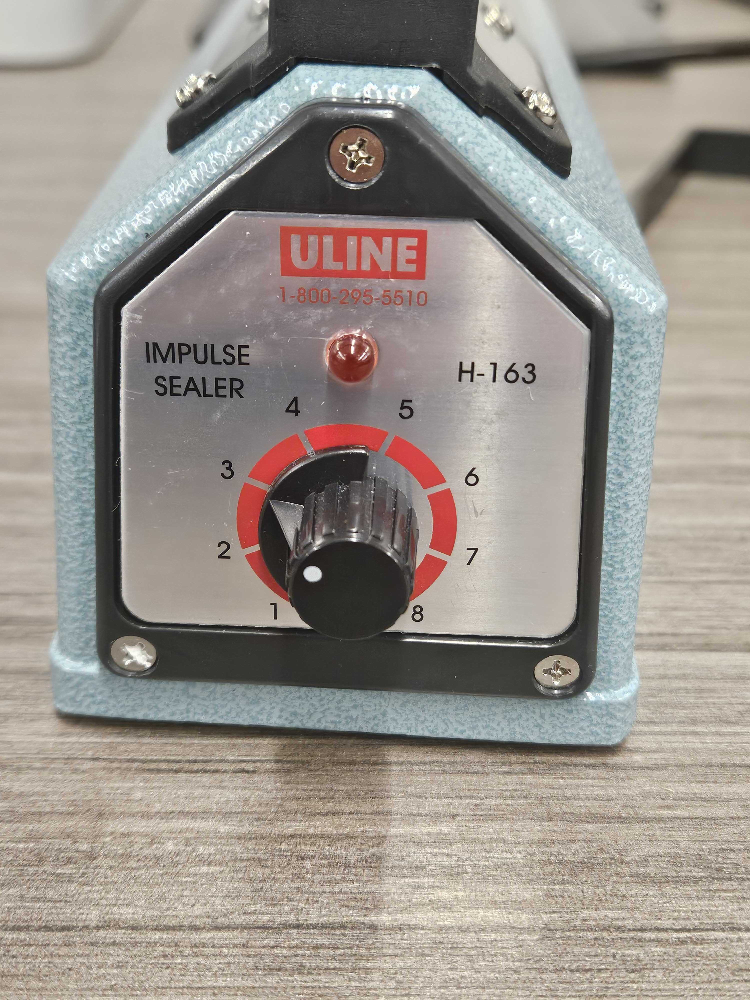
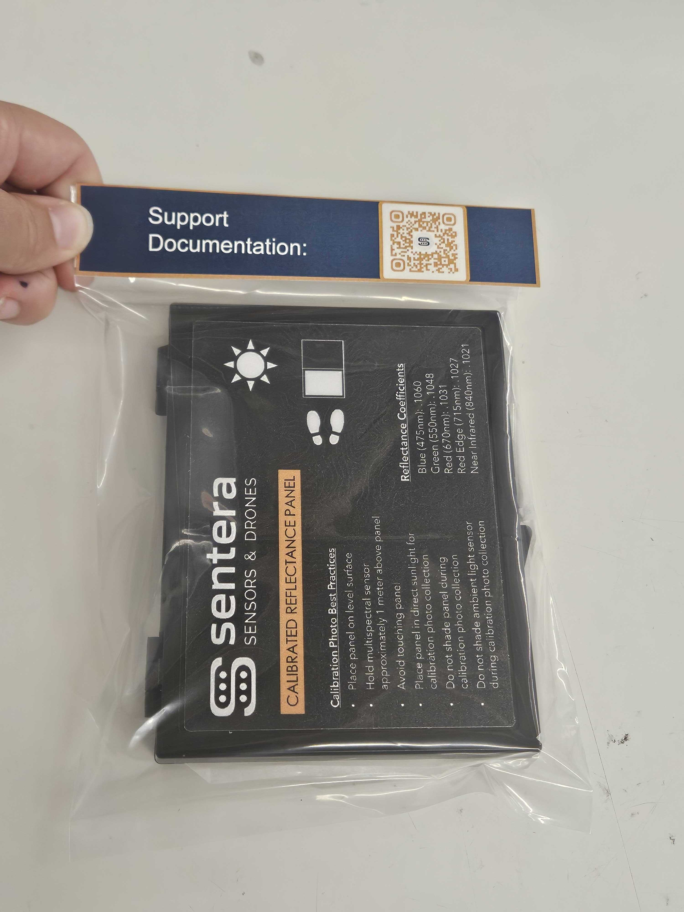

# ✅ Reflectance Panel QC

## Notes

QC must be performed by another person who did not complete the build

## QC Steps

1. Put on gloves.
2. Open a reflectance panel, inspect the reflectance panel for any nicks, gouges, discoloration, etc.
   1. If any damage is present, put aside and mark as do not ship&#x20;
      1. consult others for ship-ability
   2. Confirm stickers are correctly installed

>     
>
>

3. Select the next number sticker. Temporarily stick it on the edge of the open panel as shown, ensuring it is not covering any part of the reflectance panel.


Only use the stickers in the Reflectance panel Bin. Place the sticker roll back in the correct bin.&#x20;

<strong>DO NOT USE THE ASTRO BIN STICKER</strong>



4. In the small light box, take a photo with the following:

<figure><figcaption></figcaption></figure>

* The panel number is visible
* The entire reflectance panel is in view
* No blur exists.

<figure><figcaption></figcaption></figure>

5. Close the container with the tissue paper placed squarely in between the two halves of the container with even overhang.
6. Place the sticker on the back of the case, position it in the lower right-hand corner.
   1. "lower" means the edge next to the latches.

<figure><figcaption></figcaption></figure>

7. Place the container into an S-9482 Poly Bag and seal with the Uline Sealer.
   1.  Sealer should be set to 3. Place the container in the bag sticker side first so that the sticker is furthest from the excess material

       <figure><figcaption></figcaption></figure>
8. Put a "Sentera Documentation" sleeve on the bag. Staple on the sides of the bag to keep it secured.&#x20;

>
>
> .png>)     

9. Upload photos to taurus with the panel number in the photo name.
   1. \\\taurus\Production\Systems & Kits\21226-00 — Reflectance Panel.
   2. Photo naming convention: "Panel XXXX" where XXXX is the number on the sticker.
