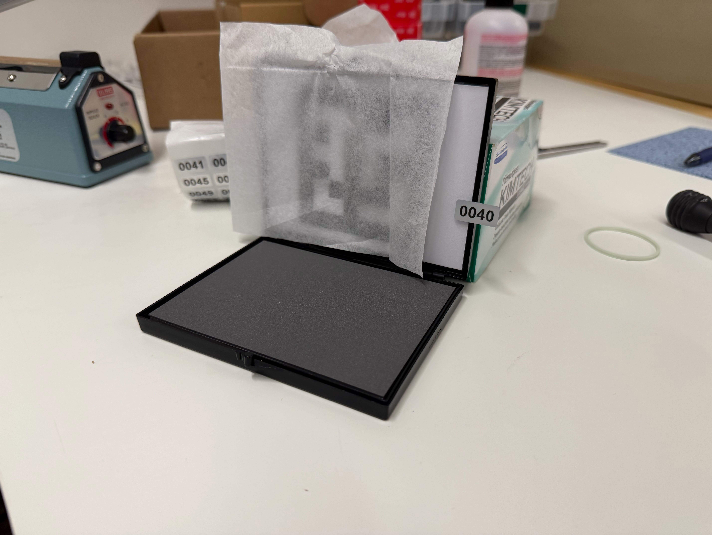
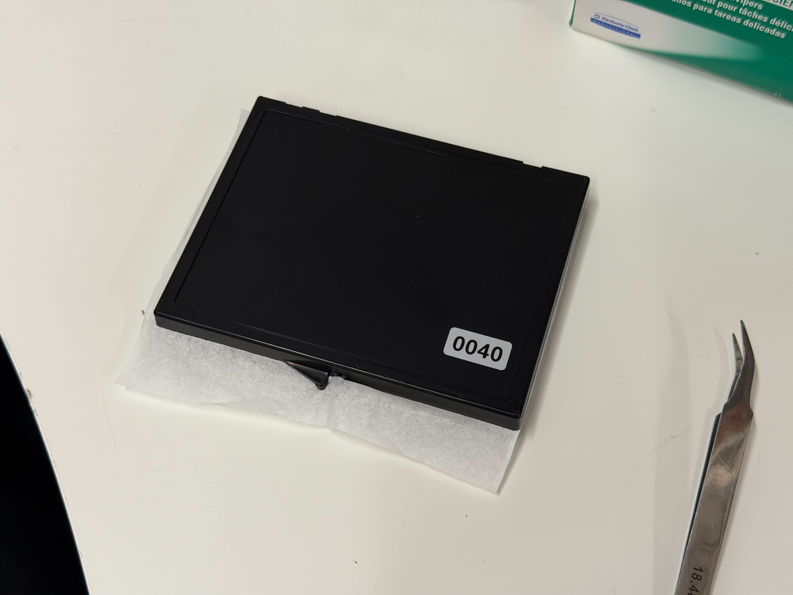
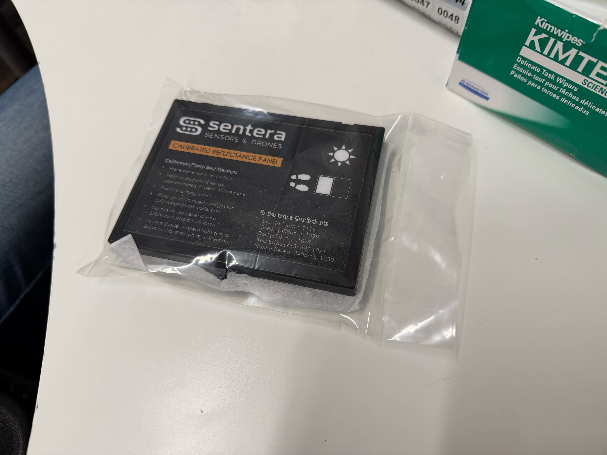

# Reflectance Panel QC

## Notes

QC must be performed within 24 hours of building by a separate person

## QC Steps

1. Put on gloves.
2. Open a container, place the tissue paper over the QR code section, ensuring it does not obstruct any part of the reflectance panel.
3. Inspect the reflectance panel for any nicks, gouges, discoloration, etc.
   1. If any damage is present, consult others for ship-ability.
4. Select the next number sticker. Temporarily stick it on the edge of the open panel as shown, ensuring it is not covering any part of the reflectance panel.

<figure><figcaption></figcaption></figure>

5. Take a photo with the following:
   1. The panel number is visible
   2. The entire reflectance panel is in view
   3. No blur exists.

<figure><figcaption></figcaption></figure>

6. Close the container with the tissue paper placed squarely in between the two halves of the container with even overhang.
7. Place the sticker on the back of the case, position it in the lower right-hand corner.
   1. "lower" means the edge next to the latches.

<figure><figcaption></figcaption></figure>

8. Place the container into an S-9482 Poly Bag and seal with the Uline Sealer.
   1. Place the container in the bag sticker side first so that the sticker is furthest from the excess material
   2. Normal operation of the sealer can be found in the manual. For this use case, typical time for sealing is \~2-3 seconds.

<figure><figcaption></figcaption></figure>

9. Upload photos to taurus with the panel number in the photo name.
   1. \\\taurus\Production\Systems & Kits\21226-00 — Reflectance Panel.
   2. Photo naming convention: "Panel XXXX" where XXXX is the number on the sticker.
