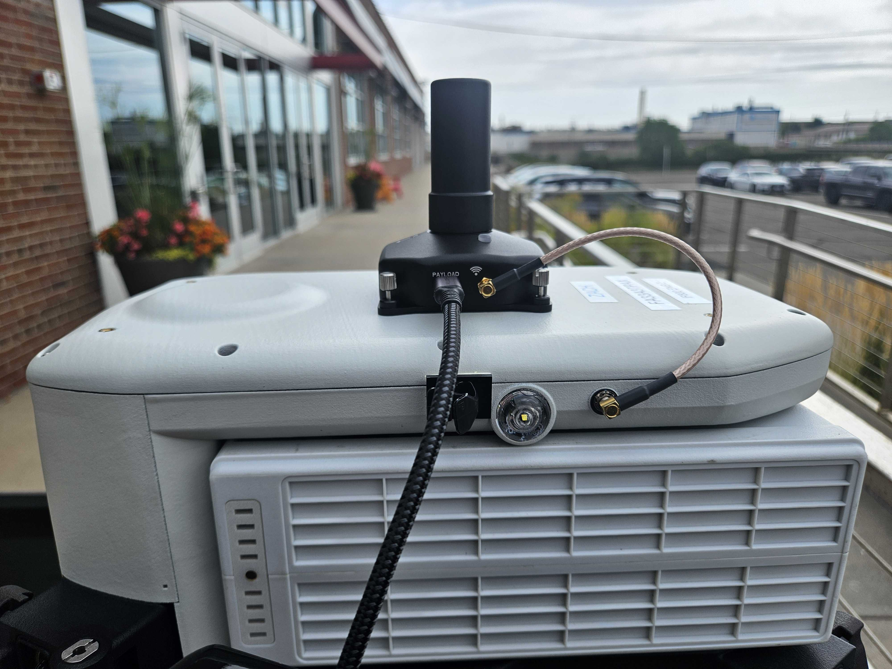
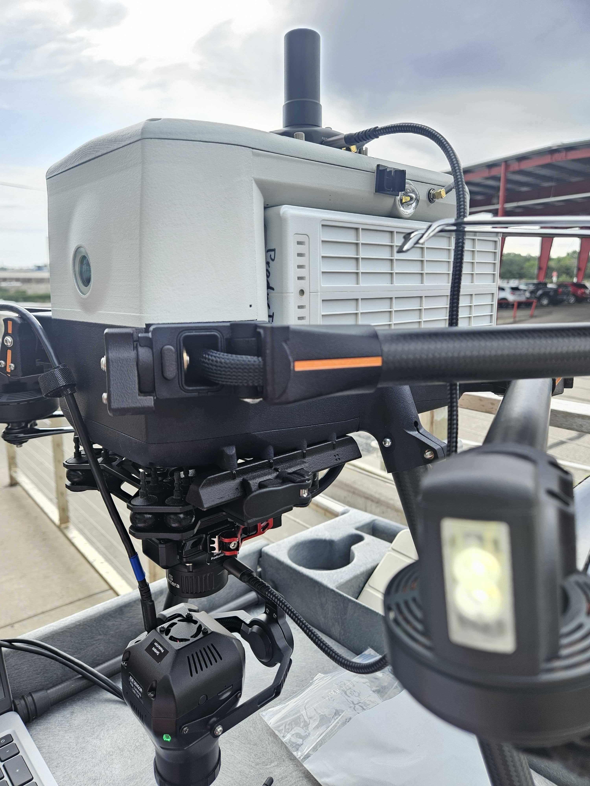

# 🚧 Module Testing

## Notes

* This document is to be used as reference only. For a complete checklist, refer to the document being used (doc # 27300).
* The steps for normal indoor procedures are listed. For outdoor tests (more accurate), accomplish both 'System Setup' parts first, before the 'System Testing' parts.

## Prep

Print out one 27300\_Sentera\_RTK\_PPK\_Module\_Checkout document for each module being tested.



## QC Check

### Top Part

1. Fill out the top part of the Sentera RTK PPK Module Checkout document.

<figure><figcaption></figcaption></figure>

### System Setup

1. Follow the 'System Setup - Indoors, Sensor Setup' part of the document.
   1. Sensor type: better with 65R as there are less photos taken which shortens transfer time
   2. Aircraft Type: For an IF1200 build, the IF800 drone can be used.&#x20;
   3. GEN II Markings: Located at the bottom of the stack closest to sensor.

<figure><figcaption></figcaption></figure>

### Aircraft Setup

1. **Install Sensor onto aircraft:** attach the sensor (6X/65R) to the drone using the smart dovetail connection. Verify it clicks into place and flip the level to lock it in place.
2. **Install module aircraft:** Attach RTK Air module to the top of the drone using 4 thumb screws. Install finger tight. Just enough to keep the module from moving.
3.  **Connect coax cable to module and aircraft:** Connect the copper colored coax cable to the Air module on top of the aircraft. Depending on the intended aircraft, connect the other end as follows:

    * IF800: Plug into the side of the aircraft body.

    <figure><figcaption></figcaption></figure>

    **Install 900Mhz antenna to aircraft:** screw in the antenna as follows depending on the intended aircraft:

    * IF800: Screw the antenna into the underbody of the aircraft.
    * IF1200: Screw the antenna into the clamp adapter, leave it hanging un-obstructed.

    **Connect module to sensor via USB-C to USB-C cable:** Connect the cable to the side of the air module and the side of the top stack of the sensor gimbal.

<figure><figcaption>
IF800
</figcaption></figure>

* IF1200: Plug into the clamp adapter, leave it handing on the side. it does not need to be secured.

Aircraft (will remove after editing)

**Install Sensor onto aircraft:** attach the sensor (6X/65R) to the drone using the smart dovetail connection. Verify it clicks into place and flip the level to lock it in place.**Install module aircraft:** Attach RTK Air module to the top of the drone using 4 thumb screws. Install finger tight. Just enough to keep the module from moving.**Connect coax cable to module and aircraft:** Connect the copper colored coax cable to the Air module on top of the aircraft. Depending on the intended aircraft, connect the other end as follows:

* IF800: Plug into the side of the aircraft body.
* IF1200: Plug into the clamp adapter, leave it handing on the side. it does not need to be secured.

**Install 900Mhz antenna to aircraft:** screw in the antenna as follows depending on the intended aircraft:

* IF800: Screw the antenna into the underbody of the aircraft.
* IF1200: Screw the antenna into the clamp adapter, leave it hanging un-obstructed.

**Connect module to sensor via USB-C to USB-C cable:** Connect the cable to the side of the air module and the side of the top stack of the sensor gimbal.**Secure cable with cable clilps:** This step is only required if the cable will interfere with operation/checkout of the RTK module, usually, it is not required.

### Hand Controller Setup/Test

1. Follow the 'Aircraft Hand Controller Setup' part of the document.

Aircraft Hand Controller Setup (Perform once on first module tested)

* Turn on your hotspot on Ipad. A phone can be used, but you might need to change frequency on hotspot for drone to connect. &#x20;


We skip "Laptop NTRIP" on the document. Please leave this section blank.&#x20;


2. Follow the 'System Testing - Outdoors - Hand Controller NTRIP' part of the document.

Hand Controller NTRIP

### Base Station Setup/Test


NOTE: normal testing procedure uses the emlid base station labeled 'Production Asset'. This is what is listed below. For Laptop NTRIP usage, refer to the document for instructions.

