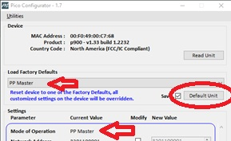
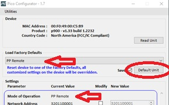
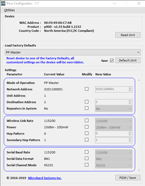
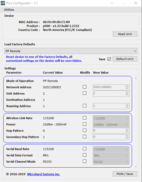

# 📷 P900 Radio Programming

## Parts Needed:

* P900 programming bag&#x20;
  * TTL-232RG USB Cable.
  * AC Power Adapter (12V)
  * Y Adapter (Labeled 'P900')

## Guide

1. Open the 'Pico Config' program located in the following folder.
   1. \as-taurus.jdnet.deere.com\Data\Part Database (things we sell)\SW-32011 -- P900 Radio>\_tools\PicoConfig1.7


Note: it may be best to install the program to your machine. However, the program may be run directly off of taurus so it is not required. For installation, refer to the software installation guide. [#pico-configurator](../../space-and-general/software-installation-guide.md#pico-configurator "mention")


2. Plug in the P900 board using the power adapter, TTL cable and Y-adapter.
3. Load the Factory Defaults if the Mode of Operation is not correct.
   1. Use the following modes:
      1. Ground Module: PP Remote
      2. Antenna Module: PP Master
   2. Click <mark style="color:blue;">Default Unit</mark> and ensure it updates correctly.



<figure><figcaption>
Use for air module boards
</figcaption></figure>




<figure><figcaption>
Use for ground module boards
</figcaption></figure>



4. Program the board using the following settings&#x20;
   1. Network Address: 32011-xxxx. This will be listed on the build.



<figure><figcaption>
Use for air module boards
</figcaption></figure>



<figure><figcaption>
Use for ground module boards
</figcaption></figure>



5. Click <mark style="color:blue;">Read Board</mark> to double check the values have been set correctly, and the board itself has not been bricked.
   1. The light should be the following:
      1. Ground module: Scrolling.
      2. Air module: One light solid.
